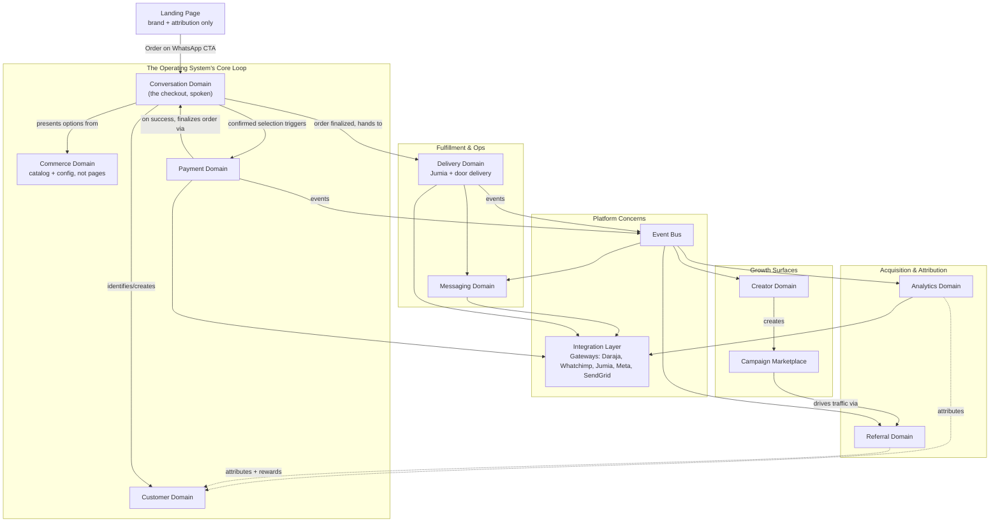
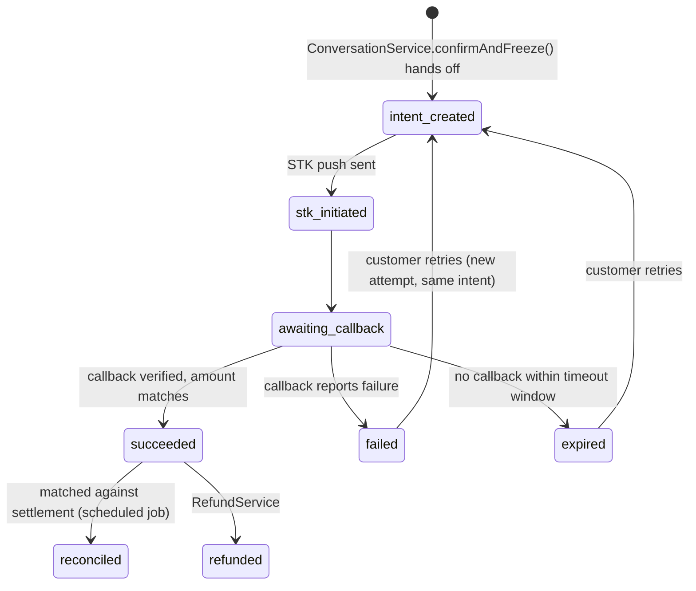
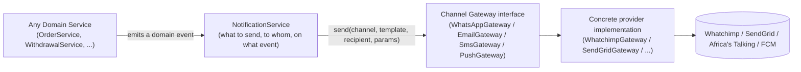
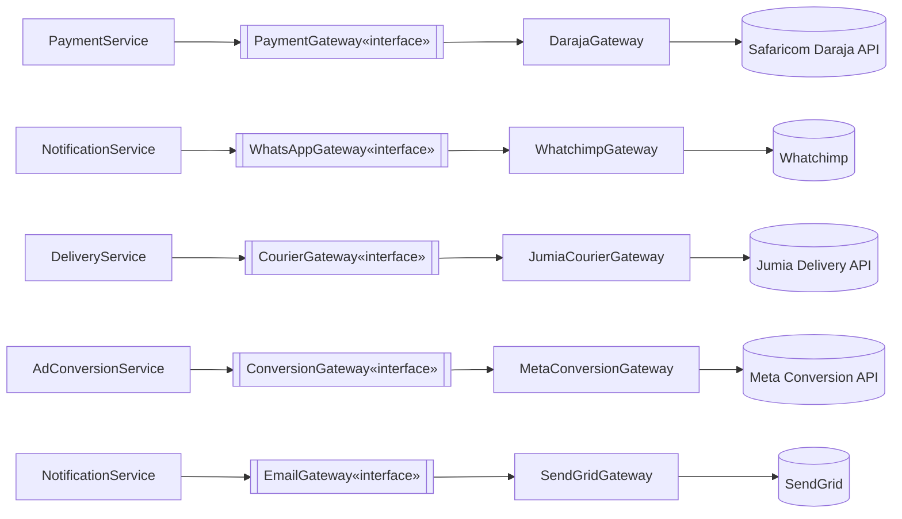
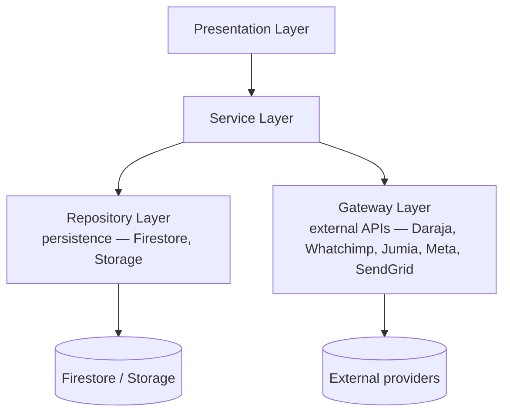
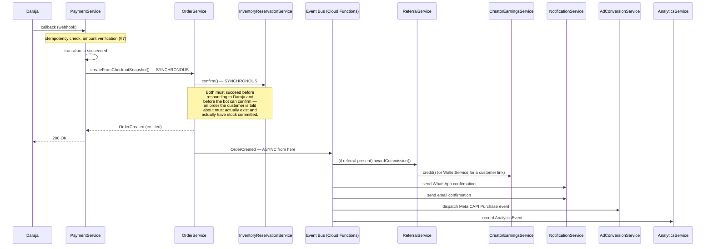

# Snack Quest — Platform Architecture V2

**Status:** Authoritative platform architecture, superseding
`TECHNICAL_DESIGN_DOCUMENT.md` §5, §8, §10, §11, §14, §16 where they
conflict with this document — everywhere else, this document *extends*
the TDD rather than replacing it. TDD §4 (Layered Architecture), TDD §6
(Authentication), TDD §7 (Authorization), TDD §9 (Security Rules
baseline), TDD §17 (Deployment), TDD §20 (Feature Flags), TDD §22
(Observability) remain correct and are built on here, not redone —
**note these are TDD section numbers, not this document's own; this
document's own §17, §20, and §22 are unrelated new sections (Multi-
Tenant SaaS Readiness, Implementation Roadmap, and Appendix,
respectively) and the collision is coincidental.**

**Relationship to prior documents.** `ARCHITECTURE_COMPLETENESS_AUDIT.md`
established *that* the TDD under-scopes the platform outside the
Creator Portal. This document is the *answer* to that audit: a complete
bounded-context redesign covering commerce, checkout, payments,
referrals, the campaign marketplace, messaging, and analytics, plus a
deliberate answer to the multi-tenant SaaS question the audit didn't
address. Where this document's data model or service catalog differs
from the original TDD, that's a deliberate revision, and the reasoning
is stated inline — nothing here is a silent contradiction.

**How to read this document.** Same convention as the TDD: **Current
State** where relevant, **Target State** as the design, explicit
**Why** reasoning wherever a decision has real trade-offs, and
**Open Questions** deferred rather than silently assumed. Every
collection, Service, Repository, and event named in the per-domain
sections (§3-12) is consolidated into machine-scannable maps in §22
(Appendix) for quick reference during implementation.

---

## 1. Executive Summary

**The reframe this document makes, restated after a mid-draft
correction (below): Snack Quest is not a store. It is Snack Quest
OS — a WhatsApp-first business operating system for the Kenyan
market**, where the website's entire job is brand story, attribution
capture, and a funnel into a WhatsApp conversation, and the
conversation itself — orchestrated by this platform, spoken through
Whatchimp — *is* the ordering, payment, and confirmation experience.
There is no web shopping cart and no web checkout page in this
architecture. The operations that matter are **"start a conversation,"
"generate an STK push," "reserve inventory," "create a Jumia
shipment," "credit a creator commission"** — not "cart page,"
"checkout page," or "product listing." Every domain below is designed
around operations a Service performs, not pages a browser renders,
because ADR-0000 already established that pages aren't architecture
in this codebase, and a conversational-commerce platform makes that
doubly true: there may not even *be* a page for a given step.

### 1.1 Critique — where this document's own first draft, and the
### original TDD, unconsciously assumed traditional e-commerce

This section exists because the request that produced it asked for a
critique, not just a redesign — and because the honest answer is that
this document's *own first draft of §6* made the exact mistake being
critiqued, which is worth naming directly rather than quietly editing
away.

1. **The original TDD's `orders` collection and `OrderService`
   assume a customer arrives at a product page, adds to a cart, and
   checks out.** Nothing in TDD §5 (Portal Architecture), §8 (Data
   Model), or §10 (API Design) mentions WhatsApp as anything other
   than a *notification channel* — a place Snack Quest sends messages
   *to*, never a place an order originates *from*. That's backwards for
   this business: the current codebase's own `chimp-flow` orchestrator
   (`server.ts:4692-4780`+, cited in the completeness audit) already
   proves orders originate in conversation today, county-by-county,
   turn-by-turn — the TDD simply never looked at that code path when it
   was written, because it was scoped to the Creator Portal.
2. **This document's own first-draft §6 ("Checkout Domain") designed
   `carts` and `checkoutSessions` as web-form-driven, multi-page
   constructs** — a price-snapshotting, multi-step, browser-based
   checkout flow. That is Shopify's shape, not Snack Quest OS's. It has
   been **deleted and replaced** with §6 below ("Conversation Domain"):
   a WhatsApp conversation state machine is the checkout; there is no
   parallel web checkout to keep in sync with it. This was a real
   mistake in this document's own reasoning, not a hypothetical one —
   worth leaving visible here rather than pretending the first draft
   never happened, since the same instinct (default to the commerce
   pattern everyone already knows) is exactly what future engineers on
   this codebase need to be warned against too.
3. **"Browse Snack Boxes" in the requested customer-journey diagram
   does not imply a product-listing page.** §5 (Commerce Domain) is
   reframed below: the packages/themes/discounts data model is
   unchanged (a catalog still has to exist *somewhere* as data), but
   *how a customer encounters it* is a conversational operation
   (`ConversationService.presentPackageOptions()`, returning a bot
   message with selectable options — exactly the shape the current
   `chimp-flow` endpoint already uses) rather than a rendered grid of
   product cards. The website may still *show* the current month's box
   for brand-storytelling purposes — but that's marketing content, not
   a "browse and add to cart" flow, and it links out to WhatsApp rather
   than a checkout page.
4. **Delivery was folded into "Checkout" in the first draft** (a
   `deliveryMethod` field on a checkout session) rather than treated as
   its own bounded context. That undersells it badly for this
   business: Jumia pickup-station logistics, county-based door-delivery
   pricing, and shipment tracking are real operational complexity this
   platform must own well, not a form field. §12 below gives Delivery
   its own domain section, with Jumia as one *replaceable* courier
   implementation behind a `CourierGateway`, not a special case wired
   through checkout logic.
5. **Payments were correctly *not* designed as an `OrderService`
   sub-feature (§7 below was right the first time and needed no
   rework)** — but its framing needs one correction: a `PaymentIntent`
   in this architecture is created from a **conversation's** confirmed
   selection, not from a web checkout session. The state machine itself
   (intent → STK push → callback → verified → order finalized) doesn't
   change; only what triggers `PaymentIntent` creation changes, and §6
   and §7 are updated to agree on that explicitly.

**What survives this correction unchanged, and why they were never
e-commerce-shaped in the first place:** Customer Domain (§3 — identity
and addresses are channel-agnostic), Creator Domain (§4 — earnings and
withdrawals don't care whether the sale that generated them happened
on a web page or in WhatsApp), Payment Domain (§7 — a payment state
machine is inherently channel-agnostic; Daraja doesn't know or care
whether the STK push was triggered by a button click or a WhatsApp
reply), Referral Domain (§8 — a referral link works identically
whether the click leads to a landing page or straight into WhatsApp),
Campaign Marketplace (§9 — unrelated to how any individual sale is
transacted), and Messaging Domain (§10, now §11 — its whole design
*already was* "no domain Service calls Whatsapp/Whatchimp directly,"
which is precisely the discipline this recalibration asks for
everywhere else too).

### 1.2 What this document establishes

- **Conversation is the primary transactional surface**, modeled as
  its own bounded context (§6) with a real state machine, not a
  sequence of web form pages translated into chat bubbles.
- **Payments remain their own domain** (§7), triggered by a confirmed
  conversation state rather than a web checkout, with a
  `PaymentIntent`/`PaymentAttempt` state machine, idempotency, and
  verification designed specifically for Daraja's actual callback
  behavior (duplicate redelivery, timeouts, amount mismatches).
- **Delivery becomes its own domain** (§12), with Jumia as one
  `CourierGateway` implementation among possible future others, county
  rules and pickup stations as first-class data, and a shipment
  lifecycle distinct from order status.
- **An Integration Layer is an explicit architectural concept** (§13):
  every external provider — Daraja, Whatchimp, Meta, Jumia, SendGrid —
  sits behind a Gateway interface a domain Service calls, never a
  provider SDK a domain Service imports directly.
- **Referrals are a first-class ledger system** (§8), not a field and
  an event handler.
- **The Campaign Marketplace grows into a real two-sided primitive**
  (§9) — budgets, creator applications distinct from content
  submissions, ROI reporting — since the platform is meant to support
  businesses (plural) running campaigns, not only Snack Quest's own.
- **Multi-tenancy gets a deliberate middle answer** (§17): reserve the
  seam (a `businessId` present everywhere from day one), don't build
  tenant onboarding/billing/workspaces until a second real business
  exists to build them for.

**What does not change:** the Service/Repository layered architecture
(TDD §4, extended here with the Gateway layer as its sibling, §13),
Firebase Authentication and session-cookie design (TDD §6),
the four-layer defense-in-depth authorization model (TDD §7), Firestore
as the system of record with rules as the non-bypassable last line
(TDD §9), Vercel/Next.js deployment (TDD §17), feature flags (TDD §20),
and the observability strategy (TDD §22).

---

## 2. Domain Model Overview



**Bounded context boundaries and why they're drawn here, not
elsewhere:**

- **The website is not a domain — it's Analytics' front door.** There
  is no "Marketing Website domain" in this model because the website
  doesn't own any business process; it captures attribution (§11) and
  hands off to Conversation. Treating it as a bounded context in its
  own right would be exactly the e-commerce-shaped mistake §1.1
  critiques — it would imply the website *does* something beyond
  telling the brand story and opening WhatsApp.
- **Customer vs. Conversation.** Customer owns *identity and standing
  data* (who this person is, where they live, their history).
  Conversation owns *the current, in-progress exchange with this
  visitor* — deliberately ephemeral relative to Customer, because a
  conversation can start before the platform knows who the visitor is
  at all (identification is itself a conversation *step*, §6, not a
  precondition for starting one).
- **Conversation vs. Payment.** Conversation produces a confirmed,
  priced selection — box, delivery method, phone number to charge.
  Payment owns *getting money to actually move* — a concern with its
  own failure modes (STK timeout, duplicate callback, wrong amount)
  that are Daraja's problem, not WhatsApp's. This is the single most
  important boundary this document draws, and the one place the
  request explicitly asked for it to be drawn precisely — see §7's
  full reasoning, unchanged from the first draft.
- **Payment vs. Order/Fulfillment.** An `orders` document represents a
  *committed, paid-for* sale. It is created *from* a successful
  payment, not the other way around — see §7 and §16's walkthrough.
- **Delivery vs. Payment/Order.** Getting a box from the warehouse to a
  customer's door or a pickup station is operationally distinct from
  whether they paid for it — a real courier (Jumia today) has its own
  API, its own failure modes (address unreachable, package damaged in
  transit), and its own status vocabulary that has nothing to do with
  `orders.status`. §12 gives it its own domain and its own
  `CourierGateway` abstraction for exactly this reason.
- **Referral vs. Campaign Marketplace.** A referral is *one customer's
  purchase being attributed to one link*. A campaign is *a business's
  budgeted initiative that creators apply to and produce content for*.
  A single creator's referral link can exist without any campaign (an
  evergreen link shared in a WhatsApp status); a campaign can drive
  purchases through referral links belonging to many creators. They
  compose, they aren't the same thing.
- **Messaging as its own domain, not a shared utility.** Every other
  domain *emits the need* for a message (order confirmed, withdrawal
  approved, campaign application accepted) but none of them decide
  *how* that message reaches the recipient or *through which provider*
  — that decision, and its provider-swap boundary, belongs in one
  place. See §11. This is also, not incidentally, the one part of this
  document's first draft that was *already* exactly right for a
  WhatsApp-first platform: "business logic must never call Whatchimp
  directly" was the design from the start.

---

## 3. Customer Domain

### Current state

`customerProfiles/{uid}` (TDD §8) exists as a collection with no owning
Service or Repository at all — the single largest concrete gap the
completeness audit found. `deliveryAddress` is a single free-text
field; there's no saved-addresses concept, no preferences, no
referral-history view, no loyalty design beyond the wallet fields
already specified.

### Collections

| Collection | Purpose | Key fields | Why it's separate from `customerProfiles` |
|---|---|---|---|
| `customerProfiles/{uid}` | Identity-adjacent profile (unchanged from TDD §8, expanded) | `walletBalanceKes`, `lifetimeCreditsEarnedKes`, `referralCode`, `county`, `favouriteCategories`, `dietaryPreferences`, `loyaltyTier`, `defaultAddressId` | — |
| `customerProfiles/{uid}/addresses/{addressId}` | Saved delivery locations | `label` ("Home"/"Office"), `county`, `area`, `estate`, `houseNumber`, `landmark`, `deliveryMethod` (`door`\|`pickup`), `pickupStationId?`, `isDefault`, audit fields | A subcollection, not fields on the profile: a customer can have several, the profile shouldn't grow unboundedly, and address CRUD is a distinct, small operation that doesn't need to touch the rest of the profile |
| `customerProfiles/{uid}/notificationPreferences` (single doc) | Per-channel opt-in/opt-out (`marketingWhatsapp`, `marketingEmail`, `marketingSms`, `transactionalOnly`) | Consent fields, `consentUpdatedAt` | Kept distinct from general preferences because consent has compliance weight (needs its own audit trail, §10) — merging it into general prefs risks it getting silently overwritten by an unrelated profile update |
| `referralAttributions` (owned by Referral Domain, §8) | Referral history, read (not owned) here | — | Customer Domain *reads* a customer's referral history via `ReferralService.getForCustomer(uid)` rather than duplicating referral data into the customer profile — single source of truth, §8 |
| `walletTransactions` (existing, TDD §8, unchanged) | Loyalty/wallet ledger | — | Already correctly designed in the TDD; no changes needed |
| `notifications` (existing, TDD §8, unchanged) | In-app notification feed | — | Unchanged |

**Loyalty — deliberately not a new collection.** "Loyalty" in the
request is fully covered by the existing `walletBalanceKes`/
`lifetimeCreditsEarnedKes` fields plus `walletTransactions` — a tier
(`loyaltyTier`, e.g. bronze/silver/gold by lifetime spend) is a derived
field recomputed by `CustomerService` on relevant events (`OrderPaid`),
not a separate ledger. Adding a second ledger for "loyalty points"
alongside the wallet's KES-denominated ledger would create exactly the
two-competing-sources-of-truth problem the unified `withdrawals`
collection (TDD §8) was designed to eliminate for creators — one
balance, one ledger, a tier is just a read of it.

**Wallet (future) — already exists, not future.** The request lists
"Wallet (future)" but `customerProfiles.walletBalanceKes` +
`walletTransactions` are already fully designed in TDD §8/§4
(`WalletService`). Nothing new is needed here; flagged so the
Implementation Roadmap (§20) doesn't schedule rebuilding something
already done.

### Services & Repositories

| Repository | Wraps | New/Existing |
|---|---|---|
| `CustomerRepository` | `customerProfiles` reads/writes | **New** — the audit's #1 finding. Mirrors `CreatorRepository`'s shape exactly (`findById`, `create`, `update`) |
| `CustomerAddressRepository` | `customerProfiles/{uid}/addresses` | **New** |

| Service | Owns | New/Existing |
|---|---|---|
| `CustomerService` | Profile CRUD, address management, preference/consent updates, loyalty tier recomputation | **New** |
| `CustomerDashboardService` | Assembling "my account" view: profile + recent orders + wallet + referral summary — reads from Order/Payment/Referral/Wallet repositories, owns none of them | **New**, mirrors `CreatorDashboardService`'s aggregator role (TDD §4) exactly |

### Events consumed (not emitted — Customer Domain is mostly a
consumer of events other domains raise)

| Event | Consumed by | Effect |
|---|---|---|
| `OrderPaid` | `CustomerService` | Recompute `loyaltyTier` if the new lifetime spend crosses a threshold |
| `ReferralAwarded` | `CustomerService` | No direct effect on the profile document itself (the wallet credit is `WalletService`'s job) — exists here only if a "referral milestone" badge/tier concept is added later |

### Security Rules

Unchanged in spirit from TDD §9's `customerProfiles` rule
(owner-or-admin read, field-level guard on financial fields). New
rules needed for the subcollections:

```javascript
match /customerProfiles/{uid} {
  // ... unchanged from TDD §9 ...

  match /addresses/{addressId} {
    allow read, write: if isOwner(uid) || isAdmin();
    // No financial fields here, so no diff().affectedKeys() guard needed —
    // full owner write access is safe and correct for address data.
  }

  match /notificationPreferences/{docId} {
    allow read, write: if isOwner(uid) || isAdmin();
  }
}
```

---

## 4. Creator Domain

### What the TDD already got right (kept unchanged)

`creatorProfiles`, `campaigns`, `campaignSubmissions`, the reference
`CreatorRepository`/`CreatorDashboardService` pair, and the withdrawal
state machine (`withdrawals`, `WithdrawalService`) are the TDD's best
work and this document does not redesign them. What follows is
strictly additive, closing the two gaps the completeness audit found.

### Gap 1: no earnings ledger (fixed here)

**Why this matters.** TDD §4 states, as a design principle, that a
customer's wallet balance "never changes without a paired ledger write,
enforced here, not left to caller discipline" (`WalletService`). No
equivalent discipline exists for `creatorProfiles.availableCashKes`/
`pendingEarningsKes`/`lifetimeEarningsKes` — they're plain fields any
Service with `CreatorRepository.update()` access could mutate directly,
with only `auditLogs`'s generic catch-all as a trail. That's a real
asymmetry: money the platform owes a creator has weaker
integrity guarantees than money it owes a customer.

**Fix:** add `creatorEarningsLedger` as a subcollection, and route
every earnings mutation through it, mirroring `walletTransactions`
exactly.

| Collection | Purpose | Key fields |
|---|---|---|
| `creatorProfiles/{uid}/earningsLedger/{entryId}` | Append-only earnings ledger | `type` (`campaign_earning`\|`referral_commission`\|`withdrawal_debit`\|`adjustment`\|`reversal`), `amountKes`, `balanceAfterKes`, `sourceId` (the `campaignSubmissionId`/`referralAttributionId`/`withdrawalId` that caused this entry), `note`, `createdAt`, `createdBy` |

**Service change:** `CampaignService.approveSubmission()` and (new)
`ReferralService.awardCommission()` no longer call
`CreatorRepository.update({ pendingEarningsKes: ... })` directly —
they call a new `CreatorEarningsService.credit(uid, amountKes, source)`,
which performs the field mutation *and* the ledger write in one
Firestore transaction, exactly matching `WalletService`'s existing
contract. This is a **new Service**, not new logic bolted onto
`CampaignService`, for the same reason `WalletService` isn't folded
into `OrderService`: "a balance never changes without a paired ledger
write" is one rule that should have exactly one enforcement point,
used by every caller (campaign earnings today, referral commissions
tomorrow, a future bonus program after that) rather than reimplemented
per caller.

### Gap 2: campaign *application* conflated with content *submission*

**Current TDD model:** a creator browses active campaigns and directly
submits a deliverable (`campaignSubmissions`) — there's no
"applying to join a campaign" step distinct from "here's my content."
This works fine for Snack Quest's own campaigns today (open
participation), but breaks the moment a business wants to **approve or
reject which creators can participate before they produce content**
(explicitly requested in §7 of this prompt) — e.g., a premium campaign
with a follower-count minimum a business wants to screen manually.

**Fix:** see §9 (Campaign Marketplace) for the full
`campaignCreatorApplications` design — Creator Domain's role is simply
that `CampaignService.listActive()` now also returns each campaign's
`applicationMode` (`open`\|`approval_required`), and a creator's "browse
campaigns" view shows "Apply" instead of "Submit" for
`approval_required` campaigns until their application is accepted.

### Verification (new, requested explicitly)

**Current state:** none — a creator's `status` field (TDD §8:
`'pending'\|'active'\|'suspended'`) has no defined transition from
`pending` to `active` beyond "onboarding completed," and no identity/
quality verification step.

**Target:** `creatorProfiles.verificationStatus`
(`unverified`\|`pending_review`\|`verified`\|`rejected`), set by a new
`CreatorVerificationService.review(uid, decision, adminId)` — admin-only,
audit-logged like every other admin action on another user's data (TDD
§4/§8's existing pattern). No new collection needed; this is a status
field plus a Service method, not a new domain concept — deliberately
avoiding a `creatorVerifications` collection when a field + audit log
entry already covers the requirement, per this document's general
bias (stated throughout) against creating a collection for something a
field on an existing document already models correctly.

### Consolidated Creator Domain map

| Repository | Wraps | Status |
|---|---|---|
| `CreatorRepository` | `creatorProfiles` | Existing, unchanged |
| `CreatorEarningsLedgerRepository` | `creatorProfiles/{uid}/earningsLedger` | **New** |
| `CampaignRepository` | `campaigns`, `campaignSubmissions` | Existing, unchanged |
| `CampaignApplicationRepository` | `campaignCreatorApplications` (§9) | **New** |
| `WithdrawalRepository` | `withdrawals` | Existing, unchanged |

| Service | Owns | Status |
|---|---|---|
| `CreatorDashboardService` | Dashboard aggregation | Existing, unchanged |
| `CreatorEarningsService` | **New** — the paired ledger-write discipline described above |
| `CreatorVerificationService` | **New** — verification review workflow |
| `CampaignService` | Campaign lifecycle, submission review | Existing, **scope expanded** to check `applicationMode` before accepting a submission |
| `WithdrawalService` | Withdrawal state machine | Existing, unchanged — now debits via `CreatorEarningsService` instead of `CreatorRepository` directly |

### Events

| Event | Emitted by | Consumers |
|---|---|---|
| `CreatorEarningsCredited` | `CreatorEarningsService` | `NotificationService`, `AnalyticsService` |
| `CreatorVerified` / `CreatorVerificationRejected` | `CreatorVerificationService` | `NotificationService` |
| `CampaignApplicationSubmitted` | `CampaignService` (§9) | `NotificationService` (alerts the business/admin) |
| `CampaignApplicationDecided` | `CampaignService` (§9) | `NotificationService` (alerts the creator) |

---

## 5. Commerce Domain

### Current state

No product/catalog collection exists anywhere in the TDD. `orders`
references `packageId` at a value that's never defined. The current
Vite app has a real `Package` type (SKU, price, referral/wallet
eligibility flags) with three hardcoded seed packages and no theme,
bundle, variant, or discount concept — confirmed absent in both systems
by the completeness audit.

### Collections

| Collection | Purpose | Key fields |
|---|---|---|
| `packages/{packageId}` | A sellable box/product | `sku`, `name`, `description`, `type` (`standard`\|`bundle`), `priceKes`, `estimatedCostKes`, `currency`, `isActive`, `availableNationwide`, `availableCounties: string[]`, `themeId?`, `bundleComponents?: {packageId, quantity}[]`, `variantOf?: string` (parent package ID if this is a variant), `variantAttributes?: {size?, snackMix?}`, `eligibleForReferralDiscount`, `eligibleForWalletRedemption`, `creatorCommissionApplies`, `imageStorageRefs: string[]`, `schemaVersion` |
| `monthlyThemes/{themeId}` | A time-boxed theme grouping packages | `name`, `description`, `startDate`, `endDate`, `packageIds: string[]`, `isActive`, `heroImageStorageRef` |
| `discounts/{discountId}` | Coupon/promo codes | `code` (unique, uppercased), `type` (`percentage`\|`fixedKes`\|`freeShipping`), `value`, `minOrderKes?`, `applicablePackageIds?: string[]` (empty = all), `usageLimitTotal?`, `usageLimitPerCustomer?`, `usedCount`, `startsAt`, `expiresAt`, `isActive`, `createdBy` |
| `countries/{countryCode}` | Market configuration (forward-looking) | `name`, `currency`, `enabledPaymentProviders: string[]`, `taxRatePercent`, `phoneFormatRegex`, `isActive` |
| `subscriptions/{subscriptionId}` | **Schema reserved, not built** — recurring box orders | `customerId`, `packageId`, `cadence` (`monthly`), `nextOrderDate`, `status` (`active`\|`paused`\|`cancelled`), `paymentMethodRef` |

### Deliberate non-collections — where a simpler model beats a new one

**Bundles are not a separate collection.** A bundle is just a
`package` with `type: 'bundle'` and a `bundleComponents` array
referencing other packages. This reuses every existing pricing/
availability/inventory rule instead of duplicating them for a "bundle"
concept — a bundle *is* a product, with a different composition, not a
different kind of thing.

**Variants are not a separate collection.** Same reasoning —
`variantOf`/`variantAttributes` on `packages` keeps variant listing,
pricing, and availability inside the one Repository/Service that
already owns products, rather than forcing every catalog read to join
two collections.

**Gift orders are not a separate collection.** A gift order is an
`orders` document with `isGift: true`, `giftMessage?`,
`giftRecipientName?`, `giftRecipientPhone?`, and `deliverTo: 'self' |
'recipient'`. Modeling it as a distinct collection would fork the
entire order lifecycle (payment, fulfillment, notifications) for what
is, functionally, a normal order with different delivery-target and
messaging behavior. **Challenging the request's framing here
deliberately:** treating "gift orders" as its own domain concept would
be the wrong abstraction — it's a *variation* on checkout and
fulfillment, not a new bounded context.

**Recommendations are not stored data.** "Recommendations" is a
*capability* (`CommerceService.getRecommendationsFor(customerId)`),
computed at read time from `orders` history + `packages` co-purchase
frequency (a simple, explainable heuristic — "customers who bought X
also bought Y" — is enough for the current data volume; nothing here
needs a trained model). Storing "recommendations" as a collection would
create a cache that's wrong the moment new orders come in, for a value
that's cheap to compute on demand at Snack Quest's current query
volume. If read latency ever becomes a real problem, the correct fix is
a scheduled job materializing a `recommendationSnapshots` collection —
the same "derived, eventually-consistent projection" pattern TDD §19
already established for search — not a hand-maintained collection
Services write into directly.

### Availability & Inventory

Reuses the completeness audit's already-identified gap:
`inventoryReservations` (owned jointly with Checkout, see §6) plus a
`packages.isActive`/`availableCounties` check at listing time.

**Update (§ Inventory: batches, purchase orders, suppliers, movements,
low-stock alerts, expiry, audit trail):** the original TDD's phasing
(§23) marked full stock-level inventory as Phase 5 territory, and this
document originally only reserved the collection names
(`snacks`/`snackBatches`/`purchaseOrders`, mirroring the deleted legacy
app's `Snack`/`SnackBatch`/`PurchaseOrder` types — see
`docs/legacy-app-archive/`) without scheduling the work. That
deferral is now closed: `suppliers`, `purchaseOrders`, and
`inventoryBatches` (renamed from the reserved `snackBatches` — a
batch here is a real received unit of a `packages` box, not a raw
"snack" ingredient, which this codebase has never modeled) are real,
built collections. `PurchaseOrderService.receivePurchaseOrder()` is
the one place a purchase order becomes real stock: one
`inventoryBatches` doc + one `inventoryMovements` entry per line item,
plus that line item's `packages.stockCount` increment, atomically.
`InventoryService.writeOffBatch()` is the counterpart for stock
leaving via expiry or damage. No legacy field-level schema for
`Snack`/`SnackBatch`/`PurchaseOrder` survived the app's deletion (see
`docs/legacy-app-archive/README.md`), so this schema was designed
fresh against this codebase's real domain (Kenyan snack-box
e-commerce, `packages` as the sellable unit) rather than reconstructed
from a spec that no longer exists.

### Services & Repositories

| Repository | Wraps |
|---|---|
| `PackageRepository` | `packages` |
| `MonthlyThemeRepository` | `monthlyThemes` |
| `DiscountRepository` | `discounts` |

| Service | Owns |
|---|---|
| `CommerceService` | Catalog browsing (active packages, by theme, by county availability), recommendation computation, bundle/variant resolution |
| `DiscountService` | Coupon validation (active, not expired, usage limits, applicability) and redemption recording — **validation and application are two different calls**, because Checkout needs to *preview* a discount's effect before the customer commits (§6), not just accept-or-reject it at the final step |

### Events

| Event | Emitted by | Consumers |
|---|---|---|
| `PackageActivated` / `PackageDeactivated` | `CommerceService` | `AnalyticsService` (catalog change tracking) |
| `DiscountRedeemed` | `DiscountService` | `AnalyticsService`, referenced by the triggering `orders` document |

---

## 6. Conversation Domain

**The conversation is the checkout.** This section replaces what was
originally drafted as a web-form "Checkout Domain" (§1.1) — there is
no cart page, no checkout page, and no parallel web flow to keep in
sync with WhatsApp. A `conversations` document *is* the in-progress
transaction, the same role `checkoutSessions` played in the deleted
draft, but state-machine-shaped for turn-by-turn exchange rather than
form-shaped for page submission.

### Why this is modeled as a state machine, not a chat log

A conversation isn't just a sequence of messages — it's a **structured
operation with required steps in a partial order** (identify who's
asking → know what they want → know how to charge them → know where to
send it → confirm → hand off to Payment). The current codebase's own
`chimp-flow` endpoint (`server.ts:4692-4780`+, per the completeness
audit) already proves this works well as a deterministic decision tree
keyed by a `current_step` + `state` blob passed between turns — this
document formalizes exactly that pattern as `ConversationService`,
rather than replacing it with something more "AI," because a
deterministic state machine is the *more correct* choice for a
structured commerce flow, not a compromise: it's auditable, testable
(TDD §21), and never hallucinates a price. **Free-form
natural-language understanding is a legitimate, separate capability**
— for open-ended support questions, product Q&A, or intent
classification when a customer's first message doesn't match an
expected pattern — and this document leaves room for it (§6's
`ConversationOrchestrator` can delegate to an NLU step when no
deterministic transition matches), but it is not required for the
core purchase flow to work correctly, and the current system's own
`@google/genai` dependency being unused (confirmed by the completeness
audit) should not be read as "the AI chatbot isn't built yet" so much
as "the deterministic flow doesn't need it to function."

### Collections

| Collection | Purpose | Key fields |
|---|---|---|
| `conversations/{conversationId}` | One per WhatsApp thread (keyed by phone number, one active conversation per number at a time) | `phoneNumber` (natural key), `customerId?` (set once identified), `status` (`active`\|`awaiting_payment`\|`completed`\|`abandoned`\|`agent_assigned`), `currentStep`, `stateBlob` (the accumulated selections: `packageId?`, `deliveryMethod?`, `pickupStationId?`\|`addressText?`, `county?`), `referralLinkId?` (captured at conversation start, §8), `attributionSnapshot?` (§11 — captured if the WhatsApp deep-link carried a session ID, matching the current `formatWhatsAppUrl()`'s `[Ref Session: ...]` continuity pattern), `assignedAgentId?` (human takeover, below), `conversationCheckoutSnapshotId?`, `startedAt`, `lastMessageAt` |
| `conversations/{conversationId}/messages/{messageId}` | Full message transcript, inbound and outbound | `direction` (`inbound`\|`outbound`), `body`, `templateCode?` (if sent via `NotificationService`, §11), `providerMessageId?`, `sentAt` |
| `conversationCheckoutSnapshots/{snapshotId}` | **Replaces the deleted `checkoutSessions`** — a frozen, priced snapshot taken the moment a conversation's selections are confirmed and ready for payment | `conversationId`, `customerId?`, `items` (price-snapshotted from `packages`), `deliveryMethod`, `deliveryAddressId?`\|`pickupStationId?`, `subtotalKes`, `discountKes`, `shippingKes`, `taxKes`, `totalKes`, `appliedDiscountCode?`, `status` (`ready`\|`payment_pending`\|`completed`\|`abandoned`\|`expired`), `expiresAt`, audit fields |

**Why a frozen snapshot still exists, even without a web checkout
page.** The reasoning from the deleted draft was correct and survives
the redesign unchanged: a price can still change between "customer
confirms in WhatsApp" and "Daraja callback arrives" (a promo ends, an
admin edits a price mid-conversation), and `PaymentService` (§7) still
needs a fixed amount to verify a callback against. What changed is
*how* the snapshot gets created — `ConversationService`, not a
checkout page, produces it, at the moment the bot flow reaches "confirm
order" — not *whether* one is needed.

### The conversation flow, as operations, not screens

| Step | Operation | What it does |
|---|---|---|
| Conversation started | `ConversationService.start(phoneNumber, inboundMessage)` | Creates or resumes a `conversations` document keyed by phone number |
| Customer identified | `ConversationService.identify()` | Looks up `customerProfiles` by phone number (`CustomerRepository.findByPhone()`, new lookup method); if none exists, proceeds as a guest — identical to the deleted draft's guest-checkout principle, just conversational instead of form-based |
| Referral captured | `ConversationService.captureReferral()` | Parses the inbound message/deep-link payload for a referral code or session-continuity ID; resolves it via `ReferralService.recordClick()` (§8) |
| Attribution recorded | `ConversationService.recordAttribution()` | Links the conversation to the `sessions` document (§11) the landing-page click created, via the continuity ID |
| Snack box selected | `ConversationService.presentPackageOptions()` → customer reply → `ConversationService.selectPackage()` | Calls `CommerceService.listAvailablePackages()` (§5) and returns them as bot-presentable options; records the selection in `stateBlob` |
| Pickup point or door delivery selected | `ConversationService.presentDeliveryOptions()` → `selectDelivery()` | Calls `DeliveryService.getOptionsFor(county)` (§12) |
| Shipping calculated | `DeliveryService.calculateFee()` (§12), called from `ConversationService` | Not a separate conversation step from the customer's perspective — folded into the delivery-option presentation and the final total |
| Order confirmed → checkout snapshot frozen | `ConversationService.confirmAndFreeze()` | Produces a `conversationCheckoutSnapshots` document; this is the conversational equivalent of "proceed to payment" |
| Daraja STK Push generated | `PaymentService.createIntent()` + `initiateAttempt()` (§7), called from `ConversationService.confirmAndFreeze()` | Hands off to Payment Domain — **synchronous call**, since the customer is mid-conversation waiting for the STK prompt on their phone |
| Payment callback / verification / order creation | Entirely inside Payment Domain (§7) and Order finalization (§16) | `ConversationService` does not re-implement any of this — it *reacts* to `PaymentSucceeded`/`PaymentFailed` (below) |
| WhatsApp confirmation sent | `NotificationService.send()` (§10), triggered by `OrderCreated` | Sent *into the same conversation thread* (`conversations/{id}/messages`), not a generic notification — this is why `NotificationService` needs `conversationId` context for WhatsApp specifically, unlike email/push which don't have a thread concept |

### Human takeover

`conversations.status = 'agent_assigned'` pauses
`ConversationOrchestrator`'s automatic step transitions — inbound
messages are still logged (`conversations/{id}/messages`) but no
automatic bot reply is generated until an agent explicitly hands back
control (`ConversationService.returnToBot()`) or resolves the thread.
This mirrors the current codebase's real `assignSalesAgent()`/takeover
mechanism (`server.ts:11698-11733`, confirmed real by the completeness
audit) — a genuinely good existing design this document keeps, just
formalized as a `ConversationService` responsibility with an explicit
status value instead of an ad hoc lock object.

### Services & Repositories

| Repository | Wraps |
|---|---|
| `ConversationRepository` | `conversations` + `messages` subcollection |
| `ConversationCheckoutSnapshotRepository` | `conversationCheckoutSnapshots` |

| Service | Owns |
|---|---|
| `ConversationService` | The state machine above: start/resume, identification, referral/attribution capture, option presentation, selection recording, snapshot freezing, human-takeover status |
| `ConversationOrchestrator` | The turn-by-turn "given this inbound message and this conversation's current step, what's the next step" decision logic — kept as a distinct, smaller piece from `ConversationService` deliberately, so the *step transition rules* (easy to unit-test as pure functions per TDD §21) are separable from the *persistence-touching* orchestration around them |

**Why this isn't just `CheckoutService` renamed.** The deleted draft's
`CheckoutService` assumed a client (browser) driving a sequence of
independent API calls at its own pace. `ConversationService` owns
something a web checkout never had to: **resuming mid-flow after an
arbitrary delay**, handling a customer who goes silent for three days
and then replies, and reconciling a customer who starts a *second*
conversation (new inbound message) while an old one is still
`awaiting_payment`. Those are real, WhatsApp-specific state-management
problems a page-based checkout doesn't have, and designing
`ConversationService` as a rename of `CheckoutService` would have
quietly carried the wrong assumptions forward.

### Events

| Event | Emitted by | Consumers |
|---|---|---|
| `ConversationStarted` | `ConversationService` | `AnalyticsService` |
| `CustomerIdentified` | `ConversationService` | — |
| `ConversationCheckoutSnapshotCreated` | `ConversationService` | `AnalyticsService` (`InitiateCheckout` Meta CAPI event, §11) |
| `ConversationCheckoutSnapshotExpired` | Scheduled job (§11) | Releases any soft inventory hold (§5), returns the conversation to `active` so the bot can re-offer |
| `HumanTakeoverRequested` | `ConversationService` (or `ConversationOrchestrator`, when no deterministic transition matches) | `NotificationService` (internal staff alert) |

---

## 7. Payment Domain

### Why an Order is not a Payment — stated directly, since the prompt
### asked for this explicitly

An order answers "what did the customer buy and is it fulfilled." A
payment answers "did money actually move, and can we prove it." These
have different lifecycles (a payment can fail and be retried *without*
a new order; a single order could, in principle, be settled by more
than one payment attempt), different failure modes (a payment fails
because Daraja timed out; an order fails because a package went out of
stock — unrelated causes needing unrelated recovery), and different
audiences (Finance needs the payment ledger; Fulfillment needs the
order). The original TDD's `POST /api/payments/mpesa/stk-push` living
inside `OrderService` (§10's API table) conflates them. This section
un-conflates them.

### The state machine



**Why `PaymentIntent` and `PaymentAttempt` are separate collections,
not one.** A customer can retry a failed/expired STK push several
times against the *same* conversation checkout snapshot and the *same*
amount — that should be one `PaymentIntent` with several
`PaymentAttempt` children,
not several unrelated payment records that each have to be manually
correlated back to the same order during reconciliation. This mirrors
exactly how real payment processors (Stripe's `PaymentIntent` +
`PaymentAttempt`/charge model) solve the same problem, for the same
reason.

### Collections

| Collection | Purpose | Key fields |
|---|---|---|
| `paymentIntents/{intentId}` | One per conversation checkout snapshot; tracks the customer's intent to pay a specific amount for a specific `conversationCheckoutSnapshot` | `conversationCheckoutSnapshotId`, `conversationId`, `amountKes`, `phoneNumber`, `status` (`created`\|`awaiting_callback`\|`succeeded`\|`failed`\|`expired`\|`refunded`), `provider` (`daraja`, extensible), `orderId?` (set once §16's order creation happens), `createdAt`, `updatedAt` |
| `paymentIntents/{intentId}/attempts/{attemptId}` | One per STK push attempt | `checkoutRequestId` (Daraja's own term for its request ID — kept as-is since it's the provider's vocabulary, not ours), `merchantRequestId`, `initiatedAt`, `status` (`pending`\|`succeeded`\|`failed`\|`timed_out`), `resultCode?`, `resultDesc?`, `mpesaReceiptNumber?`, `idempotencyKey` |
| `webhookEvents/{eventId}` | Raw inbound webhook log for **every** provider (Daraja, Whatchimp, SendGrid — not payment-specific, shared across the Integration Layer, §13) | `provider`, `eventType`, `idempotencyKey`, `rawPayload`, `processingStatus` (`received`\|`processed`\|`duplicate_ignored`\|`failed`), `relatedIntentId?`, `receivedAt` |
| `paymentReconciliations/{reconciliationId}` | Matching Daraja settlement data against `paymentIntents` | `paymentIntentId`, `expectedAmountKes`, `actualAmountKes`, `discrepancyKes`, `reconciliationType` (`automated`\|`manual_override`), `reconciledBy`, `reconciledAt` |
| `unmatchedPayments/{paymentId}` | An M-Pesa receipt that arrived with no resolvable `paymentIntent` (wrong phone, customer paid the Paybill directly, timing edge case) | `mpesaReceiptNumber`, `phoneNumber`, `amountKes`, `paybillTillNumber`, `status` (`unmatched`\|`reconciled`\|`refunded`), `matchedIntentId?`, `notes` |
| `refunds/{refundId}` | Refund records, distinct from the payment that's being refunded | `paymentIntentId`, `orderId`, `amountKes`, `reason`, `returnToWalletCredit: boolean`, `status` (`requested`\|`processed`\|`failed`), `processedBy`, audit fields |

### Idempotency — designed explicitly, since the original TDD had none

**The concrete failure this prevents:** Daraja redelivers callbacks
(confirmed necessary by the current codebase's own — currently
shadowed — duplicate-detection code, per the completeness audit). Two
identical callbacks for the same `CheckoutRequestID` must produce
**exactly one** state transition, not two, or a customer could be
double-credited or a wallet double-debited on retry.

**Mechanism:** every inbound webhook is first written to
`webhookEvents` keyed by a deterministic idempotency key
(`daraja:{CheckoutRequestID}` for STK callbacks). `PaymentGateway`'s
callback handler (§13) checks for an existing `webhookEvents` document
with that key *before* calling `PaymentService.processCallback()`; if
one exists with `processingStatus: 'processed'`, the handler
short-circuits and returns success to Daraja (Daraja expects a 200
regardless, to stop retrying) without re-running any business logic.
This is a **Firestore-backed** idempotency store — deliberately not
the current codebase's in-memory `Map`, which the completeness audit
flagged as incompatible with Vercel's serverless execution model (no
shared memory across invocations).

### Services & Repositories

| Repository | Wraps |
|---|---|
| `PaymentIntentRepository` | `paymentIntents` + `attempts` subcollection |
| `WebhookEventRepository` | `webhookEvents` — shared across every domain with a webhook, not payment-specific |
| `PaymentReconciliationRepository` | `paymentReconciliations`, `unmatchedPayments` |
| `RefundRepository` | `refunds` |

| Service | Owns |
|---|---|
| `PaymentService` | The state machine above: creating intents, initiating STK push attempts (via `PaymentGateway`, §13), processing verified callbacks, marking expiry (scheduled job), emitting `PaymentSucceeded`/`PaymentFailed`/`PaymentExpired` |
| `ReconciliationService` | Scheduled matching of settlement data to intents, surfacing `unmatchedPayments` for manual review |
| `RefundService` | Refund initiation, wallet-credit-return orchestration (calls `WalletService`, doesn't touch `walletTransactions` directly — TDD §4's "no cross-domain Repository access" discipline) |

### Payment verification — the actual check, not just "a callback
arrived"

`PaymentService.processCallback()` (called only after the idempotency
check above passes) verifies **three** things before transitioning to
`succeeded`, not just "did Daraja say ResultCode 0":
1. The `CheckoutRequestID` matches an attempt in `awaiting_callback`
   status — a callback for an unknown or already-resolved attempt is
   logged to `unmatchedPayments`, never silently accepted.
2. The `MpesaReceiptNumber`-reported amount matches the
   `paymentIntent.amountKes` **exactly** — a mismatch (customer paid
   the wrong amount, or a race with a price change) goes to manual
   review, not an automatic order creation.
3. The attempt hasn't already been processed (idempotency, above).

Only after all three pass does `PaymentService` transition the intent
to `succeeded` and emit `PaymentSucceeded` — the event §16 traces
through order creation.

### Retry

A customer can request a new `PaymentAttempt` against the same
`PaymentIntent` after a `failed`/`expired`/`timed_out` attempt — in
conversation, this is simply the bot replying "that didn't go through,
reply YES to try again" — up to a configurable limit (rate-limited per
intent — reuses the general serverless-safe rate limiter, §13).
Retrying does **not** create a new `conversationCheckoutSnapshot` or
re-run availability validation — the original price/item snapshot
stands, avoiding a scenario where a retried payment
succeeds against stale pricing.

### Events

| Event | Emitted by | Consumers |
|---|---|---|
| `PaymentIntentCreated` | `PaymentService` | `AnalyticsService` |
| `PaymentAttemptInitiated` | `PaymentService` | (internal tracing only) |
| `PaymentSucceeded` | `PaymentService` | `OrderService` (§16 — **synchronous**, not event-async, see §16's reasoning), `AnalyticsService` |
| `PaymentFailed` | `PaymentService` | `NotificationService` (payment-failed message), `AnalyticsService` |
| `PaymentExpired` | `PaymentService` (scheduled sweep) | `InventoryReservationService` (release any hold), `NotificationService` |
| `PaymentRefunded` | `RefundService` | `NotificationService`, `AnalyticsService` (Meta CAPI `Refund`) |

---

## 8. Referral Domain

### Current state

`referralCode` exists as a field on `creatorProfiles`/
`customerProfiles` (TDD §8); `ReferralService` is named with a
one-line scope ("bonus qualification rules"). No ledger, no
attribution-window design, no fraud model distinct from withdrawal
fraud scoring. The completeness audit's largest single-domain gap.

### Collections

| Collection | Purpose | Key fields |
|---|---|---|
| `referralLinks/{linkId}` | A trackable referral link/code | `code` (unique), `ownerType` (`creator`\|`customer`\|`business`), `ownerId`, `campaignId?` (if tied to a specific campaign, §9), `landingPageId?`, `isActive`, `createdAt` |
| `referralAttributions/{attributionId}` | **The referral ledger** — one row per attributed conversion | `referralLinkId`, `ownerType`, `ownerId`, `referredCustomerId`, `triggeringOrderId?` (null until the order exists, §16), `clickTimestamp`, `conversionTimestamp?`, `attributionWindowDays` (the window in effect *at click time* — see below), `status` (`clicked`\|`pending`\|`qualified`\|`rewarded`\|`fraud_flagged`\|`expired`), `commissionRuleId`, `commissionAmountKes?` |
| `commissionRules/{ruleId}` | Commission configuration, versioned | `ownerType`, `rateType` (`percentage`\|`flatKes`), `value`, `tierMinimum?` (e.g. a creator tier threshold for a higher rate), `applicablePackageIds?`, `campaignId?` (campaign-specific override), `effectiveFrom`, `effectiveTo?` |

**Referral clicks are not a separate collection.** The raw click event
(before any conversion) is captured as a `marketingEvents` document
(§11, Analytics Domain) with `eventName: 'ReferralClick'` and
`referralLinkId` in its payload — `ReferralService` reads from there
rather than maintaining a parallel click log, avoiding exactly the
kind of duplicated tracking data that made the current system's
attribution story hard to audit in the first place.

### Attribution windows — designed explicitly (not present in either
system today)

**The problem this solves:** without a window, a click today and an
unrelated purchase eight months later would attribute forever, which
is neither how any real affiliate/referral program works nor
defensible for commission payout. **Design:** each `referralLinks`
document (or, if unset, a platform-wide default in `commissionRules`)
carries an `attributionWindowDays` value (default 30, configurable per
owner type — creators might get a longer window than a generic
customer referral). At click time, `ReferralService.recordClick()`
snapshots the *currently effective* window onto the new
`referralAttributions` document (`status: 'clicked'`) — so a later
change to the default window never retroactively changes an
in-flight attribution's expiry, matching the same snapshot-at-decision-
time discipline §6 uses for pricing.

A **scheduled job** (§11) sweeps `referralAttributions` in `clicked`
status whose `clickTimestamp + attributionWindowDays` has passed with
no `conversionTimestamp`, moving them to `expired`.

### Fraud detection — distinct from withdrawal fraud scoring

**Why not reuse `withdrawals.fraudScore`'s logic wholesale:**
withdrawal fraud is about a creator's own payout request looking
suspicious (velocity, amount anomalies). Referral fraud is about
whether the *click and conversion themselves* look real — self-
referral (same device/IP/payment phone number referring themselves),
implausible click-to-conversion velocity, or a link generating
attributions far above its owner's typical traffic. `ReferralService`
gets its own `calculateFraudSignal()` using signals specific to this
problem: same `phoneNumber` on both the referring creator/customer's
profile and the paying order, `sessionId` reuse across "different"
referred customers, and click-to-conversion time near zero (bot
traffic). A flagged attribution moves to `fraud_flagged`, blocking
`awardCommission()` until admin review — the same "flag, don't
silently reject" pattern already used for withdrawals.

### Services & Repositories

| Repository | Wraps |
|---|---|
| `ReferralLinkRepository` | `referralLinks` |
| `ReferralAttributionRepository` | `referralAttributions` |
| `CommissionRuleRepository` | `commissionRules` |

| Service | Owns |
|---|---|
| `ReferralService` | Link generation, click recording, attribution-window enforcement, fraud signal calculation, commission calculation (reads `commissionRules`, doesn't hardcode a rate), status transitions |

**`ReferralService.awardCommission()` never mutates a wallet or
earnings ledger directly** — it calls `WalletService.credit()` (for a
`customer`-owned link) or `CreatorEarningsService.credit()` (for a
`creator`-owned link, §4), passing the `referralAttributionId` as the
ledger entry's `sourceId`. This is the same cross-domain discipline
used everywhere else in this document: a domain that needs to move
money calls the Service that owns the ledger, never the Repository
directly.

### Referral analytics

Not a new collection — `AnalyticsService` (§11) computes referral
performance (conversion rate per link, top referrers, commission paid
by period) by querying `referralAttributions` directly, since it's
already the ledger and re-deriving the same numbers into a separate
analytics collection would be exactly the kind of redundant
source-of-truth this document has avoided everywhere else. A
materialized `analyticsSnapshots` projection (§11) is the right answer
*if* dashboard query volume ever makes live aggregation too slow — not
before.

### Events

| Event | Emitted by | Consumers |
|---|---|---|
| `ReferralClicked` | `ReferralService` | `AnalyticsService` |
| `ReferralQualified` | `ReferralService` (on `OrderCreated`, §16) | — |
| `ReferralAwarded` | `ReferralService` | `WalletService`/`CreatorEarningsService` (whichever owns the link), `NotificationService` |
| `ReferralFraudFlagged` | `ReferralService` | `NotificationService` (admin alert), blocks `ReferralAwarded` |
| `ReferralExpired` | Scheduled job | — |

---

## 9. Campaign Marketplace

### Why this expands beyond the original TDD's model

The TDD's `campaigns`/`campaignSubmissions` pair models "Snack Quest's
own admin publishes a campaign, any creator can submit to it,
admin reviews." That's a single-business, open-participation model.
The prompt asks for businesses (plural) creating campaigns, defining
budgets, and **approving or rejecting creators before they
participate** — a real two-sided marketplace primitive, not a content
moderation queue. This section adds what's missing without discarding
the submission-review flow that already works correctly.

### Collections

| Collection | Purpose | Key fields | New/Existing |
|---|---|---|---|
| `campaigns/{campaignId}` | Campaign definition | *(existing fields)* `title`, `status`, `commissionRateKes`, `rules`, `assetsUrl`, `deadline`, `targetNiche` — **plus new:** `businessId` (§17), `budgetKes`, `spentKes`, `applicationMode` (`open`\|`approval_required`), `minFollowerCount?`, `minCreatorTier?` | Existing collection, **expanded** |
| `campaignCreatorApplications/{applicationId}` | A creator's application to join an `approval_required` campaign | `campaignId`, `creatorId`, `status` (`applied`\|`approved`\|`rejected`\|`withdrawn`), `appliedAt`, `decidedBy?`, `decidedAt?`, `rejectionReason?` | **New** |
| `campaignSubmissions/{submissionId}` | Content submitted against a campaign, unchanged shape | *(existing fields, unchanged)* | Existing, unchanged |
| `campaignPerformanceSnapshots/{campaignId}/daily/{date}` | Scheduled-job-computed ROI/reach rollup, a derived projection | `spendKes`, `revenueAttributedKes`, `roas`, `submissionCount`, `approvedSubmissionCount`, `uniqueCreatorCount`, `referralConversions` | **New**, derived — not a source of truth |

### The application → submission flow, precisely

1. Creator browses `campaigns` (`CampaignService.listActive()`,
   unchanged).
2. If `applicationMode: 'open'`, they can submit content immediately —
   **exactly today's flow, unchanged**, for backward compatibility
   with Snack Quest's own campaigns.
3. If `applicationMode: 'approval_required'`, they instead create a
   `campaignCreatorApplications` document (`CampaignService.apply()`,
   new). The business/admin approves or rejects
   (`CampaignService.decideApplication()`, new) — emits
   `CampaignApplicationDecided` (§4).
4. Only creators with an `approved` application can call
   `CampaignService.submitDeliverable()` for that campaign — enforced
   both in the Service (checked before the write) and in Firestore
   rules (the rule reads the application's status via `get()`, the
   same cross-document rule pattern TDD §9 already uses for
   `orders/items`).

### Budget tracking

`campaigns.spentKes` increments transactionally whenever
`CampaignService.approveSubmission()` credits a creator (via
`CreatorEarningsService`, §4) — the same transaction, not a
follow-up write, so `spentKes` can never drift from the sum of actual
payouts. `CampaignService` rejects a submission approval that would
push `spentKes` over `budgetKes`, surfacing this to the approving
admin rather than silently overspending — a real business rule this
document adds that neither the current system nor the original TDD
had any version of.

### ROI / reporting

`campaignPerformanceSnapshots` is populated by a scheduled Cloud
Function (§11) that joins `campaignSubmissions`, the referral ledger
(where `referralAttributions.referralLinks.campaignId` matches), and
`orders`. **Deliberately not computed on every write** — ROI is a
report, not a real-time counter, and computing it inline on every
submission/order write would violate TDD §11's own "don't do on the
request path what doesn't need to be there" principle.

### Services & Repositories

| Repository | Wraps | New/Existing |
|---|---|---|
| `CampaignRepository` | `campaigns`, `campaignSubmissions` | Existing |
| `CampaignApplicationRepository` | `campaignCreatorApplications` | **New** |
| `CampaignPerformanceRepository` | `campaignPerformanceSnapshots` | **New** |

| Service | Owns | New/Existing |
|---|---|---|
| `CampaignService` | Campaign lifecycle, application decisions, submission review, budget enforcement | Existing, **materially expanded** |
| `CampaignReportingService` | Scheduled ROI computation, on-demand report export | **New** |

### Events

| Event | Emitted by | Consumers |
|---|---|---|
| `CampaignCreated` / `CampaignBudgetExhausted` | `CampaignService` | `NotificationService` (business alert on exhaustion) |
| `CampaignApplicationSubmitted` | `CampaignService` | `NotificationService` |
| `CampaignApplicationDecided` | `CampaignService` | `NotificationService` |
| `CampaignSubmissionReviewed` | `CampaignService` | Unchanged from TDD §11 |

---

## 10. Messaging Domain

### The abstraction, precisely



**No domain Service ever imports a provider SDK or calls a provider's
REST API.** Not `OrderService`, not `WithdrawalService`, not
`ReferralService` — every one of them emits a domain event (§14) or
calls `NotificationService.send()` directly for synchronous
confirmations; `NotificationService` is the *only* code that decides
**which channel(s)** a given notification type uses and **which
Gateway** to call. This is what makes "later this should allow
replacing Whatchimp without changing business logic" (the prompt's own
framing) literally true: swapping Whatchimp for a different WhatsApp
Business API provider means writing one new class that implements
`WhatsAppGateway` and changing one line of dependency wiring — zero
changes to `OrderService`, `WithdrawalService`, or any other domain
Service, because none of them know Whatchimp exists.

### Collections

| Collection | Purpose | Key fields |
|---|---|---|
| `notifications/{notificationId}` | In-app notification feed (existing, TDD §8, unchanged) | — |
| `notificationTemplates/{templateId}` | Per-channel, versioned copy | `templateCode` (e.g. `order_confirmed`), `channel`, `providerTemplateId?` (WhatsApp requires pre-approved template names — this maps our internal code to the provider's registered name), `subject?` (email), `bodyTemplate`, `requiredParams: string[]`, `version`, `isActive` |
| `outboundMessages/{messageId}` | The real per-channel dispatch log — **replaces** the current `NotificationLog`'s never-updated `status` field, per the completeness audit's finding that messages are logged `'queued'` and essentially never observed transitioning further | `notificationId?`, `channel`, `templateCode`, `recipientRef` (phone/email/uid depending on channel), `providerMessageId?`, `status` (`queued`\|`sent`\|`delivered`\|`failed`\|`bounced`), `failureReason?`, `sentAt?`, `deliveredAt?`, `retryCount` |

### Services

| Service | Owns |
|---|---|
| `NotificationService` | Composing a notification from a `templateCode` + params, deciding which channel(s) a notification type uses (per the recipient's `notificationPreferences`, §3), calling the right Gateway, recording the `outboundMessages` entry, retry orchestration on transient Gateway failure |

**Retry, precisely:** `NotificationService` retries a `failed`
dispatch up to a configured limit with exponential backoff (a
scheduled sweep re-attempts `outboundMessages` in `failed` status
below the retry ceiling — not a blocking retry loop on the original
request path, consistent with TDD §11's async-work principle). Beyond
the ceiling, the message stays `failed` and is surfaced on the
observability dashboard (TDD §22) as a real, actionable signal, rather
than silently disappearing the way the current system's
never-updated `'queued'` records effectively do today.

### Channels

| Channel | Gateway interface | Current provider | Status |
|---|---|---|---|
| WhatsApp | `WhatsAppGateway` | `WhatchimpGateway` (§13) | Designed, provider swap-ready |
| Email | `EmailGateway` | `SendGridGateway` (§13) | Designed — current codebase has zero outbound send capability (no SDK, inbound-webhook-stub only, per the completeness audit); this is genuinely new build, not a port |
| SMS | `SmsGateway` | Provider TBD (Africa's Talking is the common Kenya-market choice; Twilio credentials exist in `.env.example` but zero integration code exists) | Designed, provider **not yet chosen** — §21 open question |
| Push | `PushGateway` | Provider TBD (Firebase Cloud Messaging is the natural choice given the rest of the stack is already Firebase) | Designed, **not yet built anywhere** (current system has only a browser permission-request stub) |

### Events consumed

Every domain event with a user-facing consequence is a
`NotificationService` consumer: `OrderCreated`, `PaymentFailed`,
`WithdrawalApproved`, `CampaignSubmissionReviewed`,
`CampaignApplicationDecided`, `ReferralAwarded`,
`CreatorVerified`/`Rejected`, `DeliveryStatusChanged` (§12) — the full
list is consolidated in §14's event catalog rather than repeated here.

---

## 11. Analytics Domain

### Current state

Zero mentions of marketing/attribution analytics anywhere in the TDD
(confirmed by the completeness audit). `AnalyticsService` exists but is
scoped narrowly to creator tier/conversion-rate math. The current Vite
app has real, substantial (if fabricated-downstream) attribution
capture logic worth preserving the *design* of, even though none of it
is wired to a real ad platform today.

### Collections

| Collection | Purpose | Key fields |
|---|---|---|
| `sessions/{sessionId}` | Visitor session + attribution | `firstTouch: {utmSource, utmCampaign, utmMedium, utmContent, utmTerm, fbclid, gclid, ttclid, landingPageId, timestamp}`, `lastTouch` (same shape), `customerId?` (linked once identified), `deviceType`, `createdAt` |
| `marketingEvents/{eventId}` | CAPI/pixel event log — the audit's `db.marketing_events` equivalent, properly modeled | `eventId` (client-generated, shared with the browser Pixel call for dedup), `eventName` (`ViewContent`\|`AddToCart`\|`InitiateCheckout`\|`Purchase`\|`Lead`\|`CompleteRegistration`\|custom), `sessionId`, `customerId?`, `orderId?`, `valueKes?`, `attributionSnapshot`, `advancedMatching` (hashed email/phone for CAPI), `dispatchStatus: {meta?, tiktok?, google?}` (per-platform, since one event can dispatch to several) |
| `landingPages/{pageId}` | Landing page config | `slug`, `name`, `themeConfig?`, `isActive` — **counters (visits/conversions) are deliberately not stored fields here**, see below |
| `analyticsSnapshots/{metric}/{period}/{date}` | Scheduled-job-computed dashboard projections (LTV, CAC, ROAS, cohort tables, funnel stages) | Metric-specific — see below |

**Why landing-page conversion counters aren't mutated inline.** The
current system increments `lp.orders`/`lp.revenue_kes` directly inside
the marketing-event Route Handler (`server.ts:7669-7682`, confirmed by
the completeness audit) — exactly the synchronous-side-effect
anti-pattern TDD §11 already identified and fixed for notifications,
just not yet applied here. This document fixes it the same way:
`MarketingEventCaptured` (an event, not an inline mutation) triggers an
async consumer that updates `analyticsSnapshots`, keeping the
webhook/event-ingestion Route Handler itself fast and side-effect-free
on the request path.

### Derived metrics — computed, not stored as raw truth

LTV, CAC, ROAS, cohort analysis, and funnel conversion rates are all
**computed by `BusinessAnalyticsService`** from `orders`,
`paymentIntents`, `sessions`, and `marketingEvents` — then
*materialized* into `analyticsSnapshots` by a scheduled job (hourly or
daily, per metric) for dashboard read performance. The distinction
that matters: `analyticsSnapshots` is a cache with a known staleness
bound, never the system of record — if it's ever wrong or needs a
different calculation, it's rebuilt from the real collections, never
hand-corrected. This is the exact same "derived, eventually-consistent
projection, rebuildable from the source of truth" pattern TDD §19
already established for search, applied here to analytics instead of
inventing a new pattern.

### Services & Repositories

| Repository | Wraps |
|---|---|
| `SessionRepository` | `sessions` |
| `MarketingEventRepository` | `marketingEvents` |
| `LandingPageRepository` | `landingPages` |
| `AnalyticsSnapshotRepository` | `analyticsSnapshots` |

| Service | Owns |
|---|---|
| `MarketingAttributionService` | Session creation/linkage, UTM/click-ID capture server-side confirmation (the browser-side capture logic in the current `attributionTracker.ts` ports largely as-is per ADR-0000's carve-out for framework-agnostic logic — it's not UI), event ingestion |
| `AdConversionService` | Building and dispatching CAPI-shaped events per platform (Meta, extensible to TikTok/Google), deduplication via the shared `eventId`, retry on transient failure — calls `ConversionGateway` (§13), never a platform SDK directly |
| `BusinessAnalyticsService` (**new**, distinct from the existing creator-scoped `AnalyticsService`) | LTV/CAC/ROAS/cohort/funnel computation, snapshot materialization |
| `AnalyticsService` (existing, unchanged scope) | Creator tier/conversion-rate math — kept separate from `BusinessAnalyticsService` deliberately: one is "how is this creator doing," the other is "how is the business doing," different audiences, different query patterns, no reason to force them into one Service |

### Events

| Event | Emitted by | Consumers |
|---|---|---|
| `SessionStarted` | `MarketingAttributionService` | — |
| `MarketingEventCaptured` | `MarketingAttributionService` | `AdConversionService` (dispatch), `AnalyticsSnapshot` updater |
| `ConversionDispatched` / `ConversionDispatchFailed` | `AdConversionService` | Retry scheduler (on failure), observability (TDD §22) |

---

## 12. Delivery Domain

### Why Delivery is its own domain (§1.1's correction, designed here)

Getting a paid-for box to a customer is operationally distinct from
whether they paid for it, and — for this market specifically — Jumia
pickup-station logistics and county-based door-delivery pricing are
real, non-trivial business rules, not a delivery-method dropdown.
Treating Delivery as a Checkout sub-concern (the first draft's mistake)
would have buried a courier integration inside a payment-adjacent
flow; treating it as its own domain means the day Snack Quest adds a
second courier, or expands beyond Nairobi/the currently-served
counties, only this domain changes.

### Collections

| Collection | Purpose | Key fields |
|---|---|---|
| `pickupStations/{stationId}` | County/area-keyed pickup points | `county`, `area`, `name`, `address`, `feeKes`, `courierRef` (which courier operates this station — Jumia today), `isActive` |
| `deliveryZoneRules/{ruleId}` | County-based pricing/eligibility | `county`, `doorDeliveryAvailable: boolean`, `doorDeliveryFeeKes?`, `estimatedDaysMin`, `estimatedDaysMax` |
| `shipments/{shipmentId}` | One per order, the fulfillment record — **distinct from `orders.status`, which tracks the commercial state, not the physical one** | `orderId`, `courier` (`jumia`, extensible), `courierShipmentRef?` (the courier's own tracking ID, once created), `deliveryMethod` (`door`\|`pickup`), `pickupStationId?`\|`deliveryAddressId?`, `status` (`pending_creation`\|`created`\|`in_transit`\|`out_for_delivery`\|`delivered`\|`returned`\|`failed`), `trackingEvents: {status, description, occurredAt}[]`, `createdAt`, `updatedAt` |

**Why `shipments.status` is not just a mirror of `orders.status`.** An
order can be `paid` and `confirmed` while its shipment is still
`pending_creation`, `in_transit`, or — a real, distinct failure mode —
`returned` (customer unreachable, wrong address) *after* the order was
already fully paid and fulfilled from the business's side. Conflating
the two would force `orders` to grow courier-specific status values it
has no business knowing about, and would make "was this order
successfully delivered" a query against the wrong collection.

### Services & Repositories

| Repository | Wraps |
|---|---|
| `PickupStationRepository` | `pickupStations` |
| `DeliveryZoneRepository` | `deliveryZoneRules` |
| `ShipmentRepository` | `shipments` |

| Service | Owns |
|---|---|
| `DeliveryService` | `getOptionsFor(county)` (pickup stations + door-delivery eligibility for a county, called from Conversation Domain, §6), `calculateFee(deliveryMethod, county, pickupStationId?)`, shipment creation (`createShipment(orderId)`, calling `CourierGateway`, §13), tracking-event ingestion from courier webhooks, `DeliveryStatusChanged` emission |

### Jumia as one courier, not *the* delivery mechanism

`CourierGateway` (§13) is the interface; `JumiaCourierGateway` is
today's only implementation. `DeliveryService` never imports a Jumia
SDK or constructs a Jumia-specific request shape — it calls
`courierGateway.createShipment({orderId, deliveryMethod, address})`
and gets back a provider-agnostic `{shipmentRef, estimatedDelivery}`.
Adding a second courier (a different logistics partner for a new
region, for instance) means a new `CourierGateway` implementation and
a routing rule in `DeliveryService` (e.g. by county), not a rewrite of
any domain logic.

### Events

| Event | Emitted by | Consumers |
|---|---|---|
| `ShipmentCreated` | `DeliveryService` | `NotificationService` (tracking info to customer) |
| `DeliveryStatusChanged` | `DeliveryService` (courier webhook via `CourierGateway`, §13) | `NotificationService` (customer update per status), `AnalyticsService` |
| `DeliveryCompleted` | `DeliveryService` | `AnalyticsService` (repeat-purchase eligibility, LTV), `NotificationService` (post-delivery satisfaction check-in) |
| `DeliveryFailed` / `DeliveryReturned` | `DeliveryService` | `NotificationService` (admin + customer alert), triggers `RefundService` review if applicable (§7) |

---

## 13. Integration Layer

### The rule, stated once, applied everywhere

**No domain Service imports a provider SDK, calls a provider's REST
API, or constructs a provider-specific request/response shape.** Every
external system sits behind a Gateway interface; every domain Service
depends on the interface, never the concrete implementation
(dependency inversion, explicitly requested and already TDD §4's
implicit discipline for Repositories — this section extends the same
discipline to external APIs).



### Why Gateways are a sibling to Repositories, not a variant of them

TDD §4 defines a Repository as "the only code that imports the
Firestore/Storage SDK... run a query, run a write." A Gateway does the
external-API equivalent, but the two fail differently in ways that
matter operationally: a Repository failing means **our own database is
unavailable** — rare, usually transient, usually retried safely without
side-effect risk. A Gateway failing means **someone else's system is
unavailable, slow, rate-limiting us, or has changed behavior without
telling us** — common, needs a different response (circuit breaking so
one slow provider doesn't cascade into a slow platform, a fallback
where one exists, and — critically for Daraja/Whatchimp specifically —
idempotent retry so a retried request doesn't double-charge or
double-message a customer). Folding Gateways into the Repository
concept would blur a distinction that changes how each failure should
be handled; keeping them siblings under the Service layer keeps that
distinction visible in the architecture itself, not just in each
engineer's head.



**This amends TDD §4's diagram** (which showed `SVC --> External`
directly) — the amendment is recorded formally as ADR-0008 (§21).

### Gateway catalog

| Gateway interface | Methods (representative) | Current implementation | Called by |
|---|---|---|---|
| `PaymentGateway` | `initiateStkPush(phone, amountKes, reference)`, `verifyCallback(payload)` | `DarajaGateway` | `PaymentService` (§7) |
| `WhatsAppGateway` | `sendMessage(phone, templateCode, params)`, `parseInboundWebhook(payload)` | `WhatchimpGateway` | `NotificationService` (§10), `ConversationService` (§6, for outbound bot replies specifically — see note below) |
| `CourierGateway` | `createShipment(order)`, `getTrackingStatus(shipmentRef)`, `parseTrackingWebhook(payload)` | `JumiaCourierGateway` | `DeliveryService` (§12) |
| `ConversionGateway` | `sendEvent(eventName, params, advancedMatching)` | `MetaConversionGateway` (extensible: `TikTokConversionGateway`, `GoogleConversionGateway`) | `AdConversionService` (§11) |
| `EmailGateway` | `send(to, templateCode, params)` | `SendGridGateway` | `NotificationService` (§10) |
| `SmsGateway` | `send(phone, message)` | TBD (§21 open question) | `NotificationService` (§10) |
| `PushGateway` | `send(deviceToken, payload)` | TBD, likely `FcmGateway` | `NotificationService` (§10) |

**Note on `ConversationService` and `WhatsAppGateway`.** Bot replies
sent *during* an active conversation turn (§6) and notifications sent
*about* an order (§10) both ultimately go out over WhatsApp via the
same `WhatchimpGateway` — but `ConversationService` calls
`NotificationService.send()` for both, rather than calling
`WhatsAppGateway` itself, preserving the "only `NotificationService`
decides which channel/provider" rule (§10) without exception. The
apparent shortcut (`ConversationService` is *already* WhatsApp-specific,
why not call the Gateway directly) is exactly the kind of exception
that, taken once, erodes the rule everywhere else — kept strict on
purpose.

### Cross-cutting Gateway concerns, applied uniformly

Rather than each Gateway implementation reimplementing retry, timeout,
and rate-limit handling independently (the completeness audit's
finding about the current codebase's per-endpoint, in-memory rate
limiter — not shared, not durable), every Gateway is wrapped by shared
utilities applied at the Integration Layer boundary, not per-provider:

| Concern | Mechanism | Why here, not per-Gateway |
|---|---|---|
| **Retry** | Exponential backoff with jitter, capped attempts, only for idempotent operations (a `PaymentGateway.initiateStkPush()` retry must carry the *same* idempotency key, never a fresh one) | One retry policy, testable once, instead of five slightly different reimplementations |
| **Circuit breaking** | A shared `withCircuitBreaker(gatewayName, fn)` wrapper — trips after N consecutive failures within a window, short-circuits further calls to `failed_fast` for a cooldown period, so one slow/down provider (e.g. Daraja during a Safaricom outage) doesn't cascade into every request that happens to need it | Consistent behavior and consistent observability (TDD §22) across every provider |
| **Rate limiting (outbound)** | Respecting each provider's own published rate limits (Whatchimp's message-send limits, Daraja's API quota) — a Firestore-backed or Redis-backed token bucket, **not** the in-memory approach the completeness audit flagged as broken for Vercel's serverless model | Same durability requirement as the *inbound* rate limiting discussed in the completeness audit — this is the outbound analog of that fix |
| **Idempotency (outbound)** | Every Gateway call that has side effects (charge a customer, send a message) carries a deterministic idempotency key generated by the calling Service, checked against `webhookEvents`-adjacent tracking before executing | Prevents a retried Gateway call from double-executing — the same discipline §7 already applies to *inbound* webhooks, extended to *outbound* calls |
| **Credential management** | Each Gateway implementation reads its own provider credentials from `lib/integrations/{provider}/config.ts`, sourced from TDD §17's secrets management (server-only env vars) | No credential is ever read outside the one Gateway implementation that needs it |

### Folder convention

```
lib/integrations/
  daraja/       # PaymentGateway impl + Daraja-specific types
  whatchimp/    # WhatsAppGateway impl + Whatchimp-specific types
  jumia/        # CourierGateway impl + Jumia-specific types
  meta/         # ConversionGateway impl (Meta) + shared conversion types
  sendgrid/     # EmailGateway impl
  shared/       # withRetry(), withCircuitBreaker(), rate limiter, idempotency helper
```

Every domain Service imports an interface from `lib/integrations/shared/types.ts`
(or a per-domain barrel), never a concrete class from a provider-named
subfolder directly — dependency injection at the composition root
(where Services are instantiated) wires the concrete implementation
in, matching the same pattern already used for `storageRepository.ts`'s
`StorageRepository`/`FirebaseStorageRepository`/
`UnavailableStorageRepository` split (TDD §16, Phase 0).

---

## 14. Event-Driven Architecture: the Complete Event Catalog

### Mechanism — unchanged from TDD §11

Firestore triggers (Cloud Functions `onDocumentCreated`/
`onDocumentUpdated`) remain the event bus, for the same reasoning TDD
§11.3 already gave (avoids standing up a queue at this scale, while
still decoupling synchronous mutations from async side effects). This
section is the *catalog* TDD §11.2 didn't have room for once the
platform grew past the Creator Portal.

### What's synchronous vs. asynchronous, and why — the chain the
### request asked for, corrected

The request's example chain (`PaymentSucceeded → CreateOrder →
ReserveInventory → AwardReferral → UpdateCreatorWallet → SendWhatsApp →
SendEmail → MetaConversionPurchase → AnalyticsEvent`) reads as one
flat sequence. It isn't one — some of those steps must complete before
the customer's WhatsApp confirmation can be sent (an order that
doesn't exist yet can't be confirmed), and some are genuinely
fire-and-forget side effects that must **not** block the customer's
confirmation message waiting on them. Collapsing that distinction
would either slow down the response the customer is actively waiting
for (bad) or risk sending a confirmation for an order that failed to
finalize (worse). This document draws the line explicitly:



**The rule this makes explicit:** anything the *next thing the
customer sees* depends on (the order existing, stock being committed)
is synchronous, inside `PaymentService.processCallback()`'s own
transaction/call chain. Everything else — commission, WhatsApp
confirmation, email, ad-platform reporting, analytics — is an
asynchronous consumer of `OrderCreated`, exactly matching TDD §11's
original "don't do on the request path what doesn't need to be there"
principle, just applied to a longer real chain than TDD §11.2's
original table showed.

### Complete event catalog

| Event | Domain | Emitted by | Sync/Async | Consumers |
|---|---|---|---|---|
| `ConversationStarted` | Conversation | `ConversationService` | — | Analytics |
| `CustomerIdentified` | Conversation | `ConversationService` | — | — |
| `ReferralClicked` | Referral | `ReferralService` | — | Analytics |
| `SessionStarted` | Analytics | `MarketingAttributionService` | — | — |
| `MarketingEventCaptured` | Analytics | `MarketingAttributionService` | Async | AdConversionService, AnalyticsSnapshot updater |
| `ConversationCheckoutSnapshotCreated` | Conversation | `ConversationService` | — | Analytics (`InitiateCheckout` CAPI) |
| `PaymentIntentCreated` | Payment | `PaymentService` | — | Analytics |
| `PaymentAttemptInitiated` | Payment | `PaymentService` | — | (internal tracing) |
| `PaymentSucceeded` | Payment | `PaymentService` | Triggers **sync** order finalization | `OrderService` (sync), Analytics (async) |
| `PaymentFailed` | Payment | `PaymentService` | Async | NotificationService, Analytics |
| `PaymentExpired` | Payment | `PaymentService` (scheduled) | Async | InventoryReservationService (release), NotificationService |
| `PaymentRefunded` | Payment | `RefundService` | Async | NotificationService, Analytics (`Refund` CAPI) |
| `OrderCreated` | Orders (§16) | `OrderService` | **Emission point for the async fan-out above** | ReferralService, NotificationService (×2 channels), AdConversionService, AnalyticsService |
| `InventoryReserved` / `InventoryConfirmed` | Commerce | `InventoryReservationService` | Sync (part of order finalization) | — |
| `InventoryReservationExpired` | Commerce | Scheduled job | Async | Releases hold |
| `ReferralQualified` | Referral | `ReferralService` | Async | — |
| `ReferralAwarded` | Referral | `ReferralService` | Async | WalletService / CreatorEarningsService, NotificationService |
| `ReferralFraudFlagged` | Referral | `ReferralService` | Async | NotificationService (admin) |
| `ReferralExpired` | Referral | Scheduled job | Async | — |
| `CreatorEarningsCredited` | Creator | `CreatorEarningsService` | Async | NotificationService, Analytics |
| `CreatorVerified` / `CreatorVerificationRejected` | Creator | `CreatorVerificationService` | Async | NotificationService |
| `CampaignApplicationSubmitted` / `Decided` | Campaign | `CampaignService` | Async | NotificationService |
| `CampaignSubmissionReviewed` | Campaign | `CampaignService` | Async | NotificationService, Analytics |
| `CampaignBudgetExhausted` | Campaign | `CampaignService` | Async | NotificationService (business) |
| `WithdrawalApproved` | Creator | `WithdrawalService` (TDD §11, unchanged) | Async | NotificationService, Analytics |
| `ShipmentCreated` | Delivery | `DeliveryService` | Async | NotificationService |
| `DeliveryStatusChanged` | Delivery | `DeliveryService` (courier webhook) | Async | NotificationService, Analytics |
| `DeliveryCompleted` | Delivery | `DeliveryService` | Async | Analytics (repeat-purchase eligibility), NotificationService |
| `DeliveryFailed` / `DeliveryReturned` | Delivery | `DeliveryService` | Async | NotificationService, RefundService (review) |
| `ConversionDispatched` / `ConversionDispatchFailed` | Analytics | `AdConversionService` | Async | Retry scheduler, observability |

### Repeat-purchase automation — the request's "Repeat Purchase" step,
### designed explicitly

Not a distinct collection or Service — `DeliveryCompleted` triggers a
scheduled evaluation (not immediate — a "buy again?" nudge sent the
instant a box arrives is poor timing) by a new, small
`RepeatPurchaseService` that checks `customerProfiles`/`orders`
history against a simple cadence rule (e.g. "last order was ~4 weeks
ago for a monthly box, no order since") and, if eligible, triggers
`ConversationService.startRepeatPurchasePrompt()` — which opens a new
conversation turn on the *existing* thread with a pre-filled "reorder
your last box?" quick action, rather than making the customer start
from scratch. This is a real design decision worth stating plainly:
repeat purchase is a **conversation re-engagement operation**, not a
web re-marketing email campaign, consistent with §1's "the conversation
is the checkout" reframing applied to retention, not just acquisition.

---

## 15. Firestore Schema Expansion — Consolidated

Every collection below either already exists in TDD §8 (unchanged
unless noted) or is new, introduced in the domain section cited. This
is the reference list; the "why" for each is in that section, not
repeated here.

| Collection | Domain | Status |
|---|---|---|
| `users`, `staffProfiles`, `withdrawals`, `walletTransactions`, `notifications`, `auditLogs` | Cross-cutting | TDD §8, unchanged |
| `customerProfiles` | Customer (§3) | TDD §8, **expanded** (`loyaltyTier`, `defaultAddressId`) |
| `customerProfiles/{uid}/addresses` | Customer (§3) | New |
| `customerProfiles/{uid}/notificationPreferences` | Customer (§3) | New |
| `creatorProfiles` | Creator (§4) | TDD §8, **expanded** (`verificationStatus`) |
| `creatorProfiles/{uid}/earningsLedger` | Creator (§4) | New |
| `campaigns` | Campaign (§9) | TDD §8, **expanded** (`businessId`, `budgetKes`, `spentKes`, `applicationMode`) |
| `campaignSubmissions` | Campaign (§9) | TDD §8, unchanged |
| `campaignCreatorApplications` | Campaign (§9) | New |
| `campaignPerformanceSnapshots` | Campaign (§9) | New, derived |
| `packages` | Commerce (§5) | New |
| `monthlyThemes` | Commerce (§5) | New |
| `discounts` | Commerce (§5) | New |
| `countries` | Commerce (§5) | New |
| `subscriptions` | Commerce (§5) | New, **schema reserved, not built** |
| `suppliers`, `inventoryBatches`, `purchaseOrders` | Commerce (§5) | **Built** (§ Inventory: batches, purchase orders, suppliers, movements, low-stock alerts, expiry, audit trail) — promoted out of the Phase 5 deferral below; see that section's note |
| `conversations` + `messages` subcollection | Conversation (§6) | New |
| `conversationCheckoutSnapshots` | Conversation (§6) | New |
| `paymentIntents` + `attempts` subcollection | Payment (§7) | New |
| `webhookEvents` | Payment (§7) / Integration (§13) | New, shared across every provider |
| `paymentReconciliations`, `unmatchedPayments` | Payment (§7) | New |
| `refunds` | Payment (§7) | New |
| `referralLinks`, `referralAttributions`, `commissionRules` | Referral (§8) | New |
| `pickupStations` | Delivery (§12) | New |
| `deliveryZoneRules` | Delivery (§12) | New |
| `shipments` | Delivery (§12) | New |
| `notificationTemplates`, `outboundMessages` | Messaging (§10) | New |
| `sessions`, `marketingEvents`, `landingPages`, `analyticsSnapshots` | Analytics (§11) | New |
| `orders` | Orders (§16) | TDD §8, **expanded** — see §16 |
| `orders/{id}/items` | Orders (§16) | TDD §8, unchanged |
| `businesses` | Multi-tenant (§17) | New, seam only — see §17 |

### New composite indexes anticipated

Per TDD §8's own convention, exact index definitions are generated
iteratively from real query patterns (Firestore surfaces missing-index
errors at development time) rather than speculatively defined — but
the query shapes this schema *will* need, worth anticipating now:
`conversations` on `(phoneNumber, status)` (resuming an active thread),
`paymentIntents` on `(conversationCheckoutSnapshotId, status)`,
`referralAttributions` on `(ownerId, status)` and `(referralLinkId,
status)`, `shipments` on `(orderId)` and `(status, courier)`,
`campaignCreatorApplications` on `(campaignId, status)`.

### Security rules additions

Every new collection above needs a rule following TDD §9's established
patterns (owner-or-admin for personal data, server-only for
ledgers/immutable records, admin-only for configuration). The two
genuinely new *patterns* (not just new collections following an
existing pattern):

```javascript
// conversations: owned by the identified customer once known, but must
// remain readable/writable by the server (Admin SDK, bypasses rules)
// from the very first inbound message, before any customerId exists —
// so the *only* client-side read allowed is a customer viewing their
// own past conversation history once identified.
match /conversations/{conversationId} {
  allow read: if isSignedIn() && resource.data.customerId == request.auth.uid;
  allow write: if false; // ConversationService (Admin SDK) only, always
}

// paymentIntents: a customer may read their own intent's status (to
// show "waiting for M-Pesa confirmation" in-conversation) but never
// write to it directly — every transition is server-verified.
match /paymentIntents/{intentId} {
  allow read: if isSignedIn() && resource.data.customerId == request.auth.uid || isAdmin();
  allow write: if false;
}
```

---

## 16. Customer Journey Validation — Full Conversational Flow

### Order finalization, defined here since it's this section's own step

`orders/{orderId}` (TDD §8, **expanded** with the attribution fields
the completeness audit found missing: `utmSource`, `utmCampaign`,
`fbclid`, `gclid`, `ttclid`, `referralLinkId?`, `sessionId`,
`conversationId`, plus `isGift`, `giftMessage?`, `giftRecipientName?`,
`deliverTo`, per §5's gift-order design) is created by
**`OrderService.createFromConversationSnapshot()`**, called
synchronously from `PaymentService.processCallback()` (§7, §14) —
never created any earlier, never created any other way. `OrderService`
is new relative to the original TDD's brief mention; its scope here is
narrow and precise: validate the snapshot is still `ready`, write the
`orders` document + `items` subcollection, call
`InventoryReservationService.confirm()` in the same logical
transaction, and emit `OrderCreated`. It does not touch payments,
referrals, notifications, or delivery — those are the async consumers
of the event it emits.

### The walkthrough

| # | Stage | Service | Repository | Collection | Integration | Events | Rules | Failure recovery / retry |
|---|---|---|---|---|---|---|---|---|
| 1 | Meta Ad / TikTok / Referral Link clicked | `MarketingAttributionService` | `SessionRepository` | `sessions` | Meta Pixel (browser) | `SessionStarted` | Public write (unauthenticated visitor) via a narrowly-scoped rule allowing only session-shaped documents | None needed — a lost click is a lost data point, not a failure state |
| 2 | Landing Page viewed | `MarketingAttributionService` | `LandingPageRepository`, `SessionRepository` | `landingPages`, `sessions` | Meta Pixel `ViewContent` | `MarketingEventCaptured` | Public read (`landingPages`), scoped write (`sessions`) | — |
| 3 | "Order on WhatsApp" tapped | — (client-side only, `formatWhatsAppUrl()`-equivalent) | — | — | Whatchimp (deep link) | — | — | If the deep link fails to open WhatsApp, standard mobile OS fallback (app store prompt) — outside this platform's control |
| 4 | Conversation started | `ConversationService` | `ConversationRepository` | `conversations` | `WhatsAppGateway` (inbound webhook) | `ConversationStarted` | Server-only write (Admin SDK) | Whatchimp redelivers webhooks — idempotency keyed on Whatchimp's own message ID prevents duplicate conversation creation |
| 5 | Customer identified | `ConversationService` | `CustomerRepository` | `customerProfiles` | — | `CustomerIdentified` | — | Phone-number lookup miss → proceeds as guest, not an error |
| 6 | Referral captured | `ReferralService` (via `ConversationService`) | `ReferralLinkRepository`, `ReferralAttributionRepository` | `referralLinks`, `referralAttributions` | — | `ReferralClicked` | Server-only write | An invalid/expired code is silently ignored (order proceeds without referral attribution), never blocks the purchase |
| 7 | Marketing attribution recorded | `MarketingAttributionService` | `SessionRepository` | `sessions` (linked to `conversations` via continuity ID) | — | — | — | If no continuity ID is present (customer opened WhatsApp directly, not via the landing page), the order simply has no attribution — not an error state |
| 8 | Snack box selected | `ConversationService` + `CommerceService` | `PackageRepository` | `packages` | `WhatsAppGateway` (bot message) | — | Public read (`packages`, active only) | Out-of-stock/inactive package → bot re-presents current options |
| 9 | Pickup point or door delivery selected | `ConversationService` + `DeliveryService` | `PickupStationRepository`, `DeliveryZoneRepository` | `pickupStations`, `deliveryZoneRules` | `WhatsAppGateway` | — | Public read | County with no coverage → bot informs customer, offers waitlist (future capability, not built) |
| 10 | Shipping calculated | `DeliveryService` | `DeliveryZoneRepository` | `deliveryZoneRules` | — | — | — | — |
| 11 | Order confirmed, snapshot frozen | `ConversationService` | `ConversationCheckoutSnapshotRepository` | `conversationCheckoutSnapshots` | — | `ConversationCheckoutSnapshotCreated` | Server-only write | Price/availability re-check fails at freeze time → bot informs customer of the change before proceeding, never silently charges a stale price |
| 12 | Daraja STK Push generated | `PaymentService` | `PaymentIntentRepository` | `paymentIntents` + `attempts` | `PaymentGateway` → `DarajaGateway` | `PaymentIntentCreated`, `PaymentAttemptInitiated` | Customer can read own intent, no client write | Daraja API error on initiation → bot informs customer, offers retry (new attempt, same intent) |
| 13 | Payment callback received | `PaymentService` | `WebhookEventRepository` | `webhookEvents` | `PaymentGateway` (inbound) | — | Server-only | **Idempotency check first** (§7) — duplicate callback short-circuits to a no-op 200, never reprocessed |
| 14 | Payment verified | `PaymentService` | `PaymentIntentRepository` | `paymentIntents` | — | — | — | Amount mismatch / unresolvable `CheckoutRequestID` → routed to `unmatchedPayments` for manual review, never auto-approved |
| 15 | Order created | `OrderService` (**synchronous**, §14) | `OrderRepository` | `orders` + `items` | — | `PaymentSucceeded` → `OrderCreated` | Owner-or-admin read, server-only write | If order creation fails after payment succeeded (should be rare — validated at freeze time), the payment stays `succeeded` and is flagged for manual order creation, **never silently lost** |
| 16 | Inventory reserved | `InventoryReservationService` (**synchronous**, part of order finalization) | — (folded into `PackageRepository`'s availability tracking, or a dedicated `InventoryReservationRepository` if stock-level tracking is built out, Phase 5) | `packages` (`isActive`/count), future `inventoryReservations` | — | `InventoryConfirmed` | — | Stock genuinely unavailable at this point (race condition) → triggers `RefundService` automatically, customer is notified, never left with a paid-but-unfulfillable order |
| 17 | Creator referral commission recorded | `ReferralService` → `CreatorEarningsService`/`WalletService` | `ReferralAttributionRepository`, `CreatorEarningsLedgerRepository`/`WalletRepository` | `referralAttributions`, `creatorProfiles/{uid}/earningsLedger` or `walletTransactions` | — | `ReferralQualified`, `ReferralAwarded` | Server-only write | Fraud signal trips → `ReferralFraudFlagged` instead of `Awarded`, held for admin review, commission not paid automatically |
| 18 | Meta Conversion API Purchase event | `AdConversionService` | `MarketingEventRepository` | `marketingEvents` | `ConversionGateway` → `MetaConversionGateway` | `ConversionDispatched` or `ConversionDispatchFailed` | — | Dispatch failure → scheduled retry (§13's shared retry policy), never blocks or delays the customer-facing confirmation |
| 19 | WhatsApp confirmation sent | `NotificationService` | `OutboundMessageRepository` | `outboundMessages`, `conversations/{id}/messages` | `WhatsAppGateway` → `WhatchimpGateway` | — | Server-only write | Delivery failure → retried per §10's retry policy; if permanently failed, surfaced on the observability dashboard (TDD §22), not silently dropped |
| 20 | Email confirmation sent | `NotificationService` | `OutboundMessageRepository` | `outboundMessages` | `EmailGateway` → `SendGridGateway` | — | — | Same retry policy as WhatsApp |
| 21 | Jumia shipment created | `DeliveryService` | `ShipmentRepository` | `shipments` | `CourierGateway` → `JumiaCourierGateway` | `ShipmentCreated` | Owner-or-admin read | Jumia API error → retried; if the courier is down entirely, circuit breaker (§13) prevents cascading failures into other shipment creations, admin alerted |
| 22 | Tracking updates received | `DeliveryService` | `ShipmentRepository` | `shipments` | `CourierGateway` (inbound webhook) | `DeliveryStatusChanged` | Server-only write | Same idempotency discipline as Daraja/Whatchimp webhooks (§13) |
| 23 | Delivery completed | `DeliveryService` | `ShipmentRepository` | `shipments` | — | `DeliveryCompleted` | — | — |
| 24 | Customer notifications (delivery updates) | `NotificationService` | `OutboundMessageRepository` | `outboundMessages` | `WhatsAppGateway`, `EmailGateway` | — | — | Same retry policy |
| 25 | Analytics recorded | `AnalyticsService`/`BusinessAnalyticsService` | `AnalyticsSnapshotRepository` | `analyticsSnapshots` | — | — | Admin-only read | Snapshot computation failure → next scheduled run recomputes; snapshots are derived, never a source of truth, so no data is ever unrecoverably lost |
| 26 | Repeat purchase automation | `RepeatPurchaseService` → `ConversationService` | `OrderRepository`, `ConversationRepository` | `orders`, `conversations` | `WhatsAppGateway` | — | — | Cadence check runs on a schedule; a missed run simply means the nudge goes out on the next scheduled pass, not a hard failure |
| 27 | Creator Dashboard updated | `AnalyticsService`, `CreatorDashboardService` | Reads `creatorProfiles/{uid}/earningsLedger`, `referralAttributions` | — | — | Read-time aggregation, not event-driven | Owner-or-admin read | — |
| 28 | Business Dashboard updated | `BusinessAnalyticsService` | `AnalyticsSnapshotRepository` | `analyticsSnapshots` | — | Populated by the same scheduled job as #25 | Admin-only read | — |

---

## 17. Multi-Tenant SaaS Readiness

### 17.1 The decision (superseded from "seam" to "built")

This section originally argued for a seam-only stance — a reserved
`businessId` field and nothing more, with every actual multi-tenant
capability deferred until a second tenant was funded. **That stance
has been superseded by explicit direction**: Snack Quest is now
treated as the first tenant of a Creator Commerce OS, not the
architecture itself, and every domain in §3-16 has been retrofitted
accordingly — `businessId` is a real, populated field on every
tenant-scoped collection, every Repository query is scoped by it,
every Gateway resolves its credentials per-tenant, and the governing
test for any new feature is *"if another Kenyan business connected
its own WhatsApp number, Daraja credentials, Meta Pixel, referral
program, and Jumia account tomorrow, could it use this feature
without modifying the code?"* — proven, not just asserted, by a
dedicated second-tenant integration test (§17.6).

**What did NOT change**: the original §17.3 deferral list below is
still correct and still deferred — this retrofit is data-model and
Service-layer tenant-awareness, not tenant *infrastructure* (billing,
onboarding UI, workspace switching). Those remain premature until a
second tenant is a real, funded initiative, for the same reasoning as
before: building them now serves no current demand.

### 17.2 What's actually built now

| Element | Reality | Where |
|---|---|---|
| `businesses/{businessId}` | Real collection, real documents — `{name, currency, whatsappPhoneNumberId, countyCoverage[], adminWhatsappPhone, status}` | `types/business.ts`, `repositories/businessRepository.ts` |
| `businesses/{businessId}/integrationSecrets/{provider}` | Per-tenant Daraja/Whatchimp/Jumia/Meta credentials, in Firestore, unconditional-deny security rule (no client, no admin exception) | `types/business.ts`, `repositories/businessIntegrationSecretRepository.ts` |
| `businessId` on every tenant-scoped collection | Not reserved-but-unused — actually populated and actually queried on: `conversations`, `conversationCheckoutSnapshots`, `paymentIntents`, `orders`, `shipments`, `packages`, `referralLinks`, `referralAttributions`, `webhookEvents`, `domainEvents`, `creatorProfiles`, `customerProfiles` | Every type in `types/`, every repository query |
| Gateway credential resolution | `initiateStkPush`, `sendMessage`, `createShipment`, `sendEvent` all take `businessId` and resolve credentials via `businessIntegrationSecretRepository` — no Gateway reads `process.env` for a tenant credential, ever | `lib/integrations/{daraja,whatchimp,jumia,meta}/config.ts` |
| Circuit-breaker isolation | Circuit-breaker keys are `${gatewayName}:${businessId}` — one tenant's Daraja outage trips only that tenant's breaker | `lib/integrations/{daraja,whatchimp,jumia}Gateway.ts` |
| OAuth token isolation | Daraja's token cache is `Map<businessId, token>`, not a single shared value — two tenants' Daraja apps never share a bearer token | `lib/integrations/daraja/darajaGateway.ts` |
| Webhook tenant resolution | Whatchimp: resolved from the inbound payload's `phone_number_id` via `businessRepository.findByWhatsappPhoneNumberId()` — one shared URL, every tenant. Daraja: resolved from the URL path itself (`/api/webhooks/daraja/{businessId}`), matching how Safaricom actually requires a distinct callback URL per shortcode | `app/api/webhooks/whatchimp/route.ts`, `app/api/webhooks/daraja/[businessId]/route.ts` |
| Cross-tenant defense-in-depth | `PaymentService.processCallback()` cross-checks the resolved `paymentIntent.businessId` against the URL-resolved `businessId` — a `checkoutRequestId` collision across two tenants (astronomically unlikely, Safaricom-generated) would still be rejected, not acted on | `services/paymentService.ts` |
| Per-tenant referral codes | `referralLinks.findByCode()` scoped by `businessId` — the same code string means nothing across tenants, proven by the second-tenant test applying `SQ10` to both a Snack Quest order (discount applied) and a Rival Snacks order (code not recognized, full price) | `repositories/referralLinkRepository.ts` |
| Per-tenant admin notifications | `adminWhatsappPhone` lives on the `businesses` document, not a global env var — a second tenant's order never has any code path that could notify the first tenant's admin | `services/notificationService.ts` |

### 17.3 What can still safely wait

Unchanged from the original assessment — none of the following exist,
and none should be built until a second tenant is a real, funded
initiative:

- Tenant onboarding flow (self-serve business signup, plan selection,
  or even an internal "add a business" admin form — today's tenant
  provisioning is a seed script, `npm run seed:business`, deliberately)
- Per-tenant billing/subscription/metering (Snack Quest OS billing
  *its* tenants — distinct from `subscriptions` in §5, which is
  Snack Quest billing *its own customers*)
- A workspace switcher or any cross-tenant admin UI
- Tenant-level feature flags/plan tiers (which Gateways a given
  tenant has access to, usage caps, etc.)
- Data residency/isolation guarantees beyond "the same Firestore
  project, filtered by `businessId`" — a real second tenant, especially
  outside Kenya, may need this reconsidered entirely (separate
  Firestore databases, or at least separate security-rule roots)

### 17.4 What must never be hard-coded to Snack Quest

The discipline is no longer aspirational — verified per row:

| Never hard-code | Where it lives instead | Verified how |
|---|---|---|
| WhatsApp number / `phone_number_id` | `businesses/{id}.whatsappPhoneNumberId` + `integrationSecrets/whatchimp.phoneNumberId` | Second-tenant test: two tenants, two numbers, correct webhook resolution for both |
| Daraja shortcode/consumer key/secret | `integrationSecrets/daraja` | Second-tenant test: two shortcodes, two independently-cached OAuth tokens, two independent STK pushes |
| Jumia merchant ID/API key | `integrationSecrets/jumia` | Second-tenant test: two merchant IDs, two distinct shipment references |
| Meta Pixel ID/access token | `integrationSecrets/meta` | Second-tenant test: two access tokens, asserted in the dispatched request body |
| Currency (`KES`) | `businesses/{id}.currency` | Still a naming-convention debt (`amountKes`-style field names) — unchanged from the original assessment, still premature to rename with one tenant live |
| Admin WhatsApp number | `businesses/{id}.adminWhatsappPhone` | Second-tenant test: each tenant's admin notified, never the other's |
| Referral codes | `referralLinks`, scoped by `businessId` | Second-tenant test: the same code string, valid for one tenant, meaningless for the other |
| Package/product catalog | `packages`, scoped by `businessId` | Second-tenant test: two independent catalogs, two independent numbered option lists |

### 17.5 Security rules: still the honest gap

Unlike §17.2-17.4, Firestore Security Rules are **not** fully
tenant-scoped yet, and this is a deliberate, named gap, not an
oversight. `firestore.rules` now has a `belongsToBusiness(businessId)`
helper and every collection carries `businessId`, but wiring that
helper into `isAdmin()` requires a `businessId` custom claim on staff
accounts — and no mechanism to issue that claim exists yet (staff
onboarding is still single-tenant). Enforcing tenant-scoped admin
reads before that claim-issuing mechanism exists would lock today's
real Snack Quest admins out of their own data — a regression, not a
security improvement. **This closes Open Question 6 (§21) partially**:
the data model and Service layer are answered; Security Rule
enforcement is now explicitly blocked on staff-claim issuance, tracked
as its own follow-up rather than silently assumed safe. Every
write-path collection remains `allow write: if false` (Admin SDK
only) regardless, which is the higher-stakes half of tenant isolation
and *is* fully enforced today.

### 17.6 The proof

`tests/integration/conversationJourney.test.ts`'s "platform proof: a
second, independent tenant" test is the operational answer to the
governing question for this section: Snack Quest and a fabricated
second tenant ("Rival Snacks Co", its own WhatsApp number, Daraja
shortcode, Jumia account, Meta Pixel, and referral codes) each
complete a full order — from first WhatsApp message through payment,
order creation, referral commission, Jumia shipment, and Meta CAPI
dispatch — through the *identical* `ConversationService`,
`PaymentService`, `OrderService`, `DeliveryService`, `ReferralService`,
and `AdConversionService` code, zero modification, and the test
asserts the two tenants' data never cross-contaminates at any of the
seams above.

---

## 18. Integration Audit

Every external provider this platform depends on, evaluated against
the completeness audit's central finding: **nothing in the
pre-migration codebase makes a real outbound call to any of these
providers today** — every integration below is a *design*, not a
description of working code, and "Current Status" says so plainly
per provider rather than letting that caveat blur into the rest of
the table.

| Provider | Purpose | Interface (Gateway) | Implementation layer | Failure strategy | Retry strategy | Testing strategy | Current status |
|---|---|---|---|---|---|---|---|
| **Daraja (Safaricom M-Pesa)** | STK Push initiation, payment callback verification | `PaymentGateway` → `DarajaGateway` (§7, §13) | `lib/integrations/daraja/` | Circuit breaker (§13); failed initiation surfaces in-conversation with a retry offer, never silently drops the customer | Retry only the *initiation* call (idempotent by fresh `CheckoutRequestID`); never retry a callback verification — callbacks are inbound and self-idempotent via `webhookEvents` (§7) | Daraja sandbox environment (Safaricom-provided) for integration tests; contract tests against a recorded fixture set of real callback payload shapes | **Design only** — no `axios`/HTTP client dependency exists in the current codebase; this is net-new implementation, not a migration |
| **Whatchimp (WhatsApp BSP)** | Conversational message send/receive, template management | `WhatAppGateway` → `WhatchimpGateway` (§6, §10, §13) | `lib/integrations/whatchimp/` | Circuit breaker; undelivered messages logged to `outboundMessages` with `status: 'failed'`, surfaced on the observability dashboard | Exponential backoff, capped; template-rejected messages are **not** retried (a rejected template is a content problem, not a transient failure) | Whatchimp's sandbox/test number if available; otherwise a recorded-fixture contract test suite, since sandbox availability is itself an open question (see §21) | **Design only** — the current chatbot (`chimp-flow`) is keyword-matching logic with no outbound WhatsApp API call; this audit's own earlier finding |
| **Meta Conversion API** | Server-side `Purchase`/`InitiateCheckout`/`ViewContent` events for ad attribution, deduplicated against client-side Pixel | `ConversionGateway` → `MetaConversionGateway` (§11, §13) | `lib/integrations/meta/` | Never blocks the customer-facing flow (§16 stage 18) — failure is logged and retried, not surfaced to the customer | Scheduled retry via §13's shared policy; permanently-failed events are acceptable data loss (advertising attribution, not transactional correctness) | Meta's test event code (`test_event_code` parameter) against the real API in a non-production ad account | **Design only** — no CAPI dispatch code exists today |
| **Meta Pixel** | Client-side browser event capture (`ViewContent`, `InitiateCheckout`-equivalent on WhatsApp CTA tap) | N/A — browser-side, not a server Gateway | `attributionTracker.ts`-equivalent (ports largely as-is per ADR-0000's carve-out for framework-agnostic logic) | Ad blockers/browser privacy features silently drop client events — this is why CAPI exists as the server-side complement, not a backup for the same event | N/A (fire-and-forget browser call) | Meta Pixel Helper browser extension during manual QA; automated testing is low-value for this specific piece | Partially exists in the pre-migration codebase; needs porting, not net-new design |
| **Firebase Authentication** | Creator/staff/customer identity | N/A — first-party Firebase, not a Gateway-wrapped third party | `lib/firebase/admin.ts`, `lib/firebase/client.ts` (already built, TDD §6) | Firebase Auth SDK's own retry/offline handling | N/A — first-party SDK | Firebase Auth Emulator (already in use this session) | **Real, working** — verified end-to-end earlier this migration |
| **Firestore** | System of record for every domain in §3-16 | Repository layer (TDD §4) | `repositories/*.ts` | Firestore SDK's own offline persistence/retry; transactional writes for multi-document consistency (§7, §16) | N/A — first-party SDK | Firestore Emulator (already in use this session) | **Real, working** |
| **Firebase Storage** | Product images, campaign assets, creator submission proof | `StorageRepository` (built this session) | `repositories/storageRepository.ts` | `UnavailableStorageRepository` stub throws `StorageUnavailableError` cleanly rather than silently no-op-ing | N/A until Blaze upgrade | Storage Emulator (verified working this session for upload/delete; `getSignedUrl` has a known emulator-only limitation) | **Abstracted, blocked on Blaze plan upgrade** — architecture is ready, provider access is not |
| **Cloud Functions** | Firestore triggers (the event bus, §14), scheduled jobs (repeat-purchase cadence, analytics snapshot computation, reconciliation) | N/A — first-party | `functions/` (not yet scaffolded) | Cloud Functions' own retry-on-failure for background triggers (configurable) | Built-in to the trigger type chosen (event-driven vs. scheduled, TDD §19-adjacent) | Functions Emulator | **Not yet scaffolded** — this is new implementation work, tracked in §20 |
| **SendGrid (email)** | Order confirmation, receipt email as a secondary channel to WhatsApp | `EmailGateway` → `SendGridGateway` (§10, §13) | `lib/integrations/sendgrid/` | Same retry policy as other Gateways; email is explicitly secondary to WhatsApp, so failure here never blocks order confirmation | Exponential backoff, capped | SendGrid sandbox mode (`mail_settings.sandbox_mode`) | **Design only** |
| **SMS provider** | Fallback notification channel when WhatsApp delivery fails | `SmsGateway` (§13) | `lib/integrations/sms/` (provider TBD) | Same shared Gateway policy | Same shared Gateway policy | Provider-dependent, TBD | **Provider not chosen — Open Question 1, §21** |
| **Jumia Delivery** | Door-delivery courier for counties outside pickup-station coverage | `CourierGateway` → `JumiaCourierGateway` (§12, §13) | `lib/integrations/jumia/` | Circuit breaker; shipment-creation failure surfaces to admin, never silently drops a paid order's fulfillment | Retry shipment creation (idempotent by order reference); tracking webhook retries handled by Jumia's own redelivery, deduplicated via `webhookEvents`-pattern | Jumia's sandbox API if available; otherwise recorded-fixture contract tests | **Design only** — chosen per the governing correction as the first courier, explicitly behind `CourierGateway` so it's replaceable |

---

## 19. Architecture Gap Analysis (vs. the original TDD)

Everything below is new relative to `TECHNICAL_DESIGN_DOCUMENT.md`,
ranked by how much production risk it closes.

### Critical

1. **No `ConversationService`/`ConversationRepository`/`conversations`
   collection existed anywhere in the TDD** — the single largest gap,
   since the governing correction establishes the conversation *as*
   the transactional surface. Closed by §6.
2. **No `PaymentIntent`/`PaymentAttempt` state machine** — the TDD
   treated payment as a field on `orders`, with no idempotency
   protection against Daraja's documented at-least-once callback
   delivery. Closed by §7; this is also where the completeness
   audit's "no real outbound HTTP calls exist" finding is most
   consequential, since payment correctness is the highest-stakes gap.
3. **No `Order.createFromConversationSnapshot()` — no formal answer to
   "what triggers order creation"** at all in the TDD; today's
   `server.ts` creates order-shaped records ad hoc from whatever a
   request handler happens to have on hand. Closed by §16.
4. **The route-shadowing bug the completeness audit found** (two
   competing payment-endpoint implementations, the more complete one
   dead code due to Express registration order) has no equivalent
   safeguard in the TDD's design — nothing in the original layered
   architecture prevents this class of bug from recurring after
   migration. Closed structurally by §6+§7's single `PaymentService`
   entry point design (no second, competing implementation path is
   introduced).
5. **No Delivery domain** — the TDD conflated fulfillment status into
   `orders.status`, with no shipment/courier modeling at all. Closed
   by §12.
6. **The password-hashing bug the completeness audit found** in the
   pre-migration staff-auth code has no direct TDD-level fix, since
   TDD §6 already specifies Firebase Authentication (which sidesteps
   custom password hashing entirely) — flagged here explicitly so the
   fix isn't lost: **the migration itself is the fix**, contingent on
   staff auth actually landing on Firebase Auth per TDD §6 rather than
   any interim custom scheme.

### High

7. **Creator earnings ledger vs. wallet balance asymmetry** — TDD only
   modeled a mutable wallet balance with no immutable transaction
   history proving how it was derived. Closed by §4.
8. **`campaignCreatorApplications` vs. `campaignSubmissions`
   conflation** — the TDD's single `campaignSubmissions` collection
   was being asked to represent two different things (applying to join
   a campaign vs. submitting deliverable content for one). Closed by
   §9.
9. **No Gateway/Integration layer as a formal architectural
   concept** — TDD §4 showed Services calling external APIs directly.
   Closed by §13 (ADR-0008, §21).
10. **No referral attribution-window snapshotting** — the TDD's
    referral design didn't specify what happens when commission rules
    change between a click and a qualifying purchase. Closed by §8.
11. **Analytics computed inline vs. derived/snapshotted** — the
    completeness audit found landing-page view counts mutated inline
    on every page view (a write-amplification anti-pattern). Closed by
    §11's `analyticsSnapshots` design.

### Medium

12. **No `webhookEvents` shared idempotency ledger** spanning every
    inbound provider webhook (Daraja, Whatchimp, Jumia) — TDD had no
    unified answer to "how do we know we've already processed this."
    Closed by §7, reused by §12, §13.
13. **No formal Event Catalog** — TDD §19 gestured at Firestore
    triggers as the event bus but never enumerated the actual events.
    Closed by §14.
14. **No multi-tenancy stance at all** — TDD was silent on whether
    Snack Quest OS would ever serve a second business. Closed
    (deliberately, minimally) by §17.
15. **`RepeatPurchaseService` / repeat-customer automation** had no
    TDD equivalent — repeat purchase was implicitly assumed to be a
    marketing-email concern, which contradicts the WhatsApp-first
    reframe. Closed by §14.

### Future (acknowledged, intentionally not built now)

16. Full multi-tenant infrastructure (§17.3's deferral list).
17. `subscriptions` collection's actual subscription-commerce logic
    (schema reserved in §5, no `SubscriptionService` built).
18. ~~`snacks`/`snackBatches`/`purchaseOrders` real inventory/stock-level
    tracking (schema reserved in §5 and §16 stage 16, Phase 5 per §20).~~
    **Closed** — built as `suppliers`/`inventoryBatches`/`purchaseOrders`,
    see §5's "Availability & Inventory" update. Batch-level FIFO
    consumption at checkout time (a specific batch being decremented
    by a specific sale, rather than the aggregate `packages.stockCount`)
    remains a real, separate follow-up, not fabricated here.
19. `PushGateway`/FCM push notifications (interface defined in §13,
    no implementation prioritized).
20. County-coverage waitlist capability (mentioned in §16 stage 9 as a
    graceful degradation, not a built feature).

---

## 20. Updated Implementation Roadmap

TDD §23's original phasing was written for a Creator-Portal-first,
e-commerce-shaped migration. It's revised here to reflect that the
Conversation and Payment domains — not the Creator Portal — are now
the architectural center of gravity, since nothing else in the
customer journey (§16) is reachable without them. `ARCHITECTURE_
COMPLETENESS_AUDIT.md`'s Phase 0.5 insertion is preserved below as
Phase 0.5.

| Phase | Objective | Exit criteria | Rationale for ordering |
|---|---|---|---|
| **0** *(done)* | Groundwork: Next.js scaffold, Firebase project, Auth, Firestore/Storage repositories, design tokens | Verified working this session | — |
| **0.5** *(from the completeness audit)* | Close the foundational gaps that would otherwise be inherited by every later phase: real Gateway HTTP clients (even against sandboxes), the shared `webhookEvents` idempotency ledger, the shared retry/circuit-breaker utilities (§13) | At least one Gateway (recommend Daraja, given payment is highest-stakes) makes a real sandbox call end-to-end | Building Conversation/Payment domains against fake HTTP clients just relocates the audit's "nothing is real" finding one layer deeper |
| **1** | **Conversation Domain** (§6) + **Payment Domain** (§7) foundations | A test phone number can complete `ConversationStarted` → `PaymentIntentCreated` → `PaymentSucceeded` → `OrderCreated` end-to-end against sandboxes | This is now the platform's core transactional path — everything else (referrals, delivery, analytics) is a consumer of events this path emits (§14) |
| **2** | **Delivery Domain** (§12) + **Messaging Domain** (§10) | An `OrderCreated` event produces a real (sandbox) Jumia shipment and a real (sandbox) WhatsApp confirmation | Both are direct, synchronous-feeling consumers of Phase 1's output — the customer journey isn't "done" without them |
| **3** | **Creator Domain** (§4) + **Referral Domain** (§8) + **Campaign Marketplace** (§9) | Creator earnings ledger, referral attribution, and campaign application flows work end-to-end against Phase 1's real orders | Deliberately *after* the core transactional path, not before — the original TDD's Creator-Portal-first framing is inverted here for exactly this reason: a referral has nothing to attribute until real orders exist |
| **4** | **Customer Domain** (§3) portal, **Analytics Domain** (§11) dashboards | Customer self-service (order history, addresses, notification preferences) and both Creator/Business dashboards read real data | UI-only phase in large part — ADR-0000 governs how it's built; the data it displays already exists from Phases 1-3 |
| **5** | Admin portal + RBAC (per original TDD §23, largely unchanged) + reserved-schema domains (`subscriptions`, `snacks`/inventory) as demand materializes | Existing TDD Phase 3/5 exit criteria, plus: reserved collections either get real Services or stay explicitly deferred, never half-built | Lowest urgency relative to the conversational core; matches original TDD reasoning |
| **6** | Cutover (per original TDD §23, unchanged) | DNS/hosting swap, `server.ts` decommissioned | — |

**What's explicitly cut relative to the original migration plan's
phasing:** a standalone "Marketing/public site" phase (original Phase
2) is folded into Phase 4 rather than kept separate — under the
Snack Quest OS reframe, the public site's only job is attribution
capture and a WhatsApp funnel (§1), which is a thin enough surface
that it doesn't warrant its own phase anymore.

---

## 21. ADR Recommendations and Open Questions

### 21.1 ADRs recommended for formal write-up

Following ADR-0000's precedent (`docs/adr/0000-ui-rebuild.md`), each
of the following is a real, non-obvious decision this document makes
that later contributors will otherwise re-litigate or accidentally
violate without a written record:

| ADR | Title | Summary |
|---|---|---|
| ADR-0001 | Conversation Domain replaces Checkout Domain | The transactional surface is a WhatsApp conversation, not a web checkout flow — no `carts`/`checkoutSessions` collections exist in this architecture (§6, §1.1) |
| ADR-0002 | PaymentIntent/PaymentAttempt precede Order creation | Orders are created *from* a succeeded payment against a frozen conversation snapshot, never the reverse (§7, §16) |
| ADR-0003 | Delivery is a bounded context distinct from Payment and Orders | `shipments.status` is independent of `orders.status`; couriers are swappable behind `CourierGateway`, Jumia is the first, not the only (§12) |
| ADR-0004 | Creator earnings ledger (subcollection) is the source of truth, wallet balance is derived | Fixes the wallet/ledger asymmetry the completeness audit found (§4) |
| ADR-0005 | Campaign applications and campaign submissions are distinct collections | "Applying to a campaign" and "submitting content for one" are different operations with different lifecycles, not one overloaded collection (§9) |
| ADR-0006 | Multi-tenancy is a reserved-field seam, not built infrastructure | `businessId` is reserved everywhere it will eventually matter; no tenant onboarding/billing/RBAC is built until a second tenant is funded (§17) |
| ADR-0007 | Analytics snapshots are derived and rebuildable, never a source of truth | Fixes the inline-mutation anti-pattern the completeness audit found in landing-page view counting (§11) |
| ADR-0008 | Integration Gateway pattern is a sibling to the Repository layer | Amends TDD §4's diagram: Services call Gateways for external providers and Repositories for persistence — never external providers directly (§13) |

Each should become its own `docs/adr/000N-*.md` file following
ADR-0000's Status/Context/Decision/Consequences structure before
Phase 1 implementation begins in earnest, so the reasoning is
recorded once rather than re-derived from this document under time
pressure later.

### 21.2 Open questions (deferred deliberately, not silently assumed)

| # | Question | Why it's open, not decided here | Where it blocks |
|---|---|---|---|
| 1 | Which SMS provider (Africa's Talking vs. Twilio, or another)? | Africa's Talking is the common Kenya-market default; Twilio credentials already exist in `.env.example` with zero integration code behind them — a real choice needs a cost/deliverability comparison this document isn't positioned to make | `SmsGateway` implementation (§13, §18) |
| 2 | Does Whatchimp offer a sandbox/test environment? | Unconfirmed — affects §18's testing strategy for the highest-stakes Gateway after Daraja | Phase 0.5/1 test strategy (§20) |
| 3 | What triggers a refund beyond the automatic out-of-stock case (§16 stage 16)? | `RefundService` (§7) is designed for the automatic path; a customer-initiated or admin-initiated refund policy (time window, partial refunds, reason codes) is a product decision, not an architecture one | `RefundService` scope (§7) |
| 4 | What's the reconciliation job's schedule and alerting threshold? | `paymentReconciliations`/`unmatchedPayments` (§7, §15) are designed as collections; the operational cadence (hourly? daily?) and who gets alerted on a growing `unmatchedPayments` count is an ops decision | Phase 1 exit criteria (§20) |
| 5 | Is there a real waitlist capability for uncovered counties, or does it stay a bot message with no persistence? | §16 stage 9 mentions it as a graceful degradation; whether it's worth a `waitlistSignups` collection depends on actual demand data this document has no visibility into | Delivery Domain scope (§12), Gap Analysis item 20 (§19) |
| 6 | When (if ever) does multi-tenancy graduate from seam to real infrastructure, and who owns re-auditing every Security Rule for tenant isolation when it does? | Explicitly deferred by §17's own reasoning — this question exists so that graduation is a deliberate re-audit, not an assumption that today's owner-or-admin rules "probably still work" | §17.5 |

---

## 22. Appendix — Consolidated Maps

Reference index only — every entry below is defined in full, with
reasoning, in its home section. Nothing here is a new decision.

### 22.1 Collection map

See §15's full collection table for the authoritative list (domain +
status per collection); not duplicated here to avoid the two tables
drifting out of sync with each other.

### 22.2 Service map

| Service | Domain | Section |
|---|---|---|
| `CustomerService`, `CustomerDashboardService` | Customer | §3 |
| `CreatorEarningsService`, `CreatorVerificationService` | Creator | §4 |
| `CommerceService` | Commerce | §5 |
| `ConversationService`, `ConversationOrchestrator` | Conversation | §6 |
| `PaymentService`, `RefundService` | Payment | §7 |
| `ReferralService` | Referral | §8 |
| Campaign application/budget services (folded into existing campaign service, expanded scope) | Campaign Marketplace | §9 |
| `NotificationService` | Messaging | §10 |
| `MarketingAttributionService`, `AdConversionService`, `AnalyticsService`, `BusinessAnalyticsService` | Analytics | §11 |
| `DeliveryService` | Delivery | §12 |
| — (Integration Layer defines Gateways, not Services — see §13) | Integration | §13 |
| `OrderService`, `InventoryReservationService`, `RepeatPurchaseService` | Orders / Journey | §14, §16 |

### 22.3 Repository map

| Repository | Domain | Section |
|---|---|---|
| `CustomerRepository` | Customer | §3 |
| `CreatorEarningsLedgerRepository` | Creator | §4 |
| `PackageRepository` | Commerce | §5 |
| `ConversationRepository`, `ConversationCheckoutSnapshotRepository` | Conversation | §6 |
| `PaymentIntentRepository`, `WebhookEventRepository` | Payment | §7 |
| `ReferralLinkRepository`, `ReferralAttributionRepository` | Referral | §8 |
| `CampaignRepository`, `CampaignCreatorApplicationRepository` | Campaign Marketplace | §9 |
| `OutboundMessageRepository` | Messaging | §10 |
| `SessionRepository`, `LandingPageRepository`, `MarketingEventRepository`, `AnalyticsSnapshotRepository` | Analytics | §11 |
| `PickupStationRepository`, `DeliveryZoneRepository`, `ShipmentRepository` | Delivery | §12 |
| `OrderRepository` | Orders | §16 |
| `StorageRepository` | Cross-cutting (built this session) | §18 |

### 22.4 Gateway map

See §13's Gateway catalog table for the authoritative list
(interface, methods, implementation, caller); not duplicated here for
the same reason as §22.1.

---

