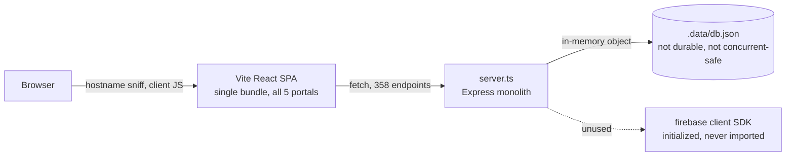
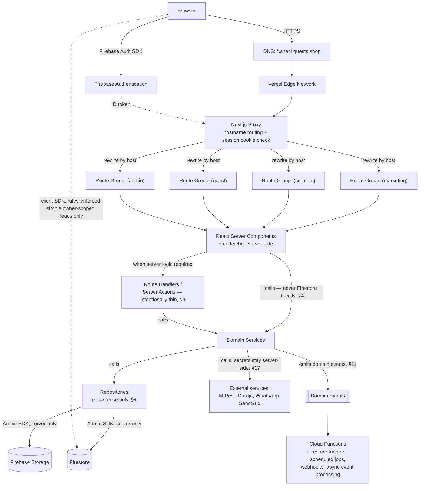
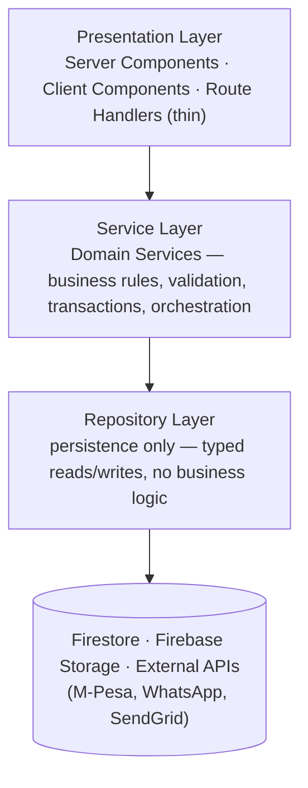
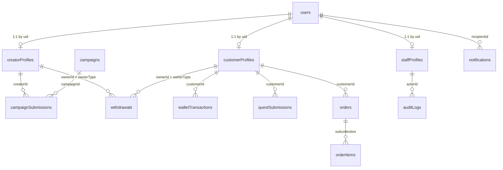

# Snack Quest — Technical Design Document

**Status:** Draft for approval. No implementation has started. This document
is the design deliverable requested after the Architecture Report,
Security Audit, and Migration Plan (all committed on
`claude/snack-quest-portal-rebuild-dtxsql`). It supersedes nothing in those
documents — it builds on them and is the authoritative target-state
blueprint they were building toward.

**How to read this document:** every section distinguishes **Current
State** (what exists today, cited from the codebase), **Target State**
(the recommended design), and where relevant, **Migration Steps**. Where
more than one reasonable approach exists, one is recommended with an
explicit justification. Anything genuinely requiring your decision — not
mine to assume — is deferred to §26, not silently resolved here.

**Revision note:** this revision incorporates a layered Service/Repository
architecture, event-driven background processing, domain-driven folder
evolution, search/feature-flag/observability/secrets/ADR strategies, and
enhanced diagrams, per an explicit request to elevate this from a
migration blueprint into a long-term architecture specification. Every
section number below reflects the reorganization this required; no prior
design decision, migration phase, or piece of reasoning was removed —
only renumbered and, where a new section's reasoning refines an earlier
one, cross-referenced.

---

## 1. Executive Summary

**Business goals.** Snack Quest is growing from a single marketing site
into a multi-sided platform connecting three audiences under one brand:
consumers who buy snack boxes and earn loyalty rewards (`quest.`),
independent creators who run paid promotional campaigns (`creators.`), and
internal staff who operate the business (`admin.`). The platform needs to
support that growth without each portal becoming a bespoke, disconnected
codebase.

**Technical goals.** Replace a single-process Express monolith with an
in-memory, non-durable data store and no real access control with a
platform built on managed, production-grade primitives — Next.js on
Vercel for hosting and routing, Firebase Authentication for identity,
Firestore for durable multi-tenant data, Firebase Storage for user-
uploaded media (campaign proof, avatars) — while preserving the UI and
product decisions already made (design system, IA, the Creator Portal
rebuild completed this session).

**Platform philosophy.** One codebase, five audiences. Each portal is a
distinct *experience* (own navigation, own layout, own trust boundary) but
not a distinct *codebase* — they share a design system, shared UI
primitives, one auth provider, and one data layer. A engineer should be
able to work in any portal without re-learning conventions.

**Scalability objectives.** Firestore's per-document access model and
Vercel's per-route serverless/edge execution both scale horizontally
without capacity planning — the current architecture's single Node
process holding all state in memory does not survive a restart, let alone
horizontal scaling. Target state removes that ceiling entirely.

**Security objectives.** Every finding in `ARCHITECTURE_REPORT.md` §4 is
addressed by construction, not by patching: no route reachable without a
verified identity where one is required, no admin action possible without
a verified role, no client able to read data it doesn't own.

**Maintainability objectives.** One data-access pattern (Firestore SDK +
rules, not 358 hand-written endpoints with inconsistent identity
assumptions), one auth system (not three), typed schemas shared between
client and server, a folder structure that scales by *adding* files in
predictable places rather than growing a single 12,600-line file, and — as
of this revision — a layered Service/Repository architecture (§4) so
business behavior lives in exactly one place per capability, not
scattered across handlers.

---

## 2. Architecture Principles

These are the principles every design decision in this document is
checked against. Where any later section appears to conflict with one of
these, the principle wins and the section should be corrected — this list
is the reason this revision's consistency pass (below) exists.

1. **Business logic belongs in Services.** A rule ("a withdrawal below
   the minimum is rejected," "a submission can't be self-approved") is
   implemented in exactly one Domain Service (§4) and nowhere else — not
   in a Route Handler, not in a Server Component, not duplicated in a
   Firestore rule beyond the shape-level validation rules can safely
   express (§9).
2. **Persistence belongs in Repositories.** The only code that imports
   the Firestore or Storage SDK is a Repository (§4). A Repository never
   decides *whether* to write, only *how* — that decision is always the
   calling Service's.
3. **Route Handlers stay thin.** A Route Handler's entire job is: verify
   auth, validate input shape, call one Service method, shape the
   response (§10). If a Route Handler contains business logic, that logic
   has leaked out of its Service and should move back.
4. **Defense in depth for security.** No single layer is trusted alone —
   client-side checks are convenience only; middleware, Services, and
   Firestore Security Rules each independently enforce authorization, so
   a bug in one layer doesn't become a breach (§7).
5. **Prefer asynchronous processing for non-user-critical work.** If a
   piece of work doesn't need to complete before the user sees a
   response — a notification, an analytics update, an audit log entry
   that isn't itself transaction-critical — it happens via a domain event
   or a scheduled job, not inline on the request path (§11).
6. **Organize by domain as the platform grows.** The migration-era
   folder structure (§13) is deliberately close to the current codebase's
   shape to make porting mechanical; the long-term structure organizes by
   business capability (creator, campaigns, wallet, orders, rewards,
   admin), not by file type, once real domain boundaries are known from
   usage rather than guessed upfront.
7. **Preserve backward compatibility during phased migration.** Every
   migration phase (§23) ships behind a feature flag (§20) and a
   DNS-level rollback path, and the old and new systems are allowed to
   run in parallel during a cutover window — nothing is a one-way door
   until its validation checklist has passed.
8. **Firestore is never accessed directly from UI code.** Server
   Components, Client Components, and Route Handlers call Services, never
   Firestore or Storage SDKs directly (principles 1-3 above). The one
   deliberate exception is a narrow set of simple, rules-enforced,
   owner-scoped reads made straight from the browser via the Firebase
   client SDK (§10) — allowed specifically because Firestore Security
   Rules (§9) enforce the same authorization there that a Service would
   otherwise enforce, and because round-tripping every trivial read
   through a Route Handler would reintroduce exactly the "everything goes
   through Express even for simple reads" pattern (53 components, in the
   current codebase) this design is moving away from. That exception
   never extends to writes with business logic behind them, or to any
   Admin-SDK-mediated access, which is server-only without exception.

---

## 3. Overall Architecture

### Current State



One Node process serves everything: it runs Vite in middleware mode for
dev/serves the static build in prod, and owns every API route directly.
Portal identity is decided *after* the JS bundle loads, client-side, by
reading `window.location.hostname` (`src/lib/domainResolver.ts`). There is
no edge/server-side gate on which portal a visitor sees, and no
server-side gate on which API calls they can make (`ARCHITECTURE_REPORT.md`
§4.1). Business logic and persistence are also fully intermingled — see
§4 for why that matters as much as the framework/hosting gap does.

### Target State

*Diagram enhanced this revision to show the Service/Repository layer
(§4) and event-driven background work (§11) — nothing from the original
diagram was removed, only the path between Server Components/Route
Handlers and Firestore/Storage/external services is now explicit about
what sits between them.*



**Request flow, authenticated page load:**
1. Browser requests `creators.snackquests.shop/dashboard`.
2. Vercel Edge routes to the Next.js deployment; `proxy.ts` runs
   first, inspects the `Host` header, and rewrites the request internally
   to `/​(creators)/dashboard` — invisible to the user, no redirect.
3. The same proxy invocation reads the Firebase session cookie (see
   §6), verifies it (cheap — signature check, no network call), and
   attaches the resolved `uid`/`role` to the request via headers for the
   downstream Server Component to read.
4. If no valid session and the route requires one, the proxy redirects to
   the portal's sign-in route before any React rendering happens — this is
   the enforcement point that doesn't exist today.
5. The Server Component for `/dashboard` calls a Domain Service (§4) —
   e.g. `CreatorDashboardService.getDashboard(uid)` — which in turn calls
   the relevant Repositories using the Firebase Admin SDK (server-side,
   trusted, bypasses security rules by design — rules exist for the
   *client* SDK) and renders HTML with data already populated — no
   client-side loading spinner for the initial paint, unlike every
   current portal's `fetchOverview()`-then-render pattern. The Server
   Component itself never imports the Firestore SDK.
6. Client-side interactivity (forms, mutations) uses the Firebase client
   SDK directly for simple, business-logic-free writes governed by
   security rules, or calls a Route Handler — itself a thin wrapper
   around a Service (§4) — for anything needing server-side validation
   (§10).

**Why this shape and not, e.g., a separate backend service per portal:**
one Next.js app with route groups keeps the "one shared design system, one
auth provider" goal achievable — a separate deployment per portal would
require its own auth wiring, its own build pipeline, and would make the
"stay logged in across portals" requirement (§6) much harder to satisfy
without inventing a cross-service session protocol from scratch.

---

## 4. Layered Architecture: Service Layer & Repository Layer

**This is the highest-priority structural addition in this revision.**
Every interaction with Firestore, Storage, or an external API in the
target architecture flows through two intermediate layers — it is never
called directly from a Server Component, a Client Component, or a thin
Route Handler:



### Current State

`server.ts` has no such separation at all — a single Express handler does
request parsing, business-rule validation, direct in-memory array
mutation, and response shaping all inline. The submission-review handler
at `server.ts:10432-10496` is a representative example: it validates the
action, mutates `campaign_submissions`, credits a customer's wallet,
writes a wallet transaction, and sends a notification, all in one
~65-line function body with no boundary between "what the rule is" and
"how it's persisted." This is precisely why the codebase's business logic
was difficult to audit this session — behavior and persistence are
inseparable, so understanding *what a withdrawal approval actually does*
required reading raw array mutations line by line rather than reading a
named, documented rule.

### Target State: three layers, one direction of dependency

**Presentation Layer** (Server Components, Client Components, and —
this is the key discipline — deliberately **thin** Route Handlers) never
talks to Firestore, Storage, or an external API directly, and never
contains a business rule. A Server Component's job is to call a Service
and render what it returns. A Route Handler's job is to verify auth,
validate input shape, call exactly one Service method, and translate the
result into an HTTP response — nothing else. If a Route Handler contains
an `if` that encodes a business rule ("a withdrawal below the minimum is
rejected"), that rule has leaked out of the Service layer and belongs
back inside it. **UI never contains business logic, and Firestore is
never accessed directly from UI code** — the one narrow exception,
covered explicitly in "Reconciling" below, is a small set of simple,
rules-enforced, owner-scoped client reads that were already part of this
document's design before this revision.

**Service Layer** owns all business behavior:
- business rules (e.g. minimum withdrawal amount, campaign eligibility)
- validation beyond schema shape (e.g. "is this creator's account in good
  standing," not just "is `amountKes` a number")
- permission orchestration beyond the coarse role check already done in
  middleware (e.g. "can *this* admin approve a withdrawal in *this*
  amount band," if tiered approval limits are ever introduced)
- transactions spanning multiple repositories (approving a submission
  touches `campaignSubmissions`, `creatorProfiles`, and `auditLogs` — the
  Service coordinates all three as one unit, calling three repositories,
  not three ad hoc Firestore writes scattered in a handler)
- workflow orchestration (e.g. a multi-step onboarding process)
- emitting domain events for asynchronous side effects (§11) rather than
  performing them inline

Representative domain services, one per business capability, not per
collection (a Service can and often does call several Repositories):

| Service | Owns |
|---|---|
| `CreatorDashboardService` | Assembling a creator's dashboard view: profile + recent submissions + recent withdrawals, applying any "how much to show" business rules |
| `CampaignService` | Campaign lifecycle: creation, activation, eligibility rules for who can submit |
| `WithdrawalService` | The withdrawal state machine (pending → approved/rejected → paid), minimum/maximum enforcement, fraud-score orchestration — the single owner that replaces the current three inconsistent withdrawal implementations (`CREATOR_PORTAL_TECH_DEBT.md` §1) |
| `WalletService` | Crediting/debiting balances, always via an atomic transaction that also writes the corresponding `walletTransactions` ledger entry — a wallet balance never changes without a paired ledger write, enforced here, not left to caller discipline |
| `OrderService` | Order creation, pricing/credit-redemption validation, status transitions |
| `NotificationService` | Composing and dispatching notifications (in-app + email + WhatsApp), the single place that decides *how* a notification reaches a user |
| `RewardsService` | Quest submission review, reward-type eligibility |
| `ReferralService` | Referral attribution, bonus qualification rules |
| `AnalyticsService` | Deriving reportable metrics (conversion rate, tier progress) from raw counters — the current client-side `calculateCreatorTier`/`conversionRate` helpers (`src/services/affiliateService.ts`, `src/components/creator/format.ts`) are exactly this kind of logic, and move here so both server-rendered and client-rendered views compute the same number the same way |

### Repository Layer: persistence only

Repositories are the *only* code in the application that imports the
Firestore/Storage SDKs directly. Their contract is narrow and mechanical:
run a query, run a write, map a Firestore document into the typed domain
model from `types/` (§8's schema). A Repository never decides *whether* a
write should happen — that's the Service's job — only *how* to perform it.

| Repository | Wraps |
|---|---|
| `CreatorRepository` | `creatorProfiles` reads/writes |
| `CampaignRepository` | `campaigns` + `campaignSubmissions` |
| `OrderRepository` | `orders` + `orders/{id}/items` |
| `WalletRepository` | `customerProfiles.walletBalanceKes` + `walletTransactions` |
| `WithdrawalRepository` | the unified `withdrawals` collection |
| `NotificationRepository` | `notifications` |

Business decisions belong in Services, never in Repositories — a
Repository method is named for what it persists (`findActiveByNiche`,
`incrementClicks`), never for a business outcome (`approveWithdrawal`
belongs to `WithdrawalService`, not `WithdrawalRepository`, even though
the Service's implementation of it calls the Repository).

### Why this separation, specifically, for this codebase

- **Maintainability.** The current single worst class of bug in this
  codebase — inconsistent identity assumptions across three separate
  withdrawal code paths — exists because "what a withdrawal is" was
  redefined independently in three places. One `WithdrawalService` makes
  that structurally impossible: there is exactly one place the state
  machine is defined.
- **Testing.** A Service can be unit-tested by mocking its Repository
  dependencies (no Firestore emulator needed for a pure business-rule
  test like "reject a withdrawal below the minimum") — directly enabling
  the unit-testing goal in §21 for logic that currently has zero tests
  anywhere in the repository. Repository-level tests run against the
  Firebase emulator and verify persistence behavior in isolation from
  business rules.
- **Future database migrations.** If Firestore is ever supplemented or
  replaced for a specific high-write-volume collection (§24's note on
  Firestore's write-rate limits becoming a bottleneck for
  `walletTransactions` at scale), only the affected Repository changes —
  every Service, Route Handler, and Server Component above it is
  unaffected, because they depend on the Repository's typed interface,
  never on Firestore's query API directly.
- **Mocking.** Server Components and Route Handlers can be developed and
  tested against an in-memory fake Repository implementing the same
  interface — useful during Phase 0/1 of the migration (§23), where a
  fake `CreatorRepository` can unblock UI work before the real Firestore
  schema is finalized.

### Reconciling with the API and data-access guidance elsewhere in this document

§10 (API Design) and §15 (State Management) describe "direct Firestore
access from the client for simple reads" as the default, to avoid
unnecessary Route Handlers. That guidance is **refined, not
contradicted**, by this section: it remains true that not every read
needs a Route Handler round-trip, but *within* whichever layer is doing
the reading, the Service/Repository discipline still applies — a Server
Component calls `CampaignService.listActive()`, which calls
`CampaignRepository.findActive()`, rather than a Server Component
importing the Firestore Admin SDK and writing a query inline. Where a
Client Component genuinely needs a direct client-SDK read (a live,
interactive view a Server Component can't serve), that read is exactly
the deliberate exception named in §2's principle 8 — it must still be
free of business logic — it's a Repository-equivalent read via
rules-enforced Firestore access, not a place to encode a rule. §10 and §15
each carry a short cross-reference note back to this section rather than
being rewritten, since the underlying design decisions in both remain
correct at the API-shape level; this section adds the layer *underneath*
them.

---

## 5. Portal Architecture

### 4.1 Marketing Website (`snackquests.shop`)

- **Purpose:** brand storytelling, product catalog, direct box orders,
  creator/customer recruitment funnels into the other two public portals.
- **Users:** anonymous visitors (Guest role), occasionally authenticated
  customers checking out.
- **Features:** landing pages, product catalog, checkout (guest or
  authenticated), "Become a Creator" / "Join Quest" CTAs linking to the
  respective subdomains.
- **Authentication:** optional. Guest checkout must remain possible —
  don't force account creation to buy a box.
- **Authorization:** none beyond guest/customer distinction.
- **Navigation:** top nav to product pages; explicit, purposeful links to
  `creators.` and `quest.` (recruitment CTAs) — the only portal that
  should link to the others by design, since its job is conversion into
  them. This is the inverse of Task 1 from the earlier audit brief (remove
  the *dev simulator*'s indiscriminate portal switcher) — a marketing CTA
  is a deliberate product decision, not leftover dev tooling.
- **Shared components:** design system primitives (`components/ui/*`),
  not portal-specific ones.
- **Protected routes:** none, except an authenticated "My Orders" view for
  logged-in customers.
- **Data ownership:** reads `products`, `campaigns` (public campaign
  teasers, if any go public), writes `orders` (via Route Handler → the
  new `OrderService`, §4 — not direct Firestore, since payment needs
  server-side validation).
- **Future expansion:** blog/content marketing, affiliate landing pages
  per creator (`snackquests.shop/?ref=CODE`, already a pattern in the
  current referral-link format — preserve it).

### 4.2 Creator Portal (`creators.snackquests.shop`)

- **Purpose:** the platform already rebuilt this session — earnings,
  campaigns, referrals, payouts for independent creators running paid
  promotions.
- **Users:** authenticated creators (role `creator`).
- **Features:** dashboard, campaign browse + submit deliverable, content
  (submission history), analytics, referrals, earnings, payments
  (withdrawal), achievements/tier, resources, profile, support. (This is
  the actual, current IA from `src/components/creator/nav.ts` — preserved
  as-is; it was product-designed this session and nothing here changes
  it.)
- **Authentication:** Firebase email/password, required for every route
  except the sign-up/sign-in screens themselves.
- **Authorization:** `role: 'creator'` custom claim required; a document
  at `creatorProfiles/{uid}` must exist (created automatically at sign-up,
  §8).
- **Navigation:** the IA above (which tabs exist, how they're grouped)
  carries forward as a product decision; the `CreatorShell` nav
  *component* itself is redesigned per ADR-0000, not ported as-is.
- **Shared components:** `components/ui/*` primitives from Phase 0
  (`StatCard`, `FormField`, `PillTabs`, `Modal`, `StatusBadge`,
  `EmptyState`, `ErrorState`, `DataTable`) are the starting foundation —
  evolved as needed while building this portal's screens, not treated as
  fixed (§14, ADR-0000).
- **Protected routes:** all of them. The proxy redirects unauthenticated
  visitors to `/sign-in`.
- **Data ownership:** owns `creatorProfiles/{uid}`, writes
  `campaignSubmissions` (own only, via `CampaignService`), reads
  `campaigns` (public, all active), reads/writes `withdrawals` (own only,
  create-only from client — status transitions are server-authorized via
  `WithdrawalService`, §4, §10).
- **Future expansion:** direct messaging with brand/campaign managers,
  content calendar, multi-platform analytics integration (currently
  self-reported clicks/conversions).

### 4.3 Customer Portal (`quest.snackquests.shop`)

- **Purpose:** loyalty/rewards hub for snack-box customers — earn Quest
  Credits via quests (social proof submissions, referrals), redeem them
  toward orders.
- **Users:** authenticated customers (role `customer`). Note: today this
  portal has *no real authentication at all* — a fabricated object written
  to `localStorage`. This is the portal with the largest authentication
  gap to close.
- **Features:** quest browsing/submission, wallet (Quest Credits ledger),
  redemption, referral program, order history, profile.
- **Authentication:** Firebase email/password recommended as the primary
  method (see §26 — phone auth is a genuinely open question given the
  current WhatsApp-OTP UX).
- **Authorization:** `role: 'customer'` claim. A customer who later joins
  the creator program holds *both* `customer` and `creator` claims (see
  §7 on multi-role handling) rather than being forced into a new account.
- **Navigation:** existing bottom-nav-first mobile layout
  (`MobileBottomBar`, `MobileHeader`, `MobileDrawerMenu`) — preserved.
- **Shared components:** `common/*` primitives, once the quest-center
  screens are brought onto the same shared library the Creator Portal
  already uses (`ARCHITECTURE_REPORT.md` notes quest-center currently
  duplicates its own empty-states/status-pills independently — this is
  the natural point to converge them).
- **Protected routes:** all except quest browsing (public quest catalog
  can be viewable logged-out as a conversion funnel, matching the
  marketing site's recruitment role).
- **Data ownership:** owns `customerProfiles/{uid}`, `walletTransactions`
  (append-only, written only by `WalletService` — never client-writable,
  since it's a financial ledger), writes `questSubmissions` (own only, via
  `RewardsService`).
- **Future expansion:** subscription management, richer order tracking,
  push notifications.

### 4.4 Admin Portal (`admin.snackquests.shop`)

- **Purpose:** internal operations — CRM, orders, inventory, accounting,
  campaign moderation, withdrawal approval, staff/role management,
  monitoring, reporting, audit logs. This is the largest surface area by
  endpoint count (§2 of `MIGRATION_PLAN.md`: the bulk of 358 endpoints are
  admin-only).
- **Users:** staff, roles `admin` and `super_admin`.
- **Features:** unchanged in scope from the current `AdminOSPortal` — CRM,
  orders, inventory, deliveries, accounting, rewards governance, wallet
  management, referral fraud review, marketing/campaigns, system health,
  reporting, settings, audit logs, staff/RBAC management, integrations.
- **Authentication:** Firebase email/password. **No public sign-up path,
  ever** — admin accounts are created only by an existing `super_admin`
  via an authenticated admin-only Cloud Function or Route Handler that
  sets the custom claim server-side. This directly closes the current
  "no password check, demo-user fallback" finding.
- **Authorization:** `role: 'admin'` or `'super_admin'`. Fine-grained
  permissions (approve refunds, adjust wallets, manage staff) are modeled
  as an explicit permission matrix per the existing `RoleManager.tsx`
  concept (`staff_users`/`roles` collections already exist conceptually in
  `ARCHITECTURAL_BLUEPRINT.md` §7) — ported to Firestore custom
  permission documents, checked server-side, not just in the UI.
- **Navigation:** existing `Sidebar`/`TopBar` layout — preserved.
- **Protected routes:** every route, with per-screen permission checks on
  top of the base role check (e.g. `finance_manager` role can view
  accounting but not modify staff roles).
- **Data ownership:** the only portal with broad read access — admins can
  read across `creatorProfiles`, `customerProfiles`, `orders`, `campaigns`,
  `withdrawals`, `auditLogs`. All admin *writes* to another user's data
  are themselves logged to `auditLogs` (§8, §10 — every such write goes
  through a Service method, and every Service method that mutates another
  user's data emits the corresponding audit entry as part of its
  transaction, §4).
- **Future expansion:** more granular permission scopes, SSO for staff
  (Google Workspace via Firebase's Google provider, restricted to the
  company domain) instead of password accounts.

### 4.5 API Gateway (`api.snackquests.shop`)

- **Purpose:** per the current `ApiGatewayPortal.tsx`, primarily
  documentation/status (Swagger UI, health checks) rather than a distinct
  functional surface — the actual APIs are Next.js Route Handlers served
  from the same deployment, reachable at this hostname by convention.
- **Users:** developers/integrators, internal tooling.
- **Authentication:** API-key based for external integrations (the
  existing `authenticateApiKey` middleware pattern is sound and can be
  ported), Firebase session for internal same-origin calls.
- **Data ownership:** none directly — it's a routing/documentation
  surface over the same Firestore-backed APIs the other portals use.
- **Future expansion:** public API for third-party integrations (e.g. a
  creator's own analytics tooling), which would need its own rate-limited,
  scoped API-key system distinct from portal session auth.

---

## 6. Authentication Design

### Current State (from `ARCHITECTURE_REPORT.md` §4, restated for context)

Three uncoordinated schemes, none of which are Firebase: creator
register/OTP/login/magic-link against an in-memory array with **no
password verification**, an admin login that accepts **any email with no
password check at all**, and a customer "session" that's a fabricated
`localStorage` object with no server round-trip.

### Target State

**Provider: Firebase Authentication**, email/password as the primary
method for all authenticated roles (creator, customer, admin,
super_admin), for reasons detailed in §6.9.

**Supported login methods.**
- Email + password (all roles) — Firebase's built-in provider, including
  its own password strength/leaked-password protections.
- Google Sign-In (optional, recommended for customers/creators as a
  lower-friction option; explicitly *not* offered on the admin portal's
  sign-in screen — staff accounts should only ever be provisioned by a
  super admin, never self-service via any provider).
- Phone/SMS auth: **open question**, see §26 — the current product uses
  WhatsApp OTP, which Firebase does not natively support.

**Email verification.** `sendEmailVerification()` on sign-up; gate
sensitive actions (first withdrawal, campaign submission) behind
`user.emailVerified`, but don't block basic browsing — matches the
current product's low-friction philosophy (`ARCHITECTURAL_BLUEPRINT.md`
explicitly favors "low-friction quest completion" over aggressive gating).

**Password reset.** `sendPasswordResetEmail()`, with a custom action
handler page per portal (`/auth/reset-password`) rather than Firebase's
default hosted page, so the reset flow stays on-brand and on-domain.

**Session persistence & cookie strategy.** This is the most consequential
decision in this section, so it's justified in full:

Firebase's client SDK issues short-lived ID tokens (1 hour) refreshed
automatically in the browser via `onIdTokenChanged` — sufficient for
*client-side* auth state, but useless for server-side rendering and
middleware, which need to know who's asking *before* any client JS runs.
The recommended pattern (Firebase's own documented approach for SSR
frameworks) is:

1. On sign-in, the client SDK obtains an ID token.
2. The client calls a Route Handler (`POST /api/auth/session`) that uses
   the **Firebase Admin SDK** to exchange that ID token for a **session
   cookie** (`createSessionCookie`, default 2-week expiry, revocable).
3. That cookie is set `httpOnly`, `secure`, `sameSite=lax`, **domain
   `.snackquests.shop`** — the leading dot is what makes it visible to
   every subdomain (`creators.`, `quest.`, `admin.`, `www.`/apex).
4. `proxy.ts` verifies this cookie on every request using the Admin
   SDK's `verifySessionCookie` (cheap, no per-request Firestore read —
   it's a signature/expiry check against Firebase's public keys) and
   attaches `uid`/decoded claims for Server Components to consume.
5. Sign-out clears the cookie (`POST /api/auth/session` `DELETE`) and
   calls `revokeRefreshTokens` server-side so the cookie can't be replayed
   even if captured before expiry.

**Why session cookies over "just check the ID token client-side and hide
UI conditionally"** (the naive alternative, and roughly what the *current*
app does with role checks): that approach cannot protect a route before
the page's JavaScript runs, which is exactly the current gap —
`ARCHITECTURE_REPORT.md` §4 finding 1 (every admin API reachable with zero
auth) exists *because* enforcement was left to client-side checks alone.
Session cookies verified in middleware close that gap by construction.

**Cross-subdomain sessions.** Yes — this is the direct payoff of the
domain-scoped cookie above. A creator signed in at `creators.` who
navigates to `snackquests.shop` (e.g. clicking through to buy a box) is
still recognized, because the cookie is sent with every request to any
`*.snackquests.shop` origin. **Important nuance:** being *recognized* does
not mean being *authorized* for every portal — a customer's session cookie
proves their identity everywhere, but the `admin` route group's middleware
still separately checks for the `admin`/`super_admin` claim before
granting access. Recognition (who are you) and authorization (what can you
do here) are deliberately separate checks (§7).

**Role resolution.** Firebase custom claims (`role`, or for multi-role
users an array — see §7) are embedded directly in the ID token/session
cookie, so middleware can authorize a request **without a Firestore read
on every single page load** — this matters at scale; reading Firestore in
middleware on every request would add latency and cost to every single
navigation. Claims are set server-side only, via the Admin SDK, in
response to a deliberate action (sign-up → default role; admin promotion
→ role change) — never client-writable.

**Token refresh.** Handled transparently by the Firebase client SDK for
client-side state; the session cookie itself is refreshed by re-running
step 2 above periodically (e.g. on each sign-in, or via a silent
background refresh before the 2-week expiry) — standard pattern, not
custom logic to build.

**Logout.** Client SDK `signOut()` + the session-cookie-clearing Route
Handler above, from any portal — since the cookie is domain-wide, signing
out from one portal signs out of all of them, which is the expected UX
for one identity across five surfaces.

**5.9 Why Firebase over the existing custom authentication.**
Not "because Firebase is more modern" — three concrete, current, verified
reasons:
1. **The current system has no real credential verification** — passwords
   aren't checked (creator or admin login), and OTP has a universal
   bypass code (`ARCHITECTURE_REPORT.md` §4, findings 2–4). Building this
   correctly from scratch (password hashing, rate-limited brute-force
   protection, leaked-password detection, secure token issuance) is
   exactly what an auth provider exists to avoid re-implementing.
2. **Three separate, inconsistent identity models today** (`creator_accounts`
   vs `customers` vs a JWT issued from either) already cause a documented
   production bug — withdrawals silently misattributed
   (`CREATOR_PORTAL_TECH_DEBT.md` §1). A single Firebase Auth `uid` as the
   one identity primitive across all portals removes that class of bug
   structurally.
3. **Cross-subdomain session sharing** (a stated goal, §8 of the original
   audit brief) has no current equivalent to extend — building it custom
   means implementing your own signed-cookie issuance, rotation, and
   revocation, which is precisely Firebase session cookies' job.

---

## 7. Authorization Design

### Roles & permissions

| Role | Can do | Cannot do |
|---|---|---|
| **Guest** | Browse marketing site, browse public quest/campaign catalogs, guest checkout | Access any portal dashboard, read any user's private data |
| **Customer** | Manage own profile, submit quests, view/redeem own wallet, view own orders, refer friends | Read other customers' data, access creator/admin portals |
| **Creator** | Manage own creator profile, browse/submit campaigns, view own earnings/withdrawals, edit own onboarding data | Read other creators' data, approve their own submissions, access admin portal |
| **Admin** | Read/write across operational collections (orders, inventory, campaigns, submissions, withdrawals — approve/reject), manage customers/creators | Manage staff roles/permissions (super admin only), delete audit logs |
| **Super Admin** | Everything Admin can, plus: create/modify staff accounts and roles, modify Firestore-level configuration, view full audit trail | — |

**Multi-role users.** A customer who joins the creator program is not a
new identity — same `uid`, an added `creator` claim/role entry, and a new
`creatorProfiles/{uid}` document alongside their existing
`customerProfiles/{uid}`. Portal access is evaluated per the route
group's required role, independent of what other roles the same user
holds.

### Enforcement layers (defense in depth — not redundant, each layer catches what the one before it can't)

1. **Client (UI):** hide/disable actions the user's role doesn't permit.
   *Convenience only — never trust this layer alone,* which is precisely
   the current system's mistake.
2. **Proxy:** the first real gate. Verifies the session cookie,
   checks the route group's required role before any Server Component
   runs, redirects to sign-in or a `/unauthorized` page otherwise.
3. **Server (Services, called from Route Handlers / Server Actions):**
   re-check role and, for owner-scoped resources, re-check ownership
   (`resource.creatorId === session.uid`) before performing the mutation
   — middleware protects *route access*, the Service layer (§4) protects
   *the specific operation*, since a valid creator session shouldn't be
   able to write to another creator's document just because it hit an
   endpoint successfully. This check belongs in the Service, not the
   Route Handler, so it applies uniformly regardless of which Route
   Handler (or future caller — a Cloud Function, a scheduled job) invokes
   the same Service method.
4. **Firestore Security Rules:** the last, non-bypassable layer for any
   *direct* client SDK access (reads especially). Even if every layer
   above had a bug, rules are evaluated by Firestore itself on every
   request and cannot be skipped by a compromised or modified client.
   This is why §9's rules are written to be correct on their own, not
   merely "backup" to the API layer.

**Why four layers instead of "just do it in the API":** because a
meaningful share of reads in this design (§10) go directly from the
client to Firestore, bypassing the API layer entirely for performance —
those reads have *no* protection except rules. Skipping rules design
because "the API checks it" is exactly how you'd reintroduce the current
system's open-admin-endpoints problem in a new form.

---

## 8. Firestore Data Model

### Design principles applied throughout
- **One identity, `uid`-keyed.** Every profile document's ID is the
  Firebase Auth `uid` — no separate internal ID scheme to keep in sync
  (this directly fixes the `creator_accounts` vs `db.creators` vs
  `customers` fragmentation documented in `ARCHITECTURE_REPORT.md`).
- **Audit fields on every document:** `createdAt`, `updatedAt` (server
  timestamps, never client-supplied), `createdBy`, `updatedBy` (`uid` of
  the actor — `'system'` for automated writes).
- **Soft delete:** `deletedAt: Timestamp | null`. Nothing is hard-deleted
  by client action; queries filter `where('deletedAt', '==', null)`. Hard
  deletion (GDPR-style erasure requests) is a separate, explicit
  super-admin-only Cloud Function, not a default UI action.
- **Schema versioning:** `schemaVersion: number` on documents whose shape
  is likely to evolve (profiles, campaigns) so future migrations can
  branch on it instead of guessing.
- **Avoid duplication, accept some denormalization deliberately:** e.g.
  `campaignSubmissions.campaignTitle` is denormalized from `campaigns` at
  write time (matches the current system's actual behavior,
  `server.ts:10402`) because campaign titles change rarely and it avoids
  an extra read on every submission list render — a deliberate,
  documented trade-off, not accidental duplication.

### Collections



| Collection | Purpose | Key fields |
|---|---|---|
| `users/{uid}` | Identity root, shared by all roles | `email`, `roles: string[]`, `displayName`, `photoURL`, `phoneNumber?`, audit fields |
| `creatorProfiles/{uid}` | Creator-specific business data | `referralCode`, `tier`, `availableCashKes`, `pendingEarningsKes`, `lifetimeEarningsKes`, `totalClicks`, `totalConversions`, `bio`, `niche`, `followersRange`, `paymentPreference`, `socialHandles`, `onboardingCompleted`, `status` |
| `customerProfiles/{uid}` | Customer-specific business data | `walletBalanceKes`, `lifetimeCreditsEarnedKes`, `referralCode`, `county`, `deliveryAddress`, `favouriteCategories`, `dietaryPreferences` |
| `staffProfiles/{uid}` | Staff-specific data | `role` (`admin`/`super_admin`), `permissions: string[]`, `department` |
| `campaigns/{campaignId}` | Brand campaigns creators can join | `title`, `status`, `commissionRateKes`, `rules`, `assetsUrl`, `deadline`, `targetNiche`, `createdBy` (staff uid) |
| `campaignSubmissions/{submissionId}` | Creator deliverable proof | `campaignId`, `campaignTitle` (denormalized), `creatorId`, `submissionType`, `fileUrl` (Storage path), `socialLink`, `notes`, `status`, `adminFeedback`, `reviewedBy`, `reviewedAt` |
| `withdrawals/{withdrawalId}` | **Unified** payout requests — replaces the current three competing implementations | `ownerId`, `ownerType` (`'creator'\|'customer'`), `amountKes`, `phoneNumber`, `status`, `fraudScore`, `auditTrail: []`, approval fields |
| `walletTransactions/{transactionId}` | Append-only customer credit ledger | `customerId`, `amount`, `balanceAfter`, `transactionType`, `note`, immutable once written |
| `orders/{orderId}` | Snack box orders | `customerId`, `packageId`, `totalAmountKes`, `creditsUsedKes`, `status`, `deliveryAddress` |
| `orders/{orderId}/items/{itemId}` | Subcollection — order line items | `snackId`, `quantity`, `unitCostKes` |
| `questSubmissions/{submissionId}` | Customer quest proof (parallel structure to `campaignSubmissions` — same review workflow, different audience) | `customerId`, `questId`, `proofUrl`, `status` |
| `notifications/{notificationId}` | **Scoped**, unlike the current unreadable-at-scale log | `recipientId`, `recipientType`, `channel`, `templateCode`, `payload`, `read: boolean`, `createdAt` — indexed on `recipientId` so a user can only ever query their own |
| `auditLogs/{logId}` | Immutable staff-action trail | `actorId`, `action`, `entityType`, `entityId`, `before`, `after`, `ipAddress`, `createdAt` — write-only from server, never updated or deleted |

**Indexes** (composite, beyond Firestore's automatic single-field
indexes): `campaignSubmissions` on `(creatorId, status)` and
`(campaignId, status)`; `withdrawals` on `(ownerId, status)`;
`notifications` on `(recipientId, read, createdAt desc)`;
`auditLogs` on `(entityType, entityId, createdAt desc)`. Exact index
definitions belong in `firestore.indexes.json`, generated iteratively as
real queries are written (Firestore's own tooling suggests missing
indexes at query time in development) rather than speculatively defined
now.

**Why `withdrawals` is unified instead of split by owner type:** the
current system's single worst, most concrete bug
(`CREATOR_PORTAL_TECH_DEBT.md` §1) exists *because* withdrawal logic is
split across three inconsistent implementations. One collection, one
status state machine, one `WithdrawalService` (§4), one admin approval UI
— this is the direct fix, not a stylistic preference.

---

## 9. Security Rules

Design principle: **deny by default, grant explicitly**. Every rule below
is additive to an implicit `allow read, write: if false;` base.

```javascript
rules_version = '2';
service cloud.firestore {
  match /databases/{database}/documents {

    function isSignedIn() {
      return request.auth != null;
    }
    function hasRole(role) {
      return isSignedIn() && role in request.auth.token.roles;
    }
    function isAdmin() {
      return hasRole('admin') || hasRole('super_admin');
    }
    function isOwner(uid) {
      return isSignedIn() && request.auth.uid == uid;
    }
    function isNotDeleted() {
      return resource.data.deletedAt == null;
    }

    match /users/{uid} {
      allow read: if isOwner(uid) || isAdmin();
      allow create: if isOwner(uid); // triggered at sign-up, uid must match auth
      allow update: if isOwner(uid) || isAdmin();
      allow delete: if false; // soft delete only, via server
    }

    match /creatorProfiles/{uid} {
      allow read: if isOwner(uid) || isAdmin();
      allow create: if false; // server-created at sign-up (see §8 automation)
      allow update: if (isOwner(uid) &&
                          // creators may edit their own profile fields,
                          // but never the financial fields directly
                          !request.resource.data.diff(resource.data)
                            .affectedKeys()
                            .hasAny(['availableCashKes','pendingEarningsKes',
                                     'lifetimeEarningsKes','status'])) || isAdmin();
      allow delete: if false;
    }

    match /customerProfiles/{uid} {
      allow read: if isOwner(uid) || isAdmin();
      allow update: if (isOwner(uid) &&
                          !request.resource.data.diff(resource.data)
                            .affectedKeys()
                            .hasAny(['walletBalanceKes','lifetimeCreditsEarnedKes'])) || isAdmin();
      allow create, delete: if false;
    }

    match /staffProfiles/{uid} {
      allow read: if isOwner(uid) || isAdmin();
      allow write: if hasRole('super_admin'); // only super admins manage staff
    }

    match /campaigns/{campaignId} {
      allow read: if isSignedIn() && resource.data.status == 'active' || isAdmin();
      allow write: if isAdmin();
    }

    match /campaignSubmissions/{submissionId} {
      allow read: if isAdmin() ||
                     (hasRole('creator') && resource.data.creatorId == request.auth.uid);
      allow create: if hasRole('creator') &&
                       request.resource.data.creatorId == request.auth.uid &&
                       request.resource.data.status == 'pending'; // cannot self-approve
      allow update: if isAdmin(); // status transitions are admin/server-only
      allow delete: if false;
    }

    match /withdrawals/{withdrawalId} {
      allow read: if isAdmin() ||
                     (isSignedIn() && resource.data.ownerId == request.auth.uid);
      allow create: if isSignedIn() &&
                       request.resource.data.ownerId == request.auth.uid &&
                       request.resource.data.status == 'pending';
      allow update: if isAdmin(); // approve/reject/pay is admin/server-only
      allow delete: if false;
    }

    match /walletTransactions/{transactionId} {
      allow read: if isAdmin() ||
                     (isSignedIn() && resource.data.customerId == request.auth.uid);
      allow write: if false; // ledger is server/Cloud-Function-written only, ever
    }

    match /orders/{orderId} {
      allow read: if isAdmin() ||
                     (isSignedIn() && resource.data.customerId == request.auth.uid);
      allow create: if false; // orders created via Route Handler (payment validation)
      allow update: if isAdmin();

      match /items/{itemId} {
        allow read: if isAdmin() ||
                       (isSignedIn() &&
                        get(/databases/$(database)/documents/orders/$(orderId)).data.customerId == request.auth.uid);
        allow write: if false;
      }
    }

    match /questSubmissions/{submissionId} {
      allow read: if isAdmin() ||
                     (hasRole('customer') && resource.data.customerId == request.auth.uid);
      allow create: if hasRole('customer') &&
                       request.resource.data.customerId == request.auth.uid &&
                       request.resource.data.status == 'pending';
      allow update: if isAdmin();
      allow delete: if false;
    }

    match /notifications/{notificationId} {
      allow read: if isAdmin() ||
                     (isSignedIn() && resource.data.recipientId == request.auth.uid);
      allow update: if isSignedIn() &&
                       resource.data.recipientId == request.auth.uid &&
                       request.resource.data.diff(resource.data).affectedKeys().hasOnly(['read']);
      allow create, delete: if false; // server-written only
    }

    match /auditLogs/{logId} {
      allow read: if isAdmin();
      allow write: if false; // Cloud Function / Admin SDK only, immutable
    }
  }
}
```

**Explaining the model in the terms the brief asked for:**
- *Read permissions:* owner-or-admin for anything personal; role-scoped
  public read for `campaigns` (active campaigns are visible to any signed-
  in creator); nothing is ever world-readable to `Guest`.
- *Write permissions:* creation is often allowed directly from the client
  (submissions, withdrawal requests) because the *shape* of a valid
  creation is easy to express in rules (`status == 'pending'`, `ownerId ==
  auth.uid`); status *transitions* (approve, reject, pay out) are always
  admin/server-only, routed through the corresponding Service (§4),
  because they involve business logic (crediting a wallet, running fraud
  checks) that rules can't and shouldn't express.
- *Role enforcement:* entirely via custom claims on the token
  (`request.auth.token.roles`), never via a Firestore read inside a rule
  for the *caller's own* role (a rule *reading another document* to check
  ownership, like the `orders/items` example, is fine and sometimes
  necessary — reading the token's own claims is free, reading another
  document costs a "get" against your Firestore quota).
- *Owner validation:* uniformly `resource.data.<ownerField> ==
  request.auth.uid`, checked on both read and create.
- *Field-level validation:* the `diff().affectedKeys()` pattern on
  `creatorProfiles`/`customerProfiles` above is what prevents a creator
  from directly writing to their own `availableCashKes` field even though
  they can write to their own document — this is the rules-level version
  of "never trust the client with financial fields."

---

## 10. API Design

*Note (added this revision): every Route Handler in this section is a
thin wrapper described precisely by §4 — it verifies auth, validates
input shape, calls one Service method, and shapes the response. It never
imports the Firestore SDK itself. None of the "why not the client SDK"
justifications below change; what changes is that the Route Handler's own
body now delegates to a Service rather than containing any data-access
code directly.*

**Principle:** default to the deliberate exception named in §2, principle
8 — the **Firebase client SDK in the browser**, governed by Firestore
Security Rules (§9) — for reads and simple owner-scoped creates. This is
the *only* place in the architecture where UI code touches Firestore
directly; Server Components and Route Handlers never do (§2, §4). Reach
for a Route Handler (→ Service, §4) instead of a client-SDK call only
when one of these is true: the operation needs a multi-document
transaction, needs a secret (payment provider, WhatsApp, email), needs
server-computed derived data, or needs to bypass what rules can safely
express (role changes, financial state transitions).

| API | Purpose | Auth | Why not the client SDK |
|---|---|---|---|
| `POST /api/auth/session` | Exchange ID token for session cookie | ID token in body | Requires Admin SDK, can't run client-side |
| `DELETE /api/auth/session` | Sign out (clear + revoke cookie) | Session cookie | Same |
| `POST /api/campaigns/[id]/submissions/[subId]/review` | Approve/reject a submission, credit creator wallet | Admin session | Multi-document transaction (submission status + `creatorProfiles.pendingEarningsKes` + `auditLogs`), owned by `CampaignService`/`WalletService` (§4) — exactly the pattern `server.ts:10448-10476` already does, ported |
| `POST /api/withdrawals/[id]/decision` | Approve/reject/mark-paid a withdrawal | Admin session | Same — status transition + balance mutation must be atomic, owned by `WithdrawalService` |
| `POST /api/payments/mpesa/stk-push` | Initiate STK push for an order | Customer session | Calls Daraja API with server-held secrets, via `OrderService` |
| `POST /api/webhooks/mpesa/callback` | Daraja payment confirmation | Daraja signature verification (not user session) | External webhook, no user context |
| `POST /api/webhooks/whatsapp` | Inbound WhatsApp events (if kept) | Provider signature | Same |
| `POST /api/admin/staff` | Create/update a staff account + role | Super admin session | Sets custom claims via Admin SDK — cannot be done client-side, ever |
| `POST /api/orders` | Create an order (guest or customer) | Optional session | Payment/pricing validation must not trust client-supplied totals |
| `GET /api/reports/[type]/export` | CSV/XLSX export for admin reporting | Admin session | Aggregation across many documents cheaper server-side than N client reads |
| `POST /api/notifications/send` | Server-originated notification (order status, campaign review outcome) | Internal only (called from other Route Handlers/Functions, not directly by users) | Writes `notifications` on behalf of another user — client can never do this; owned by `NotificationService` |

**Every API,** regardless of table row above, follows the same shape:
- **Auth:** verify the session cookie server-side (middleware already did
  this for the route, but a Route Handler re-verifies independently —
  never trust that middleware ran, defense in depth per §7).
- **Input validation:** a schema (Zod recommended) validated before any
  business logic runs; reject with `400` and a field-level error list on
  failure — replaces the current codebase's inconsistent ad hoc
  `if (!field) return res.status(400)` checks scattered per-handler.
- **Rate limiting:** the existing `sensitiveRateLimiter`/`globalRateLimiter`
  concept (`src/api/middleware/rateLimiter.ts`) is sound and ports
  directly — apply per-IP and per-uid limits on sensitive endpoints
  (withdrawal creation, submission creation, sign-in attempts).
- **Response format:** a consistent envelope, `{ data }` on success,
  `{ error: { code, message, fields? } }` on failure — matches the
  existing `sendSuccess`/`sendError` convention already established in
  `src/api/utils/response.ts`, worth keeping rather than inventing a new
  shape.
- **Error handling:** no unhandled exception should ever produce a raw
  500 with a stack trace to the client; every handler wrapped in a
  consistent error boundary (ported from `src/api/middleware/errorHandler.ts`'s
  existing pattern).

**Avoiding unnecessary APIs — the explicit "no" list:** profile reads,
campaign browsing, submission history, withdrawal history, notification
lists — none of these need a Route Handler. They're read straight from
Firestore by the browser's Firebase client SDK, with Firestore Security
Rules (§9) as the only enforcement — the §2/§4 client-SDK exception, not
a Route Handler or Service call. The current system round-trips
everything through Express even for simple reads (53 components with
inline `fetch()` calls); that's the pattern this design deliberately
avoids repeating.

---

## 11. Event-Driven Architecture & Background Jobs

### 10.1 Why: keep the request path fast

Every mutation a Service performs (§4) has two kinds of consequences:
the change itself (which must complete before the API responds — a
withdrawal *is* approved or it isn't) and side effects that don't need
to block the response (send a notification, log an audit entry someone
might read later, recompute a leaderboard). The current system conflates
these: `server.ts:10471-10476`'s submission-approval handler calls
`notifyCreator()` synchronously, inline, before responding — meaning a
slow or failing notification dispatch (WhatsApp, email) directly slows
down or can fail the admin's approval action, which has nothing to do
with whether the notification succeeds.

**Target state:** a Service completes the synchronous, consistency-
critical part of a mutation (via its Repository, in a transaction where
needed) and then emits a **domain event**. The request returns as soon as
that synchronous part is durable. Everything else — notification
dispatch, analytics, email, audit logging that isn't itself
transaction-critical, achievement recalculation, referral bonus
processing — happens asynchronously, triggered by that event.

### 10.2 Representative events

| Event | Emitted by | Typical async consumers |
|---|---|---|
| `WithdrawalApproved` | `WithdrawalService` | Notification (WhatsApp/email), audit log, payout-reconciliation job |
| `CampaignSubmissionReviewed` | `CampaignService` | Notification to creator, `AnalyticsService` conversion tracking |
| `OrderPaid` | `OrderService` (from the M-Pesa callback Route Handler) | Notification, fulfillment queue entry, `AnalyticsService` revenue tracking |
| `QuestCompleted` | `RewardsService` | Wallet credit (via `WalletService`), notification, achievement recalculation |
| `RewardRedeemed` | `WalletService` | Notification, order linkage |

### 10.3 Mechanism: Firestore triggers, not a custom queue

Firebase Cloud Functions' Firestore triggers (`onDocumentCreated`/
`onDocumentUpdated`) are the event bus — a Service's Repository write
(e.g. `withdrawals/{id}` transitioning to `status: 'approved'`) is itself
the event; a Cloud Function triggered on that write performs the async
consumers' work. This avoids standing up a separate message queue for a
platform at this scale, while still fully decoupling the synchronous
mutation from its side effects. If event volume or fan-out complexity
ever outgrows Firestore triggers, a dedicated queue (Cloud Tasks) is the
natural next step — not needed for the phases in §23.

### 10.4 Background jobs: synchronous request path vs. asynchronous work

Beyond event-triggered work, some jobs run on a schedule rather than in
response to a specific mutation:

| Background job | Trigger | Why it must not be synchronous |
|---|---|---|
| Email delivery | Event-triggered (§11.2) | Third-party API latency (SendGrid) must never block a user-facing response |
| WhatsApp notification dispatch | Event-triggered | Same — the current inline `notifyCreator()` call is exactly the anti-pattern this design removes |
| Referral bonus processing | Event-triggered (`OrderPaid`, `QuestCompleted`) | May involve multiple document reads/writes (referrer lookup, bonus calculation) unrelated to the triggering request's own response |
| Analytics aggregation | Scheduled (e.g. hourly) | Aggregating across many documents is intentionally decoupled from any single request |
| Leaderboard updates | Scheduled | Same — a leaderboard is a derived, eventually-consistent view, not something every write should recompute inline |
| Scheduled payout reconciliation | Scheduled (e.g. daily) | Matching M-Pesa settlement records against `withdrawals` is a batch operation, not a per-request one |
| Stale campaign cleanup | Scheduled | Marking expired campaigns inactive doesn't need to happen the instant a deadline passes |

**Principle:** if a piece of work doesn't need to complete before the
user sees a response, it doesn't run on the request path — this is the
direct implementation of the Cloud Functions scoping already stated in
§3's target-state diagram and §16's "only where necessary" guidance:
Cloud Functions here are used for exactly the four purposes listed there
(Firestore triggers, scheduled jobs, external webhooks, asynchronous
event processing) and nothing else — never as a substitute for a Route
Handler on the synchronous path, which would reintroduce Cloud
Functions' cold-start latency where it isn't needed.

---

## 12. Routing Strategy

> **Naming note:** Next.js 16 renamed Middleware to Proxy (`middleware.ts`
> → `proxy.ts`, `middleware()` → `proxy()`); functionality is unchanged.
> This document uses "Proxy" throughout to match the scaffolded project's
> actual Next.js 16 dependency.

**App Router, route groups per portal**, not per-path prefixes — the
groups (`(marketing)`, `(creators)`, `(quest)`, `(admin)`) exist purely to
organize layouts and don't appear in the URL. Hostname, not path, decides
which group serves a request:

```
app/
  (marketing)/layout.tsx    → snackquests.shop/*
  (creators)/layout.tsx     → creators.snackquests.shop/*
  (quest)/layout.tsx        → quest.snackquests.shop/*
  (admin)/layout.tsx        → admin.snackquests.shop/*
```

**Proxy** (`proxy.ts`) does the hostname → route-group mapping
via `NextResponse.rewrite()`, e.g. a request to
`creators.snackquests.shop/dashboard` is rewritten internally to
`/creators-portal/dashboard` where `app/creators-portal/` is the actual
directory backing the `(creators)` group (Next.js requires a real path
segment for the rewrite target even though route groups themselves don't
add one — the group parentheses are for co-location/layout sharing, the
actual rewrite target is a conventional folder). This is the same
pattern several documented Vercel multi-tenant reference implementations
use.

**Layouts.** Each route group has its own `layout.tsx` defining that
portal's shell (top nav / bottom nav / sidebar as appropriate — matching
§5's per-portal navigation) and wraps children in the shared providers
(auth context, toast provider) from `components/providers/`.

**Parallel routes:** not needed for v1. The current product has no
requirement (like a modal-over-page pattern needing independent loading
states) that justifies the added complexity — noting it as available if a
future feature (e.g. a slide-over detail panel with its own URL) needs it.

**Hostname/subdomain routing:** handled entirely in the proxy as
described above; local development uses the existing `?portal=` query
param override pattern (already implemented in `domainResolver.ts`) as a
*Next.js proxy* check instead of a client-side one — same developer
ergonomics, moved to the correct layer.

**404 handling:** a `not-found.tsx` per route group, styled consistently
with that portal's shell (an admin 404 shouldn't look like the marketing
site's 404).

**Unauthorized handling:** a dedicated `/unauthorized` route (or, more
precisely, one per portal — `(creators)/unauthorized/page.tsx`, etc.) that
the proxy redirects to when a session exists but lacks the required
role, distinct from the sign-in redirect used when no session exists at
all — these are different states with different correct actions ("log in"
vs "you're logged in but this isn't for you").

---

## 13. Folder Structure

```
snack-quest/
├── app/
│   ├── (marketing)/                 # snackquests.shop
│   │   ├── layout.tsx
│   │   ├── page.tsx
│   │   └── products/, checkout/, ...
│   ├── creators-portal/             # backs the (creators) group — see §12
│   │   ├── layout.tsx
│   │   ├── dashboard/, campaigns/, content/, analytics/, referrals/,
│   │   │   earnings/, payments/, achievements/, resources/, profile/,
│   │   │   support/, sign-in/, sign-up/, unauthorized/
│   ├── quest-portal/                # backs (quest)
│   ├── admin-portal/                # backs (admin)
│   ├── api/
│   │   ├── auth/session/route.ts
│   │   ├── campaigns/[id]/submissions/[subId]/review/route.ts
│   │   ├── withdrawals/[id]/decision/route.ts
│   │   ├── payments/mpesa/stk-push/route.ts
│   │   ├── webhooks/mpesa/callback/route.ts, whatsapp/route.ts
│   │   └── admin/staff/route.ts
│   ├── layout.tsx                   # root layout (fonts, global providers)
│   └── not-found.tsx
├── components/
│   ├── ui/                          # framework-agnostic shared primitives —
│   │                                 #   StatCard, FormField, PillTabs, Modal,
│   │                                 #   StatusBadge, EmptyState, ErrorState,
│   │                                 #   DataTable, ChartWrapper, Toast
│   ├── creator/                     # designed fresh, built on components/ui/* — ADR-0000
│   ├── quest/                       # designed fresh, built on components/ui/* — ADR-0000
│   ├── admin/                       # designed fresh, built on components/ui/* — ADR-0000
│   ├── marketing/
│   └── providers/                   # AuthProvider, ToastProvider, ThemeProvider
├── services/                        # Domain Services — §4
│   ├── creatorDashboardService.ts, campaignService.ts, withdrawalService.ts,
│   │   walletService.ts, orderService.ts, notificationService.ts,
│   │   rewardsService.ts, referralService.ts, analyticsService.ts
├── repositories/                    # Repository Layer — §4, only layer touching Firestore/Storage SDKs
│   ├── creatorRepository.ts, campaignRepository.ts, orderRepository.ts,
│   │   walletRepository.ts, withdrawalRepository.ts, notificationRepository.ts
├── events/                          # Domain event definitions + Cloud Function handlers — §11
├── lib/
│   ├── firebase/
│   │   ├── client.ts                # client SDK init (browser), public config only — §17
│   │   └── admin.ts                 # Admin SDK init (server-only, never bundled to client) — §17
│   ├── auth/                        # session cookie helpers, claim helpers
│   ├── firestore/                   # Firestore document converters shared by repositories/
│   ├── validation/                  # Zod schemas, one per API's input shape
│   ├── flags/                       # feature flag evaluation — §20
│   └── format.ts, attributionTracker.ts, affiliateService.ts   # ported as-is
├── types/                           # shared TS types, mirrors Firestore schema (§8)
├── proxy.ts
├── firestore.rules
├── firestore.indexes.json
├── storage.rules
├── functions/                       # Cloud Functions (only where necessary, §16) — event handlers (§11), scheduled jobs, webhooks
└── docs/adr/                        # Architecture Decision Records — §25
```

**Why this scales:** new features add files in predictable, already-
established locations (`app/creators-portal/new-feature/page.tsx` +
`components/creator/NewFeatureView.tsx` + a method on the relevant
`services/*Service.ts`) rather than growing a single file, which is the
current architecture's core structural problem (`server.ts` at ~12,600
lines and growing was the single biggest obstacle to this session's own
investigation work).

### Long-term evolution: domain-driven organization

The folder structure above is optimized for the migration itself — it
mirrors the current codebase's shape closely enough that porting files is
mechanical (§23's phase-by-phase moves), and it's where the Service/
Repository layers (§4) live for the duration of that migration. It is not
necessarily the right shape for the platform three years from now. As
each domain (creator, campaigns, wallet, orders, rewards, admin) grows
its own components, services, repositories, hooks, types, and validators,
organizing purely by *file type* (`components/`, `services/`,
`repositories/`) means understanding "everything about campaigns"
requires opening several unrelated top-level folders. The recommended
long-term evolution — **after the migration in §23 has stabilized, not as
part of it** — is a domain-module structure:

```
domains/
  auth/
    components/  services/  repositories/  hooks/  types/  validators/  schemas/
  creator/
    components/  services/  repositories/  hooks/  types/  validators/  schemas/
  campaigns/
    components/  services/  repositories/  hooks/  types/  validators/  schemas/
  wallet/
  orders/
  rewards/
  admin/
```

Each domain module is internally organized the same way `components/`,
`services/`, `repositories/`, `types/` are during migration, just scoped
to one business capability instead of spanning the whole app. `app/`
(routes) stays thin and imports from `domains/*` rather than containing
logic itself — the App Router structure in the tree above doesn't change,
only what it imports from does.

**Why this scales better than organizing by file type:** as the platform
grows past the current five portals, "add a feature to campaigns" should
touch one folder (`domains/campaigns/`), not four or five
(`components/creator/`, `services/`, `repositories/`, `types/`,
`lib/validation/`) each gaining one new file. File-type organization
scales linearly with file *count*; domain organization scales with the
number of domains, which grows far more slowly than the number of files
within them — the same reason `server.ts`'s single-file-per-concern-type
approach (implicitly: "all routes in one file, all seed data in one
file") became this session's biggest single obstacle to understanding the
system at ~12,600 lines.

**This does not replace the migration folder structure above.** The
route-group structure (§12) plus the `services/`/`repositories/` split
(§4) is what the migration builds and validates against; domain modules
are a refactor to consider once the platform has enough real usage to
know which domain boundaries actually hold up in practice — designing
them prematurely, before Phases 1-5 (§23) have shipped, risks guessing
wrong about where the real seams are.

---

## 14. Component Architecture

> **ADR-0000 (see `docs/adr/0000-ui-rebuild.md`):** following Phase 0,
> the presentation layer is no longer ported from the current Vite
> app — it's rebuilt. This section reflects that decision; it
> previously described porting the current screens near-verbatim, which
> `MIGRATION_PLAN.md` §1 still describes and is now superseded for
> anything above the primitive layer.

**Shared components** (`components/ui/*`) are infrastructure, not
product UI, and are the one part of the presentation layer that *is*
carried forward — the 9 primitives ported in Phase 0
(`StatCard`, `FormField`, `PillTabs`, `Modal`/`Drawer`, `StatusBadge`,
`EmptyState`, `ErrorState`, `DataTable`, `ChartWrapper`) are the
starting foundation, not a frozen artifact. They're evolved as screen
work reveals real needs: redesigned or refactored whenever doing so
improves API consistency, accessibility, composability, or visual
quality, with no obligation to preserve their original Gemini-era
styling. `Toast`/`CommandPalette` remain deferred until the provider
architecture (§15) exists to back them.

**Portal-specific components and page compositions are designed from
first principles, not mirrored from `src/components/creator/*`,
`quest-center/*`, or the admin domain folders.** The current screens are
reference material for understanding what a flow needs to do — not a
source to port layouts, markup, or visual treatment from. Each portal's
screens are built using the shared primitives above plus the project's
design system and design-focused skills, per §23's phase-by-phase
migration plan.

**Design system.** The `creator-*` token set added to `index.css` this
session (scoped, additive tokens: `--color-creator-canvas`,
`--radius-creator-card`, etc.) is the right *pattern* — scoped tokens per
portal prevent one portal's visual changes from leaking into another —
but should be generalized: every portal gets its own scoped token
namespace (`--color-quest-*`, `--color-admin-*`) built the same way,
rather than only creators having one and the others still using raw
Tailwind defaults. This is a natural next design-system milestone
independent of the Firebase migration itself.

**Theming.** Dark-mode-first, matching the current product's actual visual
language (light mode was found broken in `ARCHITECTURE_REPORT.md`-adjacent
investigation this session — the `dark:` Tailwind variant wasn't wired to
the app's own theme toggle until this session's stabilization fix). Target
state: `@custom-variant dark` (the fix already applied) generalized across
the whole app, not just the fix already shipped.

**Reusable UI patterns.** `PillTabs` (accessible tab/filter row),
`StatCard` (metric tile with loading/trend states), `FormField`
(label+input with proper `htmlFor` association) — all already built
generically enough to serve every portal, not just Creator.

**Data fetching.** See §15 — Server Components for initial render,
client-side fetching only for interactive mutations and truly dynamic
data, both ultimately backed by the Service layer (§4).

**Caching.** Next.js's built-in `fetch()` caching and React's `cache()`
for Server Component data dedication, plus a client-side cache for
mutations/optimistic updates (§15) — the current app has *zero* client-
side caching (every tab switch re-fetches from scratch), a straightforward
win.

---

## 15. State Management

*Note (added this revision): every server-state read/write below is, per
§4, ultimately backed by a Service and Repository — this section
describes how the client consumes that data, not an alternative path to
Firestore.*

- **Client state:** UI-only state (form inputs, modal open/closed,
  active tab) stays local `useState` — no change from current practice,
  which is already appropriate here.
- **Server state:** recommend **TanStack Query** for client-side data that
  needs caching, background refetch, and mutation state (loading/error)
  — replacing the current pattern of a raw `fetch()` + manual
  `loading`/`error` `useState` triplet repeated in nearly every view file
  built this session and throughout the pre-existing codebase. This is a
  meaningful ergonomic and correctness improvement (automatic
  request de-duplication, retry, stale-while-revalidate) available "for
  free" once the API layer is more consistent.
- **Authentication state:** a single `AuthProvider` (in
  `components/providers/`) wrapping `onIdTokenChanged` from the Firebase
  client SDK, exposing `{ user, roles, loading }` via context — the
  direct, narrowed replacement for the current `AppContext.tsx`'s mixed
  concerns (auth + toasts + theme + selected customer + feature flags all
  in one provider). Recommend splitting into `AuthProvider`,
  `ToastProvider`, `ThemeProvider` as separate, composable providers
  rather than one monolithic context — easier to reason about, and
  Server Components never need the auth *provider* at all (they read the
  session server-side directly).
- **Realtime updates:** Firestore's `onSnapshot` is available and
  appropriate for genuinely live data — notification badges, campaign
  submission status changes an admin might act on while the creator is
  watching. **Not** recommended as the default for everything; most views
  (dashboards, history lists) are fine with request-on-navigation +
  TanStack Query's refetch-on-focus, which is simpler to reason about and
  cheaper (Firestore realtime listeners have an ongoing connection cost).
- **Optimistic updates:** appropriate for low-risk, easily-reversible
  actions (marking a notification read); **not** appropriate for
  financial actions (withdrawal requests, wallet redemptions) — those
  should show a pending/loading state and wait for server confirmation,
  given the current system's demonstrated fragility around financial
  state consistency (§8, §9).
- **Loading strategies:** Server Component streaming (`loading.tsx` per
  route segment) for initial page loads instead of the current
  client-rendered skeleton pattern (`CardSkeleton`, `QuestCardSkeleton` —
  good components, but currently rendered *after* a blank client mount;
  in the target state the same visual skeletons can be used as
  `loading.tsx` fallbacks while the Server Component streams in).

---

## 16. External Services

| Service | Role | Current state | Target state |
|---|---|---|---|
| Firebase Auth | Identity | Unused (dead code) | Primary auth provider, §6 |
| Firestore | Data | Unused (dead code) | Primary data store, §8, accessed only via Repositories (§4) |
| Firebase Storage | Media (campaign proof, avatars) | Unused; **cannot be enabled on the current Firebase project without upgrading to the Blaze (pay-as-you-go) billing plan** — a Firestore/Auth-only Spark-plan project does not expose Cloud Storage for Firebase at all, confirmed against the actual `snack-quest-8c354` project during Phase 0 (that project has since been superseded — production now runs on `snack-quest-os`) | Direct client upload with Storage security rules mirroring Firestore's owner model; server generates signed URLs where needed. Until the Blaze upgrade happens, all file-upload call sites go through a `StorageRepository` interface (§4) with a stub implementation that fails closed with a typed, catchable error — see the note below the table |
| Firebase Cloud Functions | Background/triggered work | Unused | Only where necessary — Firestore triggers, scheduled jobs, webhooks, async event processing (§11 has the full strategy and event catalog) |
| Email (SendGrid) | Transactional email | Configured in `.env.example`, unclear if actually wired | Email verification / password reset custom templates, order confirmations, campaign review notifications — dispatched asynchronously via `NotificationService` (§4, §11) |
| Payments (M-Pesa Daraja) | STK push, B2C payout | Simulated/sandboxed per `ARCHITECTURAL_BLUEPRINT.md` §15 | Same simulation approach preserved short-term; production Daraja credentials are a business/ops decision outside this document's scope |
| WhatsApp (WhatChimp / Cloud API) | Notifications, current OTP delivery | Simulated | Notification delivery preserved; OTP role is an open question (§26) |
| Analytics | Product/marketing analytics | `src/lib/attributionTracker.ts` — session/referral tracking, framework-agnostic | Ported as-is; consider Vercel Analytics or GA4 for page-level metrics, additive not replacing the existing attribution logic |
| Storage (media hosting) | Product imagery | Raw Unsplash URLs hardcoded in seed data | Firebase Storage for user-generated content (campaign proof) once the Blaze-plan gap above is resolved; product imagery can stay CDN-hosted, doesn't need to move |
| Monitoring | Uptime/error tracking | `SystemHealthCenter.tsx` — self-reported/simulated metrics | Full observability strategy in §22 |
| Logging | Request/audit logging | `src/api/utils/logger.ts`, structured JSON logs — sound pattern | Ported as-is; see §22 |
| Error reporting | — | Not present | Sentry (or equivalent) — see §22 |
| Search (future) | — | Not present, not needed today | See §19 |
| Feature flags | — | Not present | See §20 |

**On the Storage/Blaze-plan gap (added during Phase 0):** the Phase 0 project
(`snack-quest-8c354` — since superseded; production now runs on
`snack-quest-os`, which is likewise on Spark, so this gap is unchanged)
was on the Spark (free) plan, and Firebase does not let
Cloud Storage be provisioned on Spark at all — enabling it requires a
billing-account upgrade to Blaze, which is a business/ops decision, not
a technical one, so it isn't made unilaterally here. Firestore and
Authentication have no such requirement and are already provisioned.

Rather than let this stall any feature that happens to need a file
upload, or let call sites reach for the Storage SDK directly and quietly
assume it exists, `repositories/storageRepository.ts` defines a
`StorageRepository` interface (`uploadFile`, `getDownloadUrl`,
`deleteFile`) — the same Repository-layer discipline §4 already applies
to Firestore. Two implementations exist behind it:
`FirebaseStorageRepository` (the real one, using the Admin SDK) and
`UnavailableStorageRepository` (the current default — every method
rejects with a typed `StorageUnavailableError` naming exactly what's
blocked and why). A single factory function picks which one is active,
switched by one environment variable
(`FIREBASE_STORAGE_ENABLED`). Any Service that needs file storage (e.g.
`CampaignService` for submission proof, once built) codes against the
interface, not the concrete class, so flipping that one variable after
the Blaze upgrade is the entire migration — no call site changes, no
architectural rework. Until then, features needing uploads surface a
clear "storage not yet enabled" error rather than a confusing SDK
failure or, worse, silently accepting an upload that goes nowhere.

---

## 17. Deployment Architecture

**Vercel, single project, multiple domains attached** — one Next.js
deployment serves `snackquests.shop` and every subdomain, consistent with
"these are not separate projects, they are one application" from the
original brief. Domains are attached in the Vercel project settings, DNS
points each hostname at Vercel.

**Preview deployments.** Every PR gets a unique `*.vercel.app` preview URL.
Since preview URLs don't have real subdomains, portal selection on
previews uses the existing `?portal=` query-param override — already
built, already proven this session — rather than provisioning preview
subdomains per PR.

**Environment variables & secrets.** Managed in Vercel's project settings,
scoped per environment (Development/Preview/Production). **Two separate
Firebase projects recommended — staging and production** — so preview
deployments and local development never touch production user data; this
is a standard, low-cost safeguard the current single-config setup doesn't
have at all (there's exactly one, unused, placeholder Firebase config
today).

### Secrets management

**Public** — anything prefixed `NEXT_PUBLIC_*`, bundled into the client
JavaScript and visible to anyone who opens dev tools. This includes the
Firebase **client** config (API key, project ID, auth domain) —
Firebase's client config is designed to be public; it identifies which
project to talk to, it does not grant access on its own (Firestore
Security Rules, §9, are what actually gate access, not secrecy of this
config).

**Private** — never sent to the browser, only ever read inside Route
Handlers, Server Actions, Cloud Functions, or `proxy.ts`'s server
execution context: the Firebase **Admin SDK** service account
credentials, M-Pesa Daraja consumer key/secret and passkey, SendGrid API
key, WhatsApp API credentials, any other service account or
webhook-signing secret.

Explicit rules, restated because getting this wrong is a real
vulnerability class, not a style preference:
- The Firebase **Admin SDK** must never be imported into any file that
  can end up in a client bundle — in practice, confined to
  `lib/firebase/admin.ts` (§13) and only imported from Server Components,
  Route Handlers, Services, Repositories, and Cloud Functions, never from
  a file marked `'use client'` or from `components/`.
- Every private secret above lives in Vercel's environment variable
  store, scoped per environment, never committed to the repository — the
  current `.env.example` pattern (declare the variable name, never the
  value) is the right convention and carries forward unchanged.
- The client SDK (`lib/firebase/client.ts`) is initialized with **only**
  the public config; it has no code path that could reference a private
  secret, which is enforced structurally by which file is allowed to
  import which SDK, not by developer discipline alone.

**Branch strategy.** Trunk-based development with short-lived feature
branches and PR previews — matches the repository's existing convention
(`claude/snack-quest-portal-rebuild-dtxsql` and similar branch naming
already in use) and the PR-based review flow already in place (PR #1).

**CI/CD.** Vercel's own build pipeline runs on every push (type-check +
build, mirroring the `tsc --noEmit` + `npm run build` verification already
used as the release gate this session); add Firestore rules testing
(`firebase emulators:exec`) and Playwright smoke tests (already the
pattern used for verification throughout this session) as required checks
before merge.

**Rollback strategy.** Vercel's instant rollback to any previous
deployment (atomic, DNS-level, no rebuild needed) — a direct capability
upgrade over the current architecture, which has no rollback mechanism at
all beyond `git revert` + manual redeploy. Complemented by feature flags
(§20) for rolling back a single feature without rolling back an entire
deployment.

**Disaster recovery.** Firestore's automatic daily backups (or scheduled
exports to Cloud Storage for longer retention), point-in-time recovery
within the retention window. This is a categorical improvement over the
current `.data/db.json` file, which is a single un-backed-up file on a
single ephemeral process's local disk.

---

## 18. Performance Strategy

- **Server Components by default**, `'use client'` only where interactivity
  (hooks, event handlers, browser APIs) requires it — directly reduces
  the client JS bundle versus the current all-client-rendered SPA, whose
  own production build already warns about a single 1.8MB JS chunk
  (measured this session via `npm run build`).
- **Client Components:** forms, modals, anything with `useState`/`useEffect`
  — the 74-of-99 component files already identified as needing this in
  `MIGRATION_PLAN.md`.
- **Lazy loading:** Next.js's automatic per-route code splitting
  eliminates the current single-bundle problem without manual
  `React.lazy()` wiring in most cases; use `next/dynamic` explicitly for
  genuinely heavy, rarely-used pieces (e.g. `DataTable`'s CSV/XLSX export,
  which pulls in `xlsx`/`papaparse`).
- **Image optimization:** `next/image` for any raster imagery, replacing
  the current hardcoded raw Unsplash URLs (`index.html`'s apple-touch-icon
  is one example found this session) with automatic resizing/format
  negotiation.
- **Caching:** Next.js `fetch()` cache + React `cache()` for Server
  Component data; TanStack Query cache client-side (§15).
- **Firestore query optimization:** cursor-based pagination (`startAfter`)
  replacing the current `DataTable`'s client-side pagination over an
  already-fully-fetched array — the current pattern doesn't scale past a
  few hundred rows; Firestore's native pagination does. This is a
  Repository-level concern (§4): pagination logic lives in the Repository
  method's signature (`findPage(cursor, pageSize)`), not duplicated in
  every component that lists something.
- **Bundle size:** addressed structurally by the Server/Client Component
  split above rather than by manual chunk-splitting configuration, which
  is what the current Vite build's size warning would otherwise require.

---

## 19. Future Search Strategy

**Not part of this migration — documented so the boundary is explicit
rather than discovered by accident later.**

Firestore is a document database with limited query expressiveness: it
supports equality/range filters and prefix matching, not full-text
search, fuzzy matching, or relevance ranking. Every query designed in §8/
§9 (Firestore Data Model, Security Rules) is built within that constraint
deliberately — nothing in the current design requires search Firestore
can't do.

**If a genuine full-text search need emerges** (e.g. staff searching
free-text across customer notes, or creators searching campaign titles/
descriptions with typo tolerance), the recommended pattern is a **derived
search index**, not stretching Firestore past its design: a Cloud
Function (§11) triggered on writes to the searched collection projects
the relevant fields into a purpose-built search service — Algolia,
Meilisearch, or Typesense are all reasonable choices, differing mainly on
hosting model and cost, not a decision this document needs to make ahead
of an actual requirement.

**Firestore remains the source of truth in every case.** The search index
is a read-only, eventually-consistent projection that can be rebuilt from
Firestore at any time; it never holds data that doesn't also exist in
Firestore, and a search index outage never blocks a write.

---

## 20. Feature Flag Architecture

**Purpose:** every phase of the migration (§23) and every future
significant change benefits from being able to ship code dark, roll it
out gradually, and turn it off instantly without a deploy — a capability
the current architecture has no equivalent of at all (a bad change today
can only be reverted by a new deploy).

**Representative flags:**

| Flag | Gates |
|---|---|
| `creator-v2` | The migrated Creator Portal (§23 Phase 1), during the DNS-level parallel-run window |
| `wallet-engine-v2` | The new `WalletService`-mediated wallet writes (§4), before fully retiring the old direct-mutation path |
| `new-checkout` | The Route-Handler-validated order creation flow (§10) |
| `new-auth` | Firebase session-cookie auth (§6), allowing a gradual staff cutover exactly as recommended in §23 Phase 3's rollback plan |
| `rewards-engine` | `RewardsService`-mediated quest review (§4), once it replaces the current inline review logic |

**Server-controlled, not client-controlled.** Flags are evaluated
server-side — in middleware (§12) for routing-level flags, or inside a
Service (§4) for behavior-level flags — and the *result* (not the flag
definition or a client-editable value) is what reaches the browser. This
matters for exactly the reason role enforcement is server-side (§7): a
client-controlled flag is trivially bypassable, and several of the flags
above gate security-relevant behavior (`new-auth`, `wallet-engine-v2`)
where a client-side toggle would be a genuine vulnerability, not just a
UX inconsistency.

**Why this enables what it enables:**
- *Gradual rollout* — `creator-v2` on for 5% of creators, then 50%, then
  100%, watching error rates at each step, rather than an all-or-nothing
  DNS cutover.
- *A/B testing* — product decisions (e.g. onboarding flow variants) can
  be evaluated with real usage data before committing platform-wide.
- *Safe migrations* — exactly §23's phase-by-phase strategy, with a flag
  as the actual mechanism behind each phase's "rollback plan" bullet,
  rather than rollback meaning "revert a deploy."
- *Emergency rollback* — instant, no build/deploy cycle, for the specific
  case a Vercel deployment rollback (§17) doesn't cover: a flag lets you
  roll back *one feature* without rolling back every other change that
  shipped alongside it in the same deployment.

Implementation choice (a hosted flag service like LaunchDarkly/Statsig vs.
a Firestore-backed `featureFlags` collection read server-side) is left
open — either satisfies the server-controlled requirement above; a
Firestore-backed collection has the advantage of needing no new vendor
relationship and fitting directly into the Repository pattern (§4) as a
`FeatureFlagRepository`.

---

## 21. Testing Strategy

- **Unit testing:** Vitest (or Jest) for framework-agnostic logic —
  `calculateCreatorTier`, formatters, validation schemas, and — as of
  this revision's Service layer (§4) — every Domain Service, tested by
  mocking its Repository dependencies. These functions and services are
  already (or will be) pure and easy to test; they simply aren't tested
  today (no test files found anywhere in the repository).
- **Integration testing:** Firebase Local Emulator Suite (Auth + Firestore
  + Functions running locally) for Repositories, Route Handlers, and
  Cloud Functions — verifies real Firestore read/write behavior including
  security rules, without touching production data.
- **Authentication testing:** emulator-based sign-up/sign-in/password-
  reset/email-verification flows, run against the Auth emulator.
- **Security testing:** `@firebase/rules-unit-testing` — write explicit
  test cases per rule in §9 (a creator *can* read their own profile, a
  creator *cannot* read another's, an unauthenticated request *cannot*
  read anything private) as actual assertions, not just documentation.
  This is how the design in §9 stays correct as the schema evolves,
  rather than becoming stale prose.
- **Portal testing:** Playwright, one suite per portal — directly
  continuing the pattern already used and proven this session (the
  `chromium`-driven smoke tests that verified the Creator Portal's
  auth → dashboard → withdraw flow against the real dev server).
- **End-to-end testing:** critical business paths across the whole stack
  — creator sign-up → campaign submission → admin approval → withdrawal;
  customer quest submission → credit → redemption.
- **Deployment verification:** a lightweight post-deploy health check
  (Vercel deployment hook or a scheduled Cloud Function) hitting each
  portal's root and one authenticated route, failing the deploy loudly if
  either 500s — see §22 for how this fits the broader observability
  strategy.

---

## 22. Observability

§16 (External Services) lists Monitoring, Logging, and Error Reporting as
individual rows; this section is the full strategy those rows point to.

**Metrics.** API latency (per-route, via Vercel's built-in analytics or a
custom middleware timer), Firestore reads/writes (per-Repository, since
the Repository layer (§4) is the one place all Firestore calls pass
through — instrumenting it once covers the whole app rather than needing
per-call-site instrumentation), cache hit ratio (TanStack Query's own
devtools/metrics client-side, a custom counter server-side for
`fetch()`/`cache()` hits), Storage uploads (success/failure/size),
authentication failures (failed sign-in attempts, useful both for
security monitoring and for noticing a broken flow early), payment
failures (Daraja STK push failures/timeouts), notification failures
(WhatsApp/email delivery failures — currently invisible, since the
current `notifyCreator()` call has no failure handling at all).

**Tracing.** Request tracing across the Presentation → Service →
Repository chain (§4) — a single request ID (already a pattern in the
current codebase, `src/api/middleware/requestLogger.ts`'s
`requestIdMiddleware`, worth porting directly) threaded through every log
line for that request. Background job tracing (§11) — an event's ID
threaded through every async consumer it triggers, so a failed
notification can be traced back to the mutation that emitted it.

**Logging.** Structured logs (JSON, matching the current
`src/api/utils/logger.ts` pattern — sound, portable as-is), correlation
IDs (the request ID above, plus a distinct event ID for async work),
audit logs (`auditLogs`, §9 — the durable, queryable subset of logging
that specifically records *who did what to which resource*, distinct
from general application logs which are operational, not a compliance
record).

**Monitoring.** Dashboards (Vercel's built-in observability for
request-level metrics; a Firestore-backed or third-party dashboard for
business metrics — active creators, pending withdrawals, campaign
submission volume), alerts (error-rate spikes, payment failure spikes,
authentication failure spikes — each tied to a specific on-call action,
not alerting for its own sake), uptime monitoring (external synthetic
checks against each portal's root route, independent of Vercel's own
platform status, so a DNS or edge-config problem is caught even if
Vercel's own status page hasn't).

**Error reporting.** Sentry (or equivalent) wired into: Route Handlers,
Services, and Cloud Functions (server-side exceptions), Client Component
error boundaries (currently absent entirely — no error boundary exists
anywhere in the current React tree), and Firestore rule-denial events (a
spike in denied reads/writes is itself a signal worth surfacing, since it
can indicate either an attempted exploit or a client-side bug sending
malformed requests).

**Health checks.** Deployment verification (§21 — a post-deploy check
hitting each portal's root and one authenticated route), dependency
monitoring (a scheduled check that Firestore, Firebase Auth, and each
external service (Daraja, WhatsApp, SendGrid) are reachable and
responding within an acceptable latency budget, surfaced on the same
dashboard as the metrics above rather than only discovered when a user
reports a problem).

---

## 23. Migration Strategy

This expands `MIGRATION_PLAN.md`'s six phases with the detail that
document deferred. Effort is described in relative terms (S/M/L/XL), not
calendar time, since calendar estimates depend on team size not yet
known. Phase scope below now explicitly includes standing up the Service/
Repository layer (§4) as part of Phase 0/1, since every subsequent phase
depends on that pattern existing, not on it being retrofitted later.

### Phase 0 — Groundwork
- **Objectives:** stand up the Next.js/Firebase skeleton — including the
  `services/`/`repositories/` folders and their conventions (§4, §13) —
  with nothing user-facing changed yet.
- **Files affected:** new `app/`, `services/`, `repositories/`, `events/`,
  `lib/firebase/`, `proxy.ts`, `firestore.rules`,
  `firestore.indexes.json`; ported `components/ui/*`, `types/`,
  `lib/{format,attributionTracker,affiliateService}.ts`.
- **Migration steps:** provision real Firebase project(s) (staging +
  prod, §17); scaffold Next.js App Router project; port design tokens and
  shared UI primitives; write the full `firestore.rules` from §9 against
  the full schema from §8 (even though only creator collections are
  populated yet); define the Repository interface pattern and the first
  Service (`CreatorDashboardService`) as the reference implementation
  every later Service follows; set up the Firebase Local Emulator Suite
  for local dev.
- **Validation checklist:** emulator boots; rules unit tests (§21) pass
  for every collection, including ones with no data yet; shared UI
  components render in a bare Next.js page with no visual regression
  versus the current Vite build (side-by-side screenshot comparison); the
  reference Service/Repository pair has passing unit tests per §21's
  mocking approach.
- **Rollback plan:** trivial — this phase touches no production traffic;
  delete the new project/branch if abandoned.
- **Dependencies:** none.
- **Effort:** M.
- **Risks:** underestimating rules complexity for collections not yet
  built against (mitigated by writing rules for the *whole* schema now,
  per §8's stated reasoning, rather than deferring).
- **Success criteria:** a Next.js app builds, deploys to a Vercel preview,
  and renders the shared design system correctly with zero real users
  affected.

### Phase 1 — Creator Portal + creator-auth (pilot)
- **Objectives:** first real, user-facing migrated slice; validates the
  whole pattern (auth, data, rules, routing, Service/Repository, §4) end
  to end before committing further.
- **Files affected:** `app/creators-portal/**`, `components/creator/**`
  (designed fresh on top of `components/ui/*`, per ADR-0000 — not
  ported from `src/components/creator/`), `services/creatorDashboardService.ts`,
  `services/campaignService.ts`, `services/withdrawalService.ts`,
  `repositories/creatorRepository.ts`, `repositories/campaignRepository.ts`,
  `repositories/withdrawalRepository.ts` (new — replace
  `src/components/creator/creatorApi.ts`'s Express calls with these
  Services/Repositories plus the two Route Handlers from §10's table that
  need server logic).
- **Migration steps:** implement Firebase Auth sign-up/sign-in for
  creators; implement the auto-created `creatorProfiles/{uid}` document on
  sign-up (§8, replaces `ensureCreatorAuthDb()`'s seed-on-first-use
  pattern with a proper Auth-triggered Cloud Function or a
  sign-up-Route-Handler write through `CreatorRepository`); port
  `campaigns`/`campaignSubmissions` reads through `CampaignService`; port
  the withdrawal flow to the new unified `withdrawals` collection via
  `WithdrawalService` (directly resolving `CREATOR_PORTAL_TECH_DEBT.md`
  §1); wire the `WithdrawalApproved`/`CampaignSubmissionReviewed` events
  (§11) to real notification dispatch; stand up `proxy.ts` for this
  one hostname first, behind the `creator-v2` feature flag (§20).
- **Validation checklist:** a new creator can sign up, verify email,
  complete onboarding, browse campaigns, submit a deliverable, get
  approved by a (temporary, manually-flagged) admin, and successfully
  withdraw — with the withdrawal correctly attributed to *their* uid every
  time (the specific bug this phase fixes); `WithdrawalService` and
  `CampaignService` have unit test coverage per §21.
- **Rollback plan:** `creators.snackquests.shop` DNS can point back at the
  current Express deployment if this phase fails validation; the two
  systems can run in parallel during the cutover window since they're on
  different infrastructure until DNS is switched; the `creator-v2` flag
  (§20) allows rolling back to 0% without a DNS change at all if the
  failure is discovered mid-rollout.
- **Dependencies:** Phase 0.
- **Effort:** L.
- **Risks:** the WhatsApp-OTP-vs-Firebase-phone-auth open question (§26)
  blocks finalizing the sign-up flow until decided.
- **Success criteria:** creators.snackquests.shop fully served by the new
  stack, old Express creator-auth routes no longer receiving traffic for
  this hostname.

### Phase 2 — Marketing site
- **Objectives:** validate multi-hostname routing with a second, mostly-
  static, no-auth portal.
- **Files affected:** `app/(marketing)/**`, `components/marketing/**`,
  `services/orderService.ts`, `repositories/orderRepository.ts`.
- **Migration steps:** port static pages; wire guest checkout through the
  `POST /api/orders` Route Handler (§10) → `OrderService`, behind the
  `new-checkout` flag (§20).
- **Validation checklist:** every marketing page renders correctly;
  checkout completes and creates a real `orders` document via
  `OrderService`, not a direct Firestore write.
- **Rollback plan:** DNS-level, same as Phase 1; `new-checkout` flag as an
  additional, faster lever.
- **Dependencies:** Phase 0 (not Phase 1 — can run in parallel with it if
  team capacity allows).
- **Effort:** S–M.
- **Risks:** low — no auth complexity in this phase.
- **Success criteria:** `snackquests.shop` served by the new stack.

### Phase 3 — Admin portal + RBAC
- **Objectives:** close the current architecture's most severe security
  gap (no real admin auth) as its own deliberate phase, not an
  afterthought.
- **Files affected:** `app/admin-portal/**`, `components/admin/**`
  (largest single component migration by file count), `lib/auth/roles.ts`,
  `functions/onStaffRoleChange.ts` (or equivalent Route Handler) for
  custom-claim management.
- **Migration steps:** implement `staffProfiles`, super-admin-only staff
  creation flow (§5.4), port the permission-matrix concept from
  `RoleManager.tsx` into Firestore-backed permission documents checked
  server-side inside the relevant Services (§4); migrate the
  highest-traffic admin screens first (orders, CRM) and the rest
  incrementally within this phase, each behind the `new-auth` flag
  (§20) during staff cutover.
- **Validation checklist:** an unauthenticated request to any admin API
  returns 401; a `customer`-role session hitting an admin API returns
  403; every admin mutation produces an `auditLogs` entry (verified as
  part of each Service's own transaction, §4, not a separate afterthought
  step).
- **Rollback plan:** DNS-level; additionally, given this phase touches the
  most sensitive operations, recommend a feature-flagged (`new-auth`,
  §20) gradual staff cutover (a handful of staff accounts migrated first)
  rather than an all-at-once switch.
- **Dependencies:** Phase 0; benefits from Phase 1's proven auth pattern.
- **Effort:** XL (largest phase by endpoint count, per `MIGRATION_PLAN.md`'s
  measurement that the bulk of 358 endpoints are admin-only).
- **Risks:** staff workflow disruption during cutover — mitigate with the
  gradual rollout above.
- **Success criteria:** `admin.snackquests.shop` fully migrated, every
  finding in `ARCHITECTURE_REPORT.md` §4 closed and re-verified via the
  rules/integration tests from §21.

### Phase 4 — Customer Quest Center
- **Objectives:** first real authentication for customers (none exists
  today).
- **Files affected:** `app/quest-portal/**`, `components/quest/**`,
  `services/walletService.ts`, `services/rewardsService.ts`,
  `services/referralService.ts`, `repositories/walletRepository.ts`.
- **Migration steps:** blocked on the identity-method decision (§26);
  once decided, follows the same shape as Phase 1 (auto-created
  `customerProfiles`, screens designed fresh per ADR-0000,
  Firestore-backed wallet/quests, all behind a `wallet-engine-v2` flag,
  §20).
- **Validation checklist:** a customer's wallet balance is only ever
  written by `WalletService` (rules §9 already enforce this at the data
  layer — verify with a rules unit test that a direct client write to
  `walletBalanceKes` is rejected, *and* a Service-level test that
  `WalletService` always pairs a balance change with a
  `walletTransactions` write, §4).
- **Rollback plan:** DNS-level; `wallet-engine-v2` flag as an additional
  lever specifically for the wallet-write path.
- **Dependencies:** Phase 0; the §26 decision.
- **Effort:** L.
- **Risks:** largest *product* (not just technical) decision of the whole
  migration — what "customer identity" means didn't exist before.
- **Success criteria:** `quest.snackquests.shop` fully migrated.

### Phase 5 — Remaining admin domains
- **Objectives:** finish migrating inventory, accounting, marketing tools,
  monitoring, reporting, integrations, audit log viewer — whatever wasn't
  already covered incrementally within Phase 3.
- **Migration steps:** screen-by-screen, in priority order set by actual
  staff usage (recommend instrumenting current usage before this phase to
  prioritize correctly, rather than guessing); each new domain gets its
  own Service/Repository pair (§4) following the Phase 0 reference
  implementation.
- **Effort:** L, but highly parallelizable across engineers since these
  domains are largely independent of each other — a direct benefit of the
  Service/Repository boundary (§4) making domains independently
  developable.
- **Success criteria:** `server.ts` has zero remaining active routes.

### Phase 6 — Cutover
- **Objectives:** decommission the Express server entirely.
- **Migration steps:** confirm zero traffic to any `server.ts` route
  (access logs); remove `server.ts`, `express`, and related dependencies;
  remove the `.data/` runtime directory and its gitignore entry; retire
  every feature flag (§20) that was only serving the migration cutover
  itself.
- **Rollback plan:** none needed by this point if every prior phase's
  validation passed — this phase is cleanup, not a risk point itself.
- **Success criteria:** `package.json` has no Express/Vite-SSR
  dependencies; `npm run build` produces only the Next.js output.

---

## 24. Technical Debt

**Existing debt (present today, independent of any migration):**
- No route protection on ~358 endpoints (`ARCHITECTURE_REPORT.md` §4.1).
- No password verification, creator or admin login (§5.2, §5.3).
- Universal OTP bypass code (§5.4).
- Three inconsistent withdrawal implementations
  (`CREATOR_PORTAL_TECH_DEBT.md` §1).
- `src/modules/creators` stub with hardcoded wallet data, unused by
  anything before this session (`CREATOR_PORTAL_TECH_DEBT.md` §2).
- Unscoped notifications log, unusable for a real per-user feed
  (`CREATOR_PORTAL_TECH_DEBT.md` §3).
- No tests anywhere in the repository.
- `.data/db.json` as the entire data layer — not durable, not
  concurrent-safe, no backup.
- Business logic and persistence fully intermingled in every `server.ts`
  handler — no equivalent of §4's Service/Repository boundary exists
  anywhere today, which is *why* auditing any single business rule this
  session required reading raw handler bodies line by line.

**Migration debt (risks introduced by the migration itself, to manage
deliberately rather than ignore):**
- Running two identity systems in parallel during the phased cutover
  (Phases 1–5) — a creator migrated in Phase 1 and a customer not yet
  migrated (Phase 4) exist in different systems simultaneously; the
  multi-role design (§7) needs to account for a transitional period where
  "customer becomes creator" might mean linking a new Firebase account to
  an old `customer_id` — worth a specific transitional-data plan before
  Phase 1 ships, not discovered mid-migration.
- Firestore cost/quota behavior is fundamentally different from an
  in-memory object (`.find()` is free; a Firestore query has a cost and a
  read-quota impact) — admin list/search screens (Phase 3/5) that
  currently do unrestricted in-memory filtering need query design at the
  Repository layer (§4), not a direct port, or they'll be slow and
  expensive at real scale.
- Introducing a Service/Repository layer (§4) where none existed is
  itself migration work with its own risk of getting the first few
  Services' boundaries wrong — mitigated by treating Phase 0/1's
  `CreatorDashboardService`/`CreatorRepository` pair as the reference
  implementation every later Service is reviewed against, rather than
  each engineer inventing the pattern independently per domain.

**Future risks / potential bottlenecks:**
- Firestore's document size limit (1 MiB) and write-rate limits
  (single-document sustained writes ~1/sec) matter for
  `walletTransactions`-style append-only ledgers under high volume —
  fine at current scale, worth monitoring as a scaling signal (§22's
  metrics strategy is what would surface this before it becomes an
  incident).
- Cloud Functions cold starts if overused for latency-sensitive paths —
  the "only when necessary" instruction in the brief is the right
  default; keep Functions for triggers/webhooks/scheduled jobs (§11), not
  request-path logic that a Route Handler/Service can do just as well
  without the cold-start risk.
- Event fan-out complexity (§11) growing past what Firestore triggers
  comfortably handle as the number of event types and consumers grows —
  the documented escalation path (a dedicated queue, e.g. Cloud Tasks) is
  a future decision, not a current one.

**Long-term improvements (not blocking, worth tracking):**
- Generalize the scoped design-token pattern to every portal (§14).
- Converge `quest-center`'s currently-duplicated empty-state/status-pill
  patterns onto `components/ui/*` (already partially true for Creator,
  per `ARCHITECTURE_REPORT.md`'s note that quest-center has its own
  independent duplication).
- Real error tracking/monitoring (§22) — currently simulated.
- The domain-driven folder evolution (§13) once the migration has
  stabilized and real domain boundaries are known from usage, not
  guessed upfront.

---

## 25. Architecture Decision Records

Every major decision in this document — Next.js over remaining on
Express, Firestore over a relational database, session cookies over
client-only ID tokens, hostname-based routing over path-based, Firebase
Storage over a third-party media host, the Service/Repository layer
itself — is a decision with real trade-offs that were argued through
once, here. As the platform evolves, new decisions of the same weight
will come up (a new auth provider, a new database for a specific
high-scale collection, a new hosting platform). The recommendation is to
record each such decision **once**, as an Architecture Decision Record,
rather than re-litigating it in Slack/PR comments every time someone new
joins or revisits the question.

**Format:** `docs/adr/NNNN-short-title.md`, numbered sequentially, never
renumbered or deleted (a superseded decision gets a new ADR that says so
and links back, the old one stays as a historical record of *why* the
prior choice was made at the time).

**Seed set, extracted directly from this document's own reasoning:**

```
docs/adr/
  0000-ui-rebuild.md                   # §14 — why the presentation layer is rebuilt, not ported (already written)
  0001-nextjs-app-router.md            # §3 — why Next.js over remaining on Vite/Express
  0002-firestore.md                    # §8 — why Firestore over a relational database
  0003-authentication.md               # §6.9 — why Firebase Auth over custom
  0004-routing.md                      # §12 — why hostname-based routing over path-based
  0005-storage.md                      # §16 — why Firebase Storage over a third-party host
  0006-service-repository-layer.md     # §4 — why the layered architecture
  0007-event-driven-background-jobs.md # §11 — why Firestore triggers over a custom queue
```

Each ADR follows the same shape this document already uses throughout:
context (what problem existed), decision (what was chosen), and
consequences (the trade-offs accepted, matching this document's own
"explain why, discuss trade-offs" writing standard). An ADR is not a
replacement for this document — this TDD remains the single coherent
narrative; ADRs are the durable, individually-linkable record of each
decision within it, useful specifically for the "why did we choose X"
question that comes up in isolation, months later, without needing to
re-read the whole TDD to find the answer.

---

## 26. Open Questions — require your decision, not assumed here

1. **WhatsApp OTP vs. Firebase phone auth for creator/customer
   verification.** Firebase doesn't natively support WhatsApp OTP. Options:
   (a) adopt Firebase's SMS-based phone auth (changes current UX, adds SMS
   cost per Firebase's pricing), (b) keep a custom WhatsApp-OTP step as a
   Cloud Function that unlocks a claim after Firebase email/password
   sign-up (preserves current UX, more custom code to maintain), (c) drop
   phone verification as a required step entirely. This blocks finalizing
   Phase 1's and Phase 4's sign-up flow.
2. **Customer identity method.** Email/password, phone, or both? Should
   guest checkout remain fully anonymous, or should every order create at
   least a minimal customer record? This is a product decision as much as
   a technical one.
3. **Should staff/admin use Google Workspace SSO instead of
   email/password?** Would remove password management for staff entirely
   if the company uses Google Workspace; needs confirming this is actually
   the case before designing around it.
4. **Scope of Phase 5.** Is every admin domain (inventory, accounting,
   monitoring, reporting, integrations) actually needed in the migrated
   product, or have some been superseded/deprioritized since they were
   originally built? Migrating unused surface area is wasted effort.
5. **Firestore project topology.** One Firebase project with
   environment-prefixed collections, or fully separate staging/production
   projects (recommended in §17, but confirming budget/ops tooling
   supports running two projects before committing to it).
6. **Payment provider production readiness.** M-Pesa Daraja is currently
   simulated; going to real payments is a business/compliance decision
   (KYC, PCI-adjacent concerns for the STK push flow) outside this
   document's engineering scope, but it gates whether Phase 2's checkout
   can go fully live.
7. **Team size and phase parallelization.** The phase order in §23
   assumes phases run mostly sequentially with some parallel opportunity
   (Phase 2 alongside Phase 1); actual scheduling depends on how many
   engineers are available, which this document doesn't assume.
8. **Data migration for existing records.** `.data/db.json` presumably
   holds real-ish seed/demo data today (Kimberly Wanjiru, etc.) — is there
   any actual production data to migrate into Firestore, or does the
   migration start from zero real users? This materially changes whether
   Phase 1 needs a data-import step.
9. **Search timeline (§19).** Confirmed as future work in this revision —
   is there a known near-term feature (e.g. admin free-text search) that
   would actually pull this forward into the migration phases, or is it
   genuinely deferred indefinitely until a real need appears?
10. **Feature flag tooling (§20).** Hosted service (LaunchDarkly/Statsig)
    vs. a Firestore-backed `featureFlags` collection — mainly a budget/
    vendor-relationship decision, not an architectural one, but worth
    deciding before Phase 1 needs its first flag.

---

## 27. Final Recommendation

**Why this architecture is appropriate for Snack Quest.** The product is
already, conceptually, a multi-portal platform with one shared identity
across audiences — the current implementation just lacks the
infrastructure to make that real (no durable data store, no real auth, no
server-side enforcement, no boundary between business logic and
persistence). Next.js + Vercel + Firebase, layered behind a Service/
Repository architecture (§4), is not a trend choice here; it's the
direct, managed answer to exactly the gaps this session's audit found:
Firestore replaces an in-memory object with a durable, concurrent-safe,
rules-enforced store; Firebase Auth replaces three broken auth schemes
with one verified, credential-checked one; Next.js Proxy running at
Vercel's edge replaces client-side hostname sniffing with a real
enforcement point; and
the Service/Repository layer replaces handler-body-as-business-logic with
one named, testable place per business capability.

**Why it's scalable.** Firestore and Vercel's serverless/edge execution
both scale by adding capacity automatically, not by capacity planning a
single Node process — the current architecture's ceiling (one process,
one memory space, one un-backed-up file) is removed entirely, not raised.
The event-driven background-job strategy (§11) means growth in
notification/analytics/reconciliation volume scales independently of
request-path latency, rather than every new async concern slowing down
the synchronous flows it's attached to.

**Why it's secure.** Every specific, verified finding in
`ARCHITECTURE_REPORT.md` §4 is closed by a specific mechanism in this
document: session-cookie-verified middleware (§6) closes the
"zero route protection" gap; Firebase's credential handling closes the
"no password check" gap; unified `withdrawals` + owner-scoped rules (§8,
§9), enforced consistently through one `WithdrawalService` (§4), closes
the misattribution bug; scoped `notifications` (§8) closes the
unscoped-log privacy gap; and secrets management discipline (§17) ensures
the Admin SDK and every third-party credential can never reach a client
bundle by construction, not by convention.

**Why it minimizes future rewrites.** The component and design-system
layer built this session is preserved almost entirely (§14) — the
migration's cost is concentrated in the data/auth/business-logic layer,
which was always going to need real engineering investment regardless of
framework choice, not thrown away and redone. Choosing managed primitives
(Auth, Firestore, Storage) over custom equivalents, and choosing a
layered architecture (§4) over logic embedded in route handlers, means
the *next* platform capability (realtime features, richer permissions, a
mobile app sharing the same backend, a search index, §19) is additive —
a new consumer of an existing Service, or a new Service following the
established pattern — not another rewrite.

**Why it supports additional portals and future business growth.** The
route-group + shared-provider pattern (§5, §12, §14) is designed to add a
sixth portal the same way the first five are organized — a new folder, a
new layout, the same auth/data primitives, the same Service/Repository
conventions (§4) — rather than requiring a new deployment, a new auth
integration, or a new design system each time. The domain-driven folder
evolution (§13) and the ADR practice (§25) are the two mechanisms that
keep that scaling property intact as the *number* of domains grows, not
just the size of any one of them.

This document is a blueprint, not a commitment to a timeline. Implementation
begins only after the open questions in §26 are resolved and this design is
explicitly approved.
