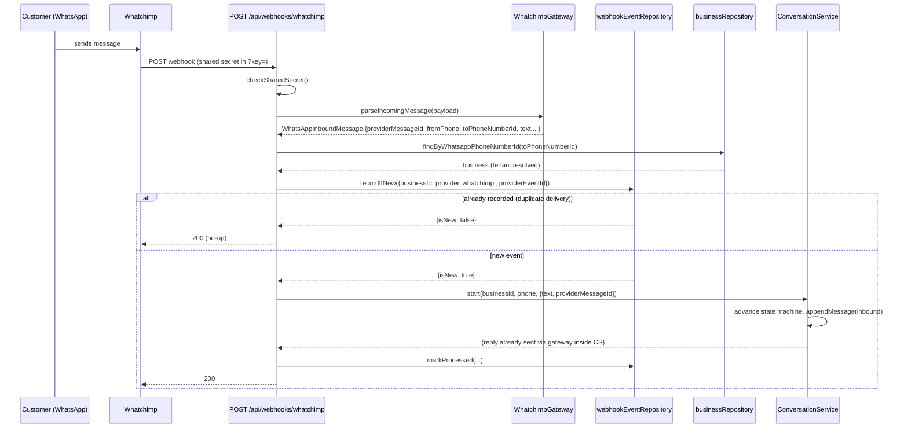
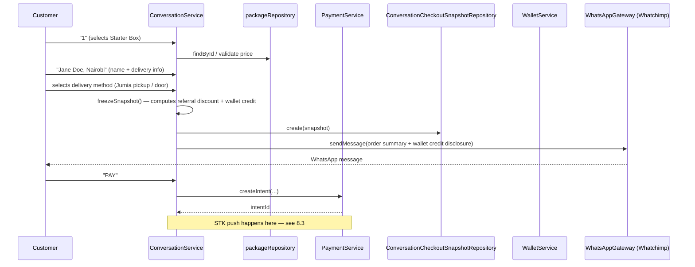
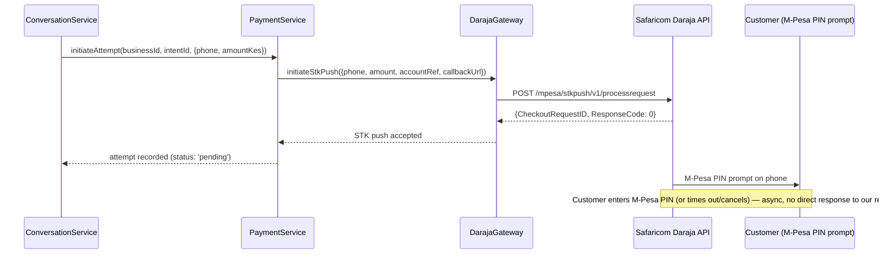
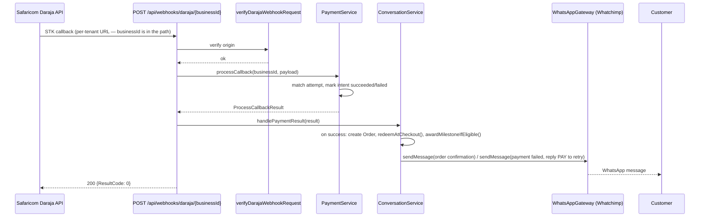
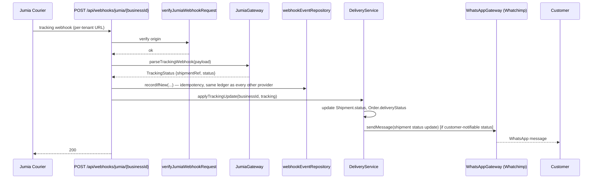
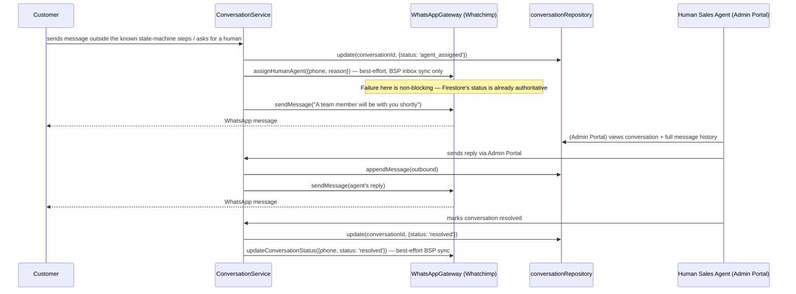

# Whatchimp Integration — Architecture Design

**Status: DESIGN ONLY — no implementation in this document.** Written for review before any code changes.

## 0. What this document is responding to, and a real constraint I hit

Whatchimp confirmed three things: inbound WhatsApp messages arrive via webhook, our backend can process them, and our backend can reply via a Send Message API, with docs at `help.whatchimp.com/docs/whatchimp-apis/getting-started-with-whatchimp-api`.

**I could not fetch that page.** This session's network egress goes through a policy-enforced proxy that allow-lists specific hosts; `help.whatchimp.com` (and a Make.com integration mirror I tried as a fallback) both came back `403` at the proxy level — a deliberate organizational policy, not a transient failure, so I did not retry or route around it. `WebSearch` got me indexed summaries, which confirmed the doc site organizes endpoints as: **Send Message, Get Conversations, Track Delivery, List Bot Postbacks**, plus **Templates / API Console generator**, **message history retrieval**, and an **outbound Webhook Workflow** feature (Whatchimp → external system on events like new lead / incoming message / campaign reply). That's capability-level confirmation, not field-level payload schemas.

**What this means for this document:** sections 1–9 below are all answerable at the architecture level without exact JSON field names — that's the point of a Gateway abstraction. Where the exact wire format matters, I've marked it **[NEEDS DOC CONFIRMATION]** and named exactly what's needed. The fastest way to unblock those spots: paste the relevant doc section(s) into the chat, or drop a saved copy of the page(s) in the repo for me to read. I have NOT invented field names to fill these gaps.

## 1. What's already built (read this before section 2 — it changes the shape of the recommendation)

This is not a greenfield integration. `WhatsAppGateway` (`lib/integrations/types.ts:194`) already exists as exactly the abstraction section 2 of the brief asks for, and `WhatchimpGateway` (`lib/integrations/whatchimp/whatchimpGateway.ts`) already implements it. The entire webhook pipeline (section 3), idempotency ledger (section 5), and conversation storage (section 4) are built and in production. The catch, stated honestly in the code's own comments: `WhatchimpGateway`'s wire format is **modeled on Meta's real, public WhatsApp Cloud API** (`entry[].changes[].value.messages[]` inbound shape, `POST /{phone_number_id}/messages` outbound shape) as "the closest honest approximation available" — a disclosed placeholder, not a verified fact about Whatchimp specifically, because no Whatchimp docs existed when it was built.

So the actual task in front of us is narrower than "design a Whatchimp integration from scratch": **validate the existing abstraction boundary (it's already right), and replace the internals of one class (`WhatchimpGateway`) once we have Whatchimp's real wire format** — everything above the Gateway interface (`ConversationService`, `PaymentService`, the webhook route, the idempotency ledger, the Integration Portal) does not change.

## 2. The `MessagingGateway` abstraction

**Recommendation: keep `WhatsAppGateway` as the interface name and shape. Do not rename it to a generic `MessagingGateway`.**

Reasoning: a "channel-agnostic" name would suggest this interface could grow to cover SMS/email/Telegram too, but it's already deliberately WhatsApp-specific in ways that would leak through any generic name anyway — `sendTemplate` exists because WhatsApp enforces a real 24-hour customer-initiated session window (outside it, only pre-approved templates are deliverable); `sendButtons`/`sendList`/`sendCatalogMessage` model WhatsApp's actual interactive-message types; `verifyWebhookChallenge` models the Meta-style `hub.mode`/`hub.verify_token`/`hub.challenge` handshake. Renaming the interface without changing any of that is cosmetic, not architectural — it wouldn't make a future SMS gateway satisfy this interface any more than it does today. (Email/SMS already have their own `EmailGateway`/`SmsGateway` shape from the Notification Breadth phase — that's the actual pattern for a new channel: a new interface next to this one, not a merged one.)

What genuinely needs to change is internal, not the interface:

- **`WhatchimpGateway.parseIncomingMessage`** — currently parses the Meta Cloud API envelope. Needs to parse whatever envelope Whatchimp's webhook actually sends. **[NEEDS DOC CONFIRMATION: exact inbound webhook JSON shape]**
- **`postMessage`'s request body** (private helper backing `sendMessage`/`sendTemplate`/`sendButtons`/`sendList`/`sendCatalogMessage`) — currently builds a Meta Cloud API-shaped body (`messaging_product: 'whatsapp'`, `type`, etc.) against `POST {baseUrl}/{phoneNumberId}/messages`. Needs to match Whatchimp's real Send Message endpoint. **[NEEDS DOC CONFIRMATION: request/response shape, whether phoneNumberId is even Whatchimp's addressing scheme]**
- **`markAsRead`, `syncItem`/`removeItem` (catalog), `assignHumanAgent`, `updateConversationStatus`** — currently either Meta-shaped or, for the last two, an explicitly-flagged guess with "no real Meta Cloud API analog" and "genuinely unverified." These may map to Whatchimp's confirmed **Get Conversations**/**List Bot Postbacks** endpoints, or may not exist as Whatchimp capabilities at all — kept as best-effort, non-blocking calls either way (see §4).
- **`config.ts`'s `baseUrl` default** (`https://api.whatchimp.com/v1`) — was itself a guess. **[NEEDS DOC CONFIRMATION: real API base URL — likely different from the `help.whatchimp.com`/`app.whatchimp.com` doc hosts]**

Nothing in `ConversationService`, `PaymentService`, `NotificationService`, the webhook route, or any repository needs to change for this. That is the abstraction doing its job.

### Two capabilities confirmed to exist that aren't in the interface yet

Whatchimp's doc site lists **Get Conversations**, **Track Delivery**, and **message history retrieval** as real endpoints. None of these are used by today's customer journey (Firestore is already the system of record for conversation state — see §4), but two are worth adding as optional Gateway methods once confirmed, because they close real gaps:

- **`getDeliveryStatus(providerMessageId)`** (from Track Delivery) — today, once `sendMessage` returns a `providerMessageId`, this codebase never learns if that message was actually delivered or read. Wiring this in would let `notificationService` mark a WhatsApp send as truly failed (not just "API call succeeded") and trigger its existing SMS/email fallback sooner.
- **`getConversationHistory(phone)`** (from message history retrieval) — a reconciliation tool, not a live-path dependency: lets an admin compare Whatchimp's own thread against Firestore's `messages` subcollection if the two ever look inconsistent. Not needed for the core journey; useful for the support-conversation workflow (§8.6) and worth having before that ships.

Both are additive to the interface (new optional methods), not a redesign.

## 3. Webhook processing pipeline

**Already built, already correct — this section documents what exists rather than proposing something new**, because the existing design already satisfies the brief:

```
POST /api/webhooks/whatchimp
  1. Shared-secret check (?key= query param against WHATCHIMP_WEBHOOK_SECRET)
  2. gateway.parseIncomingMessage(payload)
     — throws on non-message webhook deliveries (delivery receipts, status
       updates) → caught, 200 returned, nothing else happens
  3. Resolve tenant: businessRepository.findByWhatsappPhoneNumberId(toPhoneNumberId)
     — no match → 200, no-op (platform not configured for this number)
  4. webhookEventRepository.recordIfNew({businessId, provider: 'whatchimp',
     eventKind: 'inbound_message', providerEventId: message.id, payload})
     — duplicate → 200, no-op (see §5)
  5. Dispatch:
     - catalogOrder present → productService.getCheckoutableProduct(...)
                            → conversationService.startFromCatalogSelection(...)
     - otherwise           → conversationService.start(businessId, phone, {text, providerMessageId})
  6. markProcessed(...) on success / markFailed(...) on error
  7. Always return 200 (a bug in our processing must never make Whatchimp retry-storm)
```

**One real gap, worth closing regardless of Whatchimp's exact payload format**: step 2 currently detects "not a customer message" by catching a thrown parse error — correct in effect, but it conflates three different situations that should be handled differently once we know Whatchimp's real webhook event taxonomy:

1. A genuine inbound customer message → process (today's only handled case)
2. A delivery/read receipt for a message *we* sent → should update that message's status (once `getDeliveryStatus`-equivalent data is available in the payload) — today, silently dropped
3. A malformed/unexpected payload → today, also silently dropped; should probably be recorded (not necessarily processed) so a pattern of malformed webhooks is visible somewhere, e.g. via the existing Operations dashboard (§5 of the production-readiness sprint) rather than vanishing with a bare 200

**Recommendation**: once Whatchimp's real webhook event shape is confirmed, replace the throw-and-catch dispatch with an explicit `gateway.classifyWebhookEvent(payload): 'message' | 'delivery_status' | 'unknown'` (or similar), and record (not necessarily act on) the `'unknown'` case via `webhookEventRepository.recordIfNew` with `eventKind: 'unclassified'` so it surfaces in Operations rather than disappearing. This is additive — doesn't change the 200-always discipline, doesn't change tenant resolution or idempotency.

## 4. Conversation storage & synchronization

**Firestore is the single source of truth. Whatchimp's own inbox/thread state is never read back as authoritative — only pushed to, best-effort.** This is already the codebase's stated discipline (`assignHumanAgent`'s doc comment: *"Snack Quest OS's own Firestore state... remains the actual source of truth regardless of whether this call succeeds"*), and it's the right call to keep: a customer's order state, payment status, and delivery status all live in this platform's own domain model (`Order`, `PaymentIntent`, `Shipment`), not in a BSP's inbox metadata. Whatchimp is a transport, not a database.

Storage shape (existing, unchanged):

```
conversations/{conversationId}          — one per (businessId, phoneNumber)
  businessId, phoneNumber, status, currentStep, stateBlob, lastMessageAt, assignedAgentId
  conversations/{conversationId}/messages/{messageId}   — append-only, transactional
    direction ('inbound'|'outbound'), body, templateCode, providerMessageId, sentAt
```

- **Inbound**: `conversationService.start()` is the single entry point from the webhook route; it drives the state machine and calls `conversationRepository.appendMessage()` for the inbound turn.
- **Outbound**: every `NotificationService`/`ConversationService` call to `gateway.sendMessage`/`sendTemplate`/etc. is paired with an `appendMessage({direction: 'outbound', providerMessageId: result.providerMessageId})` call, so the transcript is complete in both directions regardless of what Whatchimp's own UI shows.
- **Sync direction is one-way, inbound-only, and it should stay that way.** Pulling Whatchimp's conversation state back into Firestore (e.g. via **Get Conversations**) would create two competing sources of truth for the same thing — the standing "no unnecessary abstractions" principle argues against it. The one legitimate use for a pull-based sync is the reconciliation tool mentioned in §2 (`getConversationHistory`, human-triggered, comparison-only, never auto-applied).

## 5. Retries, idempotency, duplicate webhook deliveries

**Already built, already correct.** `webhookEventRepository.recordIfNew()` uses Firestore's `.create()` (fails if the document exists) as the atomicity primitive — not a get-then-set race — keyed on a deterministic ID: `{businessId}:{provider}:{providerEventId}`. A duplicate Whatchimp delivery (BSPs routinely retry webhooks that don't get a fast 200) hits the `isAlreadyExistsError` branch, returns `{isNew: false}`, and the route short-circuits to 200 without touching `ConversationService` again. This is the same mechanism every other provider webhook (Daraja, Jumia) already uses — reuse it as-is; there's no reason to build a Whatchimp-specific idempotency path.

Two things worth being explicit about, since they're easy to get wrong when someone unfamiliar with this code touches it later:

- **The idempotency key is Whatchimp's own message ID** (`inbound.providerMessageId`), not a hash of the payload or a timestamp — this is what makes it correct across true retries (same message ID) vs. rejecting a customer's legitimately-repeated text. **[NEEDS DOC CONFIRMATION: confirm the field Whatchimp calls this ID, so `parseIncomingMessage` extracts the right one]**
- **Outbound sends are deliberately NOT retried automatically** at the Gateway level (`postMessage`'s own comment: *"a blind retry... risks a duplicate message landing in the customer's WhatsApp thread"*). Retry policy lives one layer up, in callers that have conversation state to reason with — today that's `NotificationService.retrySweep()` (cron-driven, already built, already has its own `outboundMessageRepository` retry-count tracking). No new retry mechanism is needed for Whatchimp specifically; it inherits this for free by implementing `WhatsAppGateway`.

## 6. What the Integration Portal should expose

The Integration Portal (Admin → Settings → Integrations) already has a `whatchimp` entry driven by `lib/integrations/fieldManifest.ts` and `businessIntegrationSecretRepository`. Current fields: `apiKey` (secret), `phoneNumberId`, `baseUrl`, `catalogId`. Recommended changes, all confirmable only from real docs:

| Field | Status | Action |
|---|---|---|
| `apiKey` | exists | Confirm this is really the auth mechanism — Whatchimp may use a distinct "access token" vs. "API key" vs. account-scoped credential. **[NEEDS DOC CONFIRMATION]** |
| `phoneNumberId` | exists | Confirm Whatchimp addresses a business's number the same way (Meta's `phone_number_id` concept) or uses its own account/instance identifier instead. **[NEEDS DOC CONFIRMATION]** |
| `baseUrl` | exists, has a guessed default | Update the default once the real API base URL is confirmed; keep it overridable per-tenant (Whatchimp may run region-specific API hosts). |
| `catalogId` | exists | No change — this is Meta's own WhatsApp Commerce Catalog concept (used for `sendCatalogMessage`/catalog sync), independent of whichever BSP is in front of it. |
| Webhook signing secret | **not yet a per-field concept** | Today's `WHATCHIMP_WEBHOOK_SECRET` is a platform-level env var + `?key=` query param stopgap (`lib/webhooks/webhookSecret.ts`), explicitly because no real Whatchimp signature mechanism was known. **[NEEDS DOC CONFIRMATION: does Whatchimp sign webhook payloads with an HMAC header, the way Meta's own Cloud API does with `X-Hub-Signature-256`?]** If yes, this becomes a real, stronger verification path and should replace the query-param stopgap — worth its own small follow-up once confirmed, not blocking this design. |

Nothing about the *shape* of the Integration Portal changes — same masked-secret display, same Test Connection pattern (`testWhatchimpConnection`, already implemented as a side-effect-free `GET`), same audit-logged updates. Only field *values/defaults* need revisiting once the real API contract is known.

## 7. Changes needed to the current architecture

Summarizing sections 2–6 into one list, ordered by what's actually required vs. nice-to-have:

**Required, blocked on doc confirmation:**
1. Rewrite `WhatchimpGateway.parseIncomingMessage` to match Whatchimp's real inbound webhook shape.
2. Rewrite `postMessage` (backing all five `send*` methods) to match Whatchimp's real Send Message request/response shape.
3. Confirm/update `config.ts`'s `baseUrl` default and the field manifest entries per §6.

**Required, not blocked (can do now or alongside the above):**
4. Replace the throw-and-catch "is this a message" detection in the webhook route with explicit event classification (§3), so non-message webhook deliveries are recorded rather than silently vanishing.

**Optional, additive, worth doing once the endpoints are confirmed:**
5. Add `getDeliveryStatus`/`getConversationHistory` to `WhatsAppGateway` (§2) — non-breaking additions, only used by delivery-status tracking and the support-reconciliation tool respectively.
6. If Whatchimp signs webhooks, add real HMAC verification alongside (not instead of, initially) the existing query-param secret, same fail-open-until-configured discipline `lib/webhooks/webhookSecret.ts` already uses for Daraja.

**Not needed:**
- No new abstraction layer, no `MessagingGateway` rename (§2).
- No change to `ConversationService`, `PaymentService`, `NotificationService`, or any repository.
- No change to conversation storage shape or sync direction (§4).
- No new idempotency mechanism (§5) — the existing `webhookEventRepository` ledger already covers Whatchimp correctly.
- No change to the Integration Portal's UI/update/audit-log pattern — only its Whatchimp field values (§6).

This is a small, contained blast radius: one Gateway class's internals, one webhook route's dispatch logic, a few Integration Portal field defaults. Everything else in the platform is unaffected because the Gateway boundary was already drawn in the right place.

## 8. Sequence diagrams

All six diagrams reflect the **existing, already-implemented** flow (validated against the real code in this pass), with the Whatchimp-specific parts marked. Only the `WhatchimpGateway` internals inside these flows are placeholders pending real docs — the flows themselves are live in production.

### 8.1 Incoming customer message



### 8.2 Order placement (free-text journey to PAY confirmation)



### 8.3 Daraja STK Push



### 8.4 Payment confirmation



### 8.5 Shipment updates



### 8.6 Customer support conversation (human agent handoff)



## 9. Recommended implementation order

Given §7's scoped required-changes list, and given none of it touches anything above the Gateway boundary:

1. **Unblock on docs** — get the real Send Message request/response shape, inbound webhook payload shape, auth mechanism, and (if it exists) webhook signature mechanism. This is the actual critical path; everything below is fast once this is in hand.
2. **Rewrite `WhatchimpGateway` internals** (`parseIncomingMessage`, `postMessage`, and any Meta-shaped assumptions in `markAsRead`/`syncItem`/`removeItem`/`assignHumanAgent`/`updateConversationStatus`) against the real contract. Existing tests in `tests/integrations/whatchimpGateway.test.ts` get rewritten against real fixtures, not deleted — same TDD discipline as every other phase in this sprint.
3. **Update `config.ts` defaults + field manifest** per §6, once the real field names/base URL are known.
4. **Webhook event classification** (§3, §7 item 4) — can happen in parallel with 2–3, or right after; it's a self-contained change to the route's dispatch logic.
5. **If webhooks are signed**: add real signature verification alongside the existing shared-secret stopgap (§7 item 6).
6. **Optional**: `getDeliveryStatus`/`getConversationHistory` additions (§2, §7 item 5) — lowest priority, no current caller depends on them; sequence into a later pass once the above is stable and verified end-to-end (emulator + a real sandbox Whatchimp account, mirroring how Daraja's sandbox was used earlier in this build).

At every step: real tests against real (or documented-fixture) payloads, no suppressed warnings, full emulator validation before considering it done — same discipline as the rest of this sprint.

---

**Waiting on your review before touching any code**, per the brief. The one thing that would unblock the most (steps 1–3 above) is the actual doc content for Send Message + the inbound webhook payload — paste it in, or point me at a way to fetch it that isn't blocked, and I'll turn this into working code and tests against real fixtures rather than another disclosed guess.
