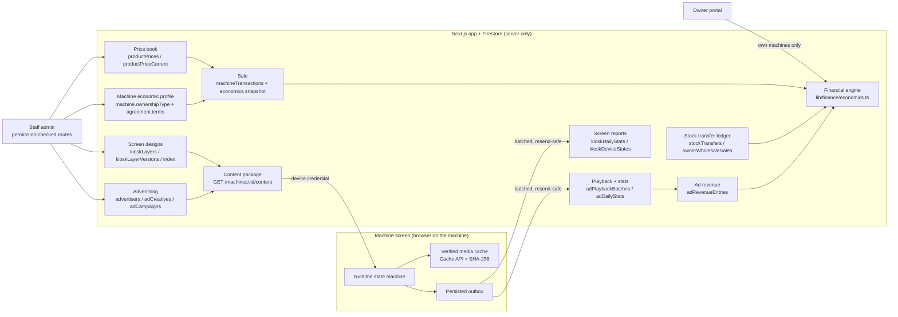

# Snack Quest OS: build report

The master brief (55 parts) was classified A–F in `docs/OS_MASTER_GAP_ANALYSIS.md`, and parts B–F were built in phases OS0–OS10 on branch `claude/review-improvements-udxkqz`. This report covers what exists now, how it fits together, what was deliberately left out, and what was verified.

**This is not a production-readiness claim.** Everything here was verified with unit tests, the Firebase emulator, a production build and static checks. It has not run against real machines, real M-Pesa, real Vercel Blob storage, real kiosk hardware or real traffic.

## 1. Executive summary

Snack Quest now treats who owns a machine, who owns its stock, and on what terms as data:

- Every sale freezes its own economics at the moment it happens.
- One financial engine computes margin and contribution for staff and owners alike.
- Owners see their own margins (never Snack Quest's cost unless their agreement allows it).
- Stock moves through a ledger.
- The customer screen is designed in layers, with publish and rollback.
- Advertising runs on idle screens with review, verified files, schedules, caps and revenue shares.
- The kiosk runs on an explicit state machine with offline caching, service mode and reporting.
- Permissions are explained exactly as the server enforces them.

| Phase | What it delivered | Commit |
|---|---|---|
| OS0 | Verification fixes (V-01 staff roles kept on invite, V-02/V-03 workspace and dashboard gating, V-09 no sales to stopped machines, V-12 race-free stock counts, V-18 conflict acknowledgement) | `37b51f2` |
| OS1 | Gap analysis, A–F classification, architecture decisions, defaults | `37b51f2` |
| OS2–OS5 | Ownership types and commercial terms, price book with history, sale economics snapshots, financial engine, stock transfer ledger and owner wholesale sales, machine P&L, owner profitability dashboard | `37b51f2` |
| OS6 | Kiosk experience builder: theme tokens, section layout, badges, card options, idle and wording; four-level inheritance; drafts, immutable versions, rollback, preview; device profiles | `71ab030` |
| OS7 | Advertising: advertisers, reviewed creatives with server-side checksums, campaigns, shared playlist, deduplicated playback, revenue and owner shares, admin console, owner view | `c3df3b6` |
| OS8 | Kiosk runtime state machine, staged content sync, verified offline ad cache, ad playback, persisted outbox, service mode, screen reports and activity | `8b6b2e9` |
| OS9 | Access explainer and "What can this person do?", per-role invariants | `50b62e2` |
| OS10 | Per-method route guard, capability matrix generator, record checks, dashboard panel, final gate | `72ecb88` and the final commit |
| Follow-up 1 | WhatsApp checkout for more than one box (ported from `codex/public-checkout`; the rest of that branch is superseded by `/checkout`) | `5a1b384` |
| Follow-up 2 | Maintenance: owner and staff problem reports, a cost ledger, maintenance in the machine P&L | `9932f53` |
| Follow-up 3 | Snack brand, barcode, allergens and net content, shown on the machine screen | `195b57c` |
| Follow-up 4 | Machine screen in English and Kiswahili, with a customer language switch | `419694b` |
| Follow-up 5 | Owners propose their machines' screen design; staff accept to publish | `e56df24` |
| Follow-up 6 | Ad videos up to 50 MB, uploaded straight to storage and checked after | `b400a30` |
| Payment fix | M-Pesa confirmations for orders handled before the vending lookup; stuck payments listed on Reconciliation with a receipt form | `614eb3f` |
| Follow-up 7 | Machine deals (landed, installation and sale per machine) and the combined Income view in Finance | this commit |

## 2. Architecture

Rules held throughout:

- Machines and owners never touch Firestore directly. The new collections deny all client access in `firestore.rules`.
- Device routes use the machine's own credential and read only that machine's data.
- Staff routes check named permissions.
- Owner routes read only the owner's machines.

## 3. Financial model

All margin arithmetic is in `lib/finance/economics.ts`.

| Term | Definition |
|---|---|
| Landed cost | What Snack Quest paid to get one unit to the warehouse (`productPrices`, type `landed_cost`) |
| Owner wholesale price | What an owner pays Snack Quest per unit, when their agreement says so (`owner_wholesale`) |
| Retail price | The machine's selling price. One rule, used for both display and charge: the assortment override, else the slot price (`lib/vending/sellingPrice.ts`) |
| Unit cost | From the sale's own snapshot. For Snack Quest's view it is the landed cost. For the owner's view it is the owner's cost basis: landed cost (the default for existing agreements) or the wholesale price |
| Gross profit | Net revenue − unit costs. Units without a recorded cost are counted and left out, never costed at zero |
| Contribution | Gross profit − location commission − subscription (owner view) − payment fees − maintenance + advertising share |

How the inputs behave:

- Fees and maintenance are not recorded yet. They are listed as *missing* in every P&L, never assumed to be zero.
- Contribution is never labelled "net profit".
- Every sale freezes its economics when it is created (`SaleEconomicsSnapshot`): costs, wholesale price, ownership and terms. Later price changes never rewrite history.
- Older sales without a snapshot are costed at today's cost and counted as estimated.
- Price changes are written by the price book only, in a transaction that closes the open entry and opens the next. Changes are never backdated.

Snack Quest's income from an owner's machine is the wholesale margin, plus the subscription, plus its advertising share. Ad revenue never mixes into product margin.

Advertising revenue per campaign and month:

| Billing model | Revenue |
|---|---|
| Per completed play | Completed plays × price |
| Per machine-day | (machine, day) pairs with a completed play × price |
| Flat monthly | The price, for a month with at least one completed play |

- Revenue is attributed to machines by their share of delivery (machine-days for per-machine-day billing).
- Owners receive their agreement's `adRevenueSharePartnerPct` of what their machines earned. The default is 0%.

## 4. Kiosk and advertising architecture

### Screen design

`kioskLayers`, `kioskLayerVersions` and `kioskPublishedIndex`.

- **Layers.** Design layers are global → owner → location → machine; the most specific wins, and a section list replaces the inherited one whole.
- **What a design holds.** Each layer stores a partial config:
  - theme: hex-only colours, corner style, allow-listed fonts, motion;
  - an ordered layout of whitelisted sections;
  - badge wording, tone and visibility;
  - product-card options;
  - idle timeout and the ads on/off switch;
  - screen wording;
  - languages offered (English, Kiswahili), the starting language, and translations of the layer's own wording.
- **Publish rules.** One rule set (`lib/kiosk/experienceConfig.ts`) runs in the builder, on the server and on the kiosk.
  - Publishing is blocked if the product grid is missing or body text contrast is below 4.5:1.
  - Button and badge labels below 3:1 only warn. The current brand orange with white text is 2.6:1, and changing brand colours is a brand decision.
  - A lower layer that becomes unreadable after a higher layer changes is skipped when a machine's design is resolved.
- **Version history.** Versions are immutable. A rollback publishes an old version's config as a new version.
- **Preview.** The builder previews the real kiosk renderer, in an iframe at the machine's recorded screen size, with payments off.
- **Read cost.** Resolving a design reads one cached index document plus cached immutable versions. That is roughly zero reads per poll in steady state.
- **Languages.** The screen's own words (buttons, states, payment messages) come from `lib/kiosk/kioskText.ts` in English and Kiswahili. With more than one language offered, customers get a switch at the top; it resets to the starting language when an order ends. A phrase without a translation shows in English, and the checks warn about it.
- **Owners' designs** (`kioskOwnerProposals`). An owner edits colours, menu, badges, product tiles, wording and languages for their own machines in the Owner Portal and sends it for review; idle and ad settings stay Snack Quest's. A proposal is checked like a publish before it can be sent. Staff with `kiosk.publish` accept it (published on the owner layer, keeping staff's idle and ad settings there) or send it back with a reason. Owners preview only on their own machines.

### Content sync

`GET /api/vending/machines/[id]/content` returns the design, the artwork and the ad playlist, with one `packageVersion`; `?have=` returns `unchanged`. On the kiosk:

1. Validate everything again.
2. Download every ad file and verify its SHA-256 (computed by the server at upload) with Web Crypto, through the Cache API.
3. Apply the whole package at once and cache it for offline starts.

A file whose checksum doesn't match is never played or cached, and is counted (`ad_media_rejected`).

### Advertising

- **Creatives.** Uploaded through `POST /api/vending/advertising/creatives` (up to 4 MB), or, for videos up to 50 MB, straight to storage and then `…/creatives/finalize`.
  - Only JPEG, PNG, WebP, MP4 and WebM are accepted, and the bytes must match the declared type. HTML, SVG and scripts are refused.
  - The SHA-256 is always computed by the server from the stored bytes.
  - Direct uploads: the token (`…/creatives/direct-upload`) goes only to staff with `advertising.manage`, only for videos, only into that business's ad folder, with a random suffix. Finalize asks storage for the file's real path, type and size, re-reads the bytes, and deletes a file that fails.
  - A creative waits for review: approve, or reject with a reason; an approved creative can be pulled later.
  - The general upload route refuses the `ads` directory.
- **Campaigns.**
  - Schedule: Nairobi dates, weekdays and a daily window.
  - Targeting: every machine, or chosen machines, locations or owners.
  - Weight 1–10 and an optional hourly cap.
  - Billing model.
  - Only drafts and paused campaigns can change, and starting one needs every creative approved.
- **Playlist** (`lib/ads/playlist.ts`, pure and shared).
  - The server lists what a machine may play today.
  - The machine picks at play time with smooth weighted round-robin, the schedule and the hourly caps, so it keeps working offline.
  - Ads play only in the IDLE state, are labelled "Ad", and a tap always starts an order.
- **Playback.** `POST /api/vending/machines/[id]/ad-events` takes batches of up to 500 events.
  - Each batch has an id. One document per batch keeps the events as evidence, and the daily stats are counted in the same transaction. A resent batch counts once.
  - Per-event documents were rejected: at roughly 900 writes per hour per idle screen, 10,000 screens would mean about 9M writes an hour.
- **"Taps after"** counts screen taps during an ad or within 10 s after it. It is a post-ad interaction, not a claim that the ad caused a sale.

### Kiosk runtime

- **State machine** (`lib/kiosk/runtimeMachine.ts`): BOOTING, OFFLINE, IDLE, SHOPPING, CHECKOUT, PAYMENT, DISPENSING, SUCCESS, PARTIAL, ERROR, REFUND_PENDING, MAINTENANCE.
  - Every screen change goes through the transition table; anything not in the table is refused.
  - Nothing leaves PAYMENT or DISPENSING except progress.
  - Service mode opens only when nobody is mid-purchase.
- **Outbox** (`PersistedBatchQueue`). Ad plays and activity counts are persisted to localStorage. A batch keeps its id until it is acknowledged; no event is in two batches; overflow is counted, not hidden.
- **Service mode.**
  - An 8-digit one-time code is issued in Admin (`machines.service_codes.issue`).
  - It is stored as a salted hash, valid for 15 minutes, single use, and replaced when a new one is issued.
  - Five wrong codes lock the machine out for 15 minutes. Issuing a code and opening service mode are both audited.
  - On the screen, hold the logo for 3 s. The service screen shows versions, connection and queues, and can sync, send reports and clear cached ads.
  - It cannot send machine commands, touch stock or take payments.
- **Screen reports.** Every 5 minutes the screen sends its content and menu versions, state, queue sizes, and activity counts:
  - sessions, snacks opened, added to order, went to pay, M-Pesa requests;
  - orders that succeeded or failed;
  - orders left behind;
  - service mode opened;
  - new content applied;
  - ad files refused (checksum mismatch).

  Counts only, nothing personal. They are shown on the machine's screen page.

## 5. RBAC architecture

- **Permissions.** Permissions (`lib/auth/permissions.ts`) are granted by template, plus individual grants, minus individual removals. A super admin holds everything.
- **New permissions:**
  - `products.cost.view/manage` and `products.wholesale.view/manage`;
  - `machines.economics.manage` and `finance.machine_pnl.view`;
  - `kiosk.view/design/publish`;
  - `advertising.view/manage/review/publish`;
  - `machines.service_codes.issue`.
- **Templates.**
  - Product manager: products, snacks, recipes and content, with no costs, prices, machines or money.
  - Marketing: designs drafts and runs campaigns, but can't publish designs, approve its own ads, or see costs or money.
  - Finance: sees costs and P&L read-only, and can't change prices.
- **Access explainer.** `explainPermissions()` shares its starting-set code with `effectivePermissions()`, so the explanation can't drift from what is enforced. `/admin/staff/[uid]/access` shows:
  - money, cost and control permissions in plain words;
  - the pages in that person's menu;
  - every permission, with whether it comes from the template, was given individually, or was removed individually;
  - `?template=` previews another template without saving.
- **Guards.**
  - `tests/security/routeGuard.test.ts` reads every API method.
  - Every staff method must check a real permission.
  - Only ten listed, justified methods are unauthenticated.
  - Nothing under `/api/vending` or `/api/admin` is public.
  - Device and staff authentication never mix.
  - Screen, advertising and economics writes are audited.

## 6. Capability matrix

`npm run audit:capabilities` regenerates `docs/ADMIN_CAPABILITY_MATRIX.md` from the code: 392 route methods and 146 admin page and layout gates.

| Status | Methods |
|---|---:|
| Complete (guarded, has a UI caller, writes audited) | 203 |
| System interface (machine, owner, cron, webhook, customer, public) | 111 |
| Works, unaudited (staff writes the service records itself, or none) | 30 |
| Read API (pages read the service directly) | 30 |
| No UI caller found | 18 |

Most "No UI caller" rows are UI code that builds the path in pieces (`${base}/publish`, `/restock/${id}/${action}`), which the static match can't see. The matrix says so; check a row before treating it as missing.

## 7. Business decisions: defaults taken, to confirm

| Decision | Default | Why |
|---|---|---|
| What owners pay for stock | Landed cost for existing agreements; new agreements choose | Exactly what settlement deducted before |
| When owners pay | Deducted from settlement for units sold | Today's rule; owner wholesale sales on delivery are recorded, not deducted |
| Payment processing fees | Not shown until configured | The M-Pesa tariff depends on the account |
| Owner ad revenue share | 0% unless the agreement sets it | No agreement promises ad revenue |
| Who sees landed cost | Staff with `products.cost.view`; owners never, unless the agreement allows | The brief |
| Flat-monthly ad billing | Billed for a calendar month with at least one completed play | Ties billing to delivery |
| Ad revenue split across machines | By share of completed plays (machine-days for per-machine-day billing) | The only delivery measure held |
| Ad file size | 4 MB through the app; videos up to 50 MB uploaded straight to storage | Vercel's request-body limit; 50 MB matches the review-video ceiling and keeps machine downloads reasonable |
| Maintenance in the P&L | Snack Quest's spend is the sum of costs recorded as paid by Snack Quest. In an owner's view, owner-paid costs show; if the agreement makes the owner responsible for maintenance and none are recorded, it shows as not recorded rather than 0 | Nothing is estimated; only recorded costs count |
| Who can record maintenance costs | Finance and machine operations (`maintenance.costs.record`); warehouse can log and move requests but not record money | Money entries stay with roles that already handle money |
| Owners' screen designs | Need acceptance by staff with `kiosk.publish`; idle and ad settings are not the owner's | An owner's screen is still a Snack Quest screen; ads are Snack Quest revenue |
| Kiswahili wording | Written for this build | Needs review by a native speaker before customers see it |
| Combined income | Profit before overheads, only where a cost is recorded; revenue without a cost is shown beside it, never counted as profit. Owners' machine sales are excluded; only Snack Quest's income from those machines counts | Nothing estimated; owners' money is theirs |
| Machine sale profit | Sale price (and any installation charged on top) less landed cost (purchase, freight, duty and clearing, transport to site) and installation cost (installation, branding, other setup); recognised on the sale date. Shown only once landed cost is recorded and installation is recorded or marked "none" | The costs that make up a machine, with nothing assumed |
| Machines Snack Quest keeps | Their landed and installation cost is shown as money invested, not taken off a period's income, and not depreciated | Depreciation is an accounting policy for your accountant to set |
| Foreign-currency machine costs | Entered in KES as actually paid; the original amount goes in the description | No exchange rate is guessed |
| Barcodes | Must be a valid GTIN (8, 12, 13 or 14 digits) and unique among snacks | One barcode, one snack, so a scan can't be ambiguous |

## 8. Not built, and known limits

**Not built**

- Paying owners' ad share through settlements. The share is computed and shown, but not paid out; when to pay it is a business decision.
- Payment fee configuration, so fees appear as "not recorded" in every P&L.
- New badge types beyond featured, new and limited time. Their wording, colour and visibility are configurable.
- Languages beyond English and Kiswahili. Snack names and descriptions are not translated; only the screen's own words and each design's wording are.
- Barcode scanning at the machine. Barcodes are stored and checked, not yet read by any device.
- The rest of `codex/public-checkout`. Only multi-box WhatsApp checkout was ported; the branch's own checkout page is superseded by `/checkout` on main.
- Depreciation of machines Snack Quest keeps, and instalment payments on machine sales (a sale is recorded at its agreed price on its date).
- Overheads (salaries, rent, marketing) in the Income view; it shows profit before overheads.
- The server does not decode video. Video length is declared by staff, and machines report the real play time.

**Known limits**

- Record checks read the most recent 5,000 records per check and say so when cut short.
- The machine P&L (and so the Income view) sorts a machine as Snack Quest's or an owner's by its ownership today. A machine sold to an owner part-way through a period has that whole period's sales counted the owner's way. Each sale does freeze its own ownership, so this can be split per sale later.
- A direct ad upload that is never finalized leaves an unreferenced file in storage. It plays nowhere and is safe to sweep, but nothing sweeps it yet.
- Report batch documents carry `expireAt`. A Firestore TTL policy on that field has to be enabled in the Firebase console; it can't be set from this repo.
- `tests/api/rateLimitDistributed.test.ts` › "a high-volume key is spread over several counter documents" failed once in a full run and passed 3/3 in isolation. It is probabilistic: random shard choice under load. It predates this work and was not changed.

## 9. Verification

Run on the emulator in this container, after the final changes:

| Check | Result |
|---|---|
| `tsc --noEmit` | clean |
| `eslint` | 0 errors, 2 warnings (pre-existing, in tests) |
| `next build` | succeeds |
| Full test suite (`vitest run`, Firestore and Auth emulators) | 411 of 411 test files passed; 4,380 tests passed, 1 skipped (4,381), after machine deals and the Income view. Run against the emulators, so this is not evidence of production readiness. |
| Capability matrix | regenerated from the code |

New test files in this work include:

- financial engine;
- price book;
- machine economics;
- stock ledger and P&L;
- economics RBAC routes;
- kiosk experience config, service and routes;
- kiosk component (24 tests: design, preview, ads, checksum refusal, counts, service mode);
- playlist;
- advertising service and routes;
- kiosk runtime state machine;
- device queue;
- kiosk runtime service and routes;
- RBAC templates;
- route guard;
- record checks;
- follow-ups: multi-box WhatsApp checkout, maintenance service and routes, product details and barcode uniqueness, kiosk text in two languages, owner screen design service and routes, direct ad video upload (owner isolation sweep extended to the new owner routes).

Emulator tests prove the logic and the access rules. They do not prove behaviour on real machines, real payment rails, real storage or under real load.
